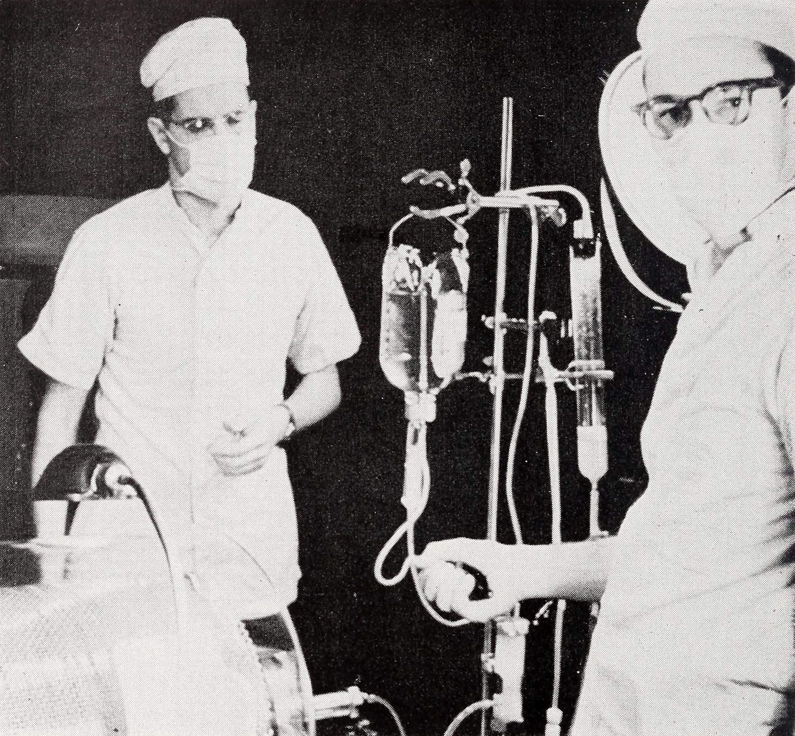

# Three Beds {.section-divider}

## Before We Start

::: {.thought-question}
Take **ninety seconds**. Don't talk to anyone yet.

A hospital has one machine that will keep you alive. Sixty other people need it too. A committee of strangers will decide who gets it.

**Write down the three things you would most want that committee to know about you.**

Keep what you wrote. We come back to it.
:::

## This Actually Happened

:::: {.columns}

::: {.column width="56%"}
That was not a hypothetical. In January 1962, a hospital basement in Seattle held the only machine in the world that could keep a person with dead kidneys alive indefinitely. It served **three patients at a time**.

Roughly **sixty people** in the region would die that year without it. Every one of them was medically eligible.

Seven strangers were appointed to choose. For the next hour, that is your job.
:::

::: {.column width="44%"}
{width="100%" fig-alt="Medical staff in 1950s uniforms attend a patient beside a large rotating-drum dialysis machine."}

::: {.attribution}
Kolff-type artificial kidney, U.S. Army, 1955. Public domain.
:::
:::

::::

## Today

::: {.learning-outcomes}
By the end of today, you will be able to:

- Explain why a machine that saved lives created a moral problem no one had faced before
- State the criteria the Seattle committee actually used, and the strongest objection to them
- Distinguish a fair **process** from a fair **rule**, and say why a decision can pass one test and fail the other
- Locate the single premise on which two opposed arguments about rationing disagree
:::

## The Machine

In occupied Holland during the Second World War, a physician named **Willem Kolff** built the first artificial kidney from sausage casing, a wooden drum, and washing-machine parts. Blood ran out of the patient, through a filtering bath, and back in.

By the 1950s, refined versions were rescuing people whose kidneys had suddenly shut down — from injury, infection, or poisoning.

::: {.context-box}
**What kidneys do.** Your kidneys filter waste from your blood around the clock. When they stop, that waste builds up and poisons you within weeks — a condition called [uremia]{.key-term}. [Hemodialysis]{.key-term} does the filtering outside the body.

*Acute* kidney failure can heal. *Chronic* failure is permanent, and without a machine it is fatal.
:::

## The Problem in the Plumbing

Every dialysis session meant cutting into an artery and a vein with glass tubes. When the session ended, those vessels were tied off and lost for good.

A patient had only so many usable vessels. After a handful of treatments there was nowhere left to connect the machine.

For patients whose kidneys would recover, that was enough. For patients whose kidneys never would, dialysis was a death sentence with extra steps — clean blood this week, and next week, and then the vessels were spent. Most doctors in the 1950s refused to start chronic patients at all. Why build a bridge that ends in midair?

## March 9, 1960

:::: {.columns}

::: {.column width="54%"}
**Belding Scribner**, a kidney specialist in Seattle, said the answer came to him in the middle of the night. If the connection never had to be *removed*, it never had to be *repeated*.

With an engineer and a surgeon, he built a small U-shaped loop of Teflon — a new material blood would not clot on. One end sat in an artery, the other in a vein. Between treatments, blood simply circled through it.
:::

::: {.column width="46%"}
On March 9, 1960, a machinist named **Clyde Shields** became the first person on earth to begin dialysis for chronic kidney failure with no plan to ever stop.

He lived **eleven more years** [@blagg2007].
:::

::::

## The Miracle Makes the Nightmare

The moment the shunt worked, a fatal disease became a treatable one — for as many people as there were machines. There were almost none.

| The new reality | The number |
|---|---|
| Beds at the Seattle Artificial Kidney Center, January 1962 | **3** |
| Cost per patient, per year | **~$15,000** (over $150,000 today) |
| Insurance coverage available | **None** |
| Americans dying each year of chronic kidney failure | **Thousands** — now, in principle, all savable |

: What Scribner's invention created overnight.

## Who Should Decide?

The physicians took the first cut and kept it strictly medical: under forty-five, no other serious disease, able to endure the regimen, and a resident of Washington State, whose taxpayers had funded the research.

That still left far more dying candidates than beds.

The doctors did not want what remained. Choosing among *medically equal* patients, they reasoned, is not a medical judgment — and they did not want to make it privately. So the county medical society appointed **seven ordinary citizens**: a lawyer, a minister, a banker, a homemaker, a labor leader, a state official, and a surgeon.

They asked for guidelines. There were none to give.

# You Are the Committee {.section-divider}

## Round One — Six Names, Three Beds

| | Age | Why the kidneys failed | Time left |
|---|---|---|---|
| **A** | 41 | An infection scarred them in childhood | ~3 months |
| **B** | 27 | Born with kidneys that never worked properly | ~4 months |
| **C** | 44 | Years of high blood pressure wore them out | ~2 months |
| **D** | 35 | The body's own immune system attacked them | ~3 months |
| **E** | 31 | An inherited disease filled them with cysts | ~5 months |
| **F** | 38 | A severe infection destroyed them last year | ~3 months |

: All six are medically eligible. All six will otherwise die.

*Composites, built from the kinds of facts the real 1962 files contained. The real ratio was nearer three beds to sixty candidates.*

## Round One — Your Task

::: {.thought-question}
In groups of four, you have **eight minutes**. Three of these six get a bed.

1. Choose your three.
2. State the **rule** you used — a sentence someone else could apply to a different six patients.
3. Could you defend that rule out loud to the families of the other three?

You may not ask for more information. This is everything the doctors gave you.
:::

## Round One — What Rules Appeared?

::: {.callout-note}
Most groups land somewhere in here. Each rule is defensible, and each one quietly assumes something.

| The rule | What it assumes matters |
|---|---|
| Draw lots | Nothing distinguishes them, so nothing should |
| First to arrive, first served | Waiting establishes a claim |
| Youngest first | Years of life saved |
| Sickest first | Urgency of need |
| Best medical odds first | Not wasting a bed |
:::

## Round Two — The Envelope

The real committee decided it needed to know more. Its candidate files contained these factors, recorded by the journalist **Shana Alexander**, who watched it deliberate for six months [@alexander1962].

| The file listed | The question it was really asking |
|---|---|
| Marital status, number of dependents | How many people fall if this one falls? |
| Income and net worth | Who pays if he lives — or if he dies? |
| Occupation, education | What has this life produced so far? |
| Past performance, future potential | What will it produce if we save it? |
| Emotional stability | Can she endure the machine? |
| Names of references | What do respectable people say about him? |

: The 1962 selection factors.

## Round Two — The Same Six People

:::: {.columns}

::: {.column width="48%"}
**A · 41** — Machinist, married, four children. Sole earner. Church deacon. His employer sends a letter.

**B · 27** — Unmarried, no children. Waitress on night shifts. Sends her wages to her mother.

**C · 44** — Accountant, married, two teenagers. Savings enough to pay two years himself.
:::

::: {.column width="48%"}
**D · 35** — Divorced, two children living with their mother. Musician; irregular work. No references given.

**E · 31** — Chemistry teacher, married, one child. Coaches the debate team.

**F · 38** — Widower, no children. Lives alone, works nights as a watchman. Quiet, few contacts.
:::

::::

## Round Two — Your Task

::: {.thought-question}
Same groups. Same six people. **Five minutes.**

1. Does this information change your three? Say honestly whether it did.
2. If it changed your answer — which single fact did the work?
3. Should the committee have asked for these files at all?
:::

## Round Two — Report Out

::: {.callout-note}
Two questions for the whole room before we go on.

- **How many groups changed at least one name?** In most rooms, most do.
- **Did anyone refuse the envelope** — decide the extra information should not be used, once it was already in front of them?

Notice what just happened to you. You did not ask for these facts. You now cannot un-know them.
:::

## What the Committee Actually Did

It chose largely on **social worth** — steady employment, church attendance, marriage, children, savings, the good opinion of references. Its members were volunteers: unpaid, anonymous, and by every account conscientious.

::: {.quote-card}
> As human beings ourselves, we rejected the idea instinctively, of classifying other human beings in pigeonholes, but we realized we had to narrow the field somehow.

::: {.attribution}
A member of the Admissions and Policy Committee, to Shana Alexander [@alexander1962]
:::
:::

Another member, the banker, on his own qualifications: *"I've never had any idea how a kidney works, and I still don't."*

## They Decide Who Lives, Who Dies

Alexander's article ran in *Life* on November 9, 1962, under exactly that title. The photograph showed the seven members with their faces in shadow.

The reaction was national and furious. Critics gave the panel a nickname that stuck: the **God Committee**. In 1965, an NBC documentary filmed the members as faceless silhouettes, deliberating over who would be saved.

What shocked people was not that the committee was cruel. It was the standard itself — that a hospital was weighing souls, and weighing them by the measures of a middle-class résumé.

## Your Own Three Things

Look back at what you wrote before we started.

::: {.thought-question}
1. How many of your three were things the 1962 file had a box for — a job, a family, people who depend on you?
2. How many were things it had no box for at all?
:::

The file could only weigh what it thought to ask about.

## After You've Discussed

::: {.callout-note}
**A fair process is not the same thing as a fair rule.**

Judge the committee's *process*: unpaid volunteers, no self-interest, careful deliberation. By the standards of procedure, it was scrupulous.

Judge its *criteria*: it rewarded people who resembled its own members.

A scrupulous process can still deliver an indefensible rule. "We followed a fair procedure" is never, on its own, an answer — and that holds every time this course meets a committee, a protocol, or an algorithm.
:::

# What You Just Invented {.section-divider}

## You Already Used Four Words

Reading back your own rules from the last half hour:

:::: {.columns}

::: {.column width="48%"}
**"Whoever the machine helps most"**
→ [beneficence]{.key-term}: the duty to do good

**"Don't put someone through it for nothing"**
→ [non-maleficence]{.key-term}: the duty not to cause harm
:::

::: {.column width="48%"}
**"Everyone deserves an equal shot"**
→ [justice]{.key-term}: fairness in dividing benefits and burdens

**"It's his life, he should say"**
→ [autonomy]{.key-term}: a person's right to decide about their own body
:::

::::

Nobody taught you these today. You reached for them because you already had them. Next week we give them names, sharp edges, and the places where they contradict one another.

## Two Words for Two Different Problems

:::: {.columns}

::: {.column width="48%"}
[Microallocation]{.key-term} — which of *these* patients gets the scarce thing.

That is what the seven citizens were handed. It is the question that keeps people awake, because the losers have faces.
:::

::: {.column width="48%"}
[Macroallocation]{.key-term} — how much of the scarce thing exists at all, and who pays for it.

That is settled elsewhere: by legislatures, budgets, and insurers. It is duller, and it is where the shortage was actually manufactured.
:::

::::

The committee agonized over a microallocation problem created by a macroallocation decision nobody had asked it about. **Every rationing dilemma in this course has both halves.** Ask which one you are really being shown.

# The Argument Didn't End {.section-divider}

## How This One Ended: Money

In November 1971, a dialysis patient named **Shep Glazer** was hooked to a running machine on the floor of a congressional hearing room and dialyzed in front of the House Ways and Means Committee.

A year later, Congress added a few lines to the Social Security Amendments of 1972: virtually every American with end-stage kidney disease would be covered by **Medicare**, whatever their age [@blagg2007].

Kidney failure is still the only disease in America with its own federal entitlement. It now covers more than half a million dialysis patients, at something on the order of **$50 billion a year**.

## Why That Man, and Not the Others?

::: {.context-box}
**The rule of rescue.** We spend enormous sums on the identified person in front of us — the man dialyzing in the hearing room, the child down the well — and far less on the anonymous many who could be saved more cheaply. A face moves budgets that a statistic never does.
:::

Congress did not answer the committee's question. It bought its way out of the question, for one disease, because one identifiable man was dying in the room.

::: {.thought-question}
Was that a solution or an evasion? And what happens to patients whose disease never gets its own hearing?
:::

## Round Three — One Ventilator

::: {.thought-question}
**April 2020.** Two patients need the last ventilator. Similar age, similar odds of surviving.

One of them is an **ICU nurse** who, if she recovers, goes back to treating patients like the other one.

Hands up: does that fact belong in the decision?
:::

## What the Ethicists Recommended

In March 2020, a team of prominent ethicists writing in the *New England Journal of Medicine* proposed that scarce ventilators and vaccines go first to those who could save the most lives. They added that frontline health workers deserved priority because of their **"instrumental value"** to everyone else [@emanuel2020fair].

Set that phrase beside the 1962 file: *occupation · past performance · future potential*.

The premise is the one the God Committee used. What changed is that it was written down, published, and defended in public — where it could be argued with.

## Find the Split

:::: {.columns}

::: {.column width="48%"}
::: {.argument}
::: {.arg-name}
The Social Worth Argument
:::

1. Some method of choosing is unavoidable.
2. Saving a life also saves what that life does for others.
3. The community may weigh that difference.
4. Therefore, the beds go to those whose survival does the most for others.
:::
:::

::: {.column width="48%"}
::: {.objection}
::: {.arg-name}
The Equal-Worth Argument
:::

1. A person's claim to live does not rise or fall with their usefulness.
2. Choosing by usefulness treats persons as instruments.
3. Chance gives every claim equal weight.
4. Therefore, the beds are allocated by lot, not by merit.
:::
:::

::::

::: {.thought-question}
Two minutes with the person beside you. These two agree about almost everything. Find the **one** premise where they part.
:::

## After You've Discussed

::: {.callout-note}
**The split is Social Worth 3 against Equal-Worth 1.** Everything else is compatible. The whole fight is over whether a person's usefulness to others may affect their claim to be saved — and you cannot settle it by gathering more facts, because it is not a factual disagreement.

**This is the skill the course is built on.** Not "which side sounds nicer," but: where exactly is the hinge?
:::

## What Sixty Years Fixed — and Didn't

The secrecy is gone. So are the unwritten standards, and the anonymous judges. Criteria now get published, reviewed, and argued over in advance. That is a real victory, and the critics of 1962 won it.

In 2020, Alabama's crisis plan directed that ventilators be withheld from patients with severe intellectual disability. It was official, written down, and withdrawn only after a federal civil-rights complaint [@mello2020].

Writing your criteria down makes them arguable. It does not make them right.

# Twenty Minutes, One Argument {.section-divider}

## The Question on the Table Now

::: {.context-box}
**Every transplant candidate today gets a psychosocial evaluation** — an assessment of housing, reliability with medication, and **social support**: whether someone can drive them home, watch for complications, and get them to follow-ups. The stated reason is medical, since a transplanted organ can fail without aftercare.

A national survey of transplant providers found that about **one in ten** candidates evaluated is excluded for inadequate social support: no spouse, no family, nobody available [@ladin2019].
:::

You are on the transplant team. A medically suitable patient lives alone and has no one to bring them home.

**Should the team deny listing?**

## What to Hand In

:::: {.columns}

::: {.column width="46%"}
| Minutes | What you are doing |
|---|---|
| **0–3** | Read it again. Pick your side. |
| **3–8** | **Bullets only.** No sentences yet. |
| **8–18** | Write it out — 150–200 words. |
| **18–20** | Trade with the person beside you. |
:::

::: {.column width="54%"}
Four moves, in this order:

1. **Your position**, in one sentence, first.
2. **The split** — the premise the two sides actually disagree about.
3. **The strongest objection**, stated so that someone who holds it would recognize it.
4. **Your answer** to that objection.
:::

::::

## Why We Did It This Way

::: {.recap}
Twice this term you will write an argumentative essay in seventy-five minutes, with a case study open on the screen. The part that decides the grade is not the writing — it is the planning, and specifically moves 2 and 3 above.

You just did all four in twenty minutes, on a question nobody has settled.

Read the full case study before our next meeting. Then we start on the four words you already invented today.
:::

## Key Terms

| Term | Meaning |
|---|---|
| [Rationing]{.key-term} | Dividing a benefit that cannot stretch to everyone who needs it |
| [Social worth]{.key-term} | A person's value measured by their usefulness to others |
| [Microallocation]{.key-term} | Which particular patient gets the scarce resource |
| [Macroallocation]{.key-term} | How much of the resource exists, and who funds it |
| [Rule of rescue]{.key-term} | The pull to spend heavily on an identified person in danger |
| [Procedural vs. substantive fairness]{.key-term} | A fair process versus a defensible rule |

## References

::: {#refs}
:::
