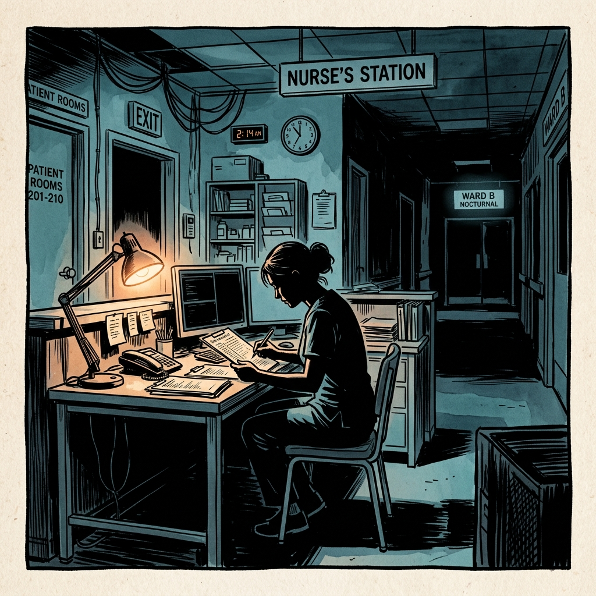
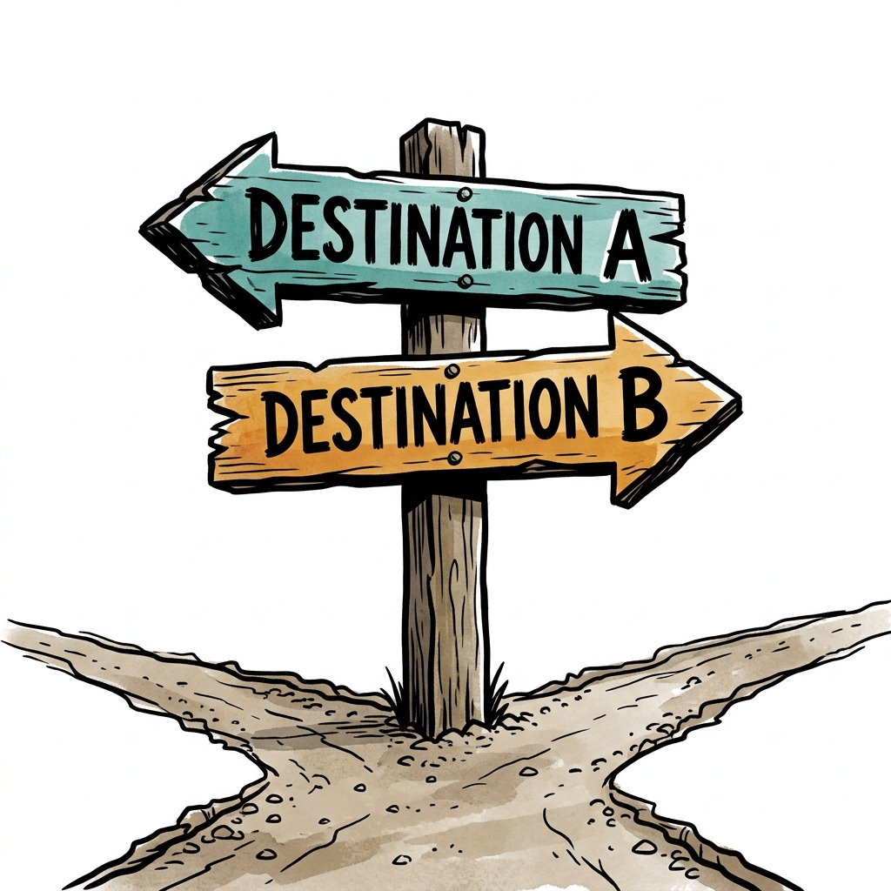
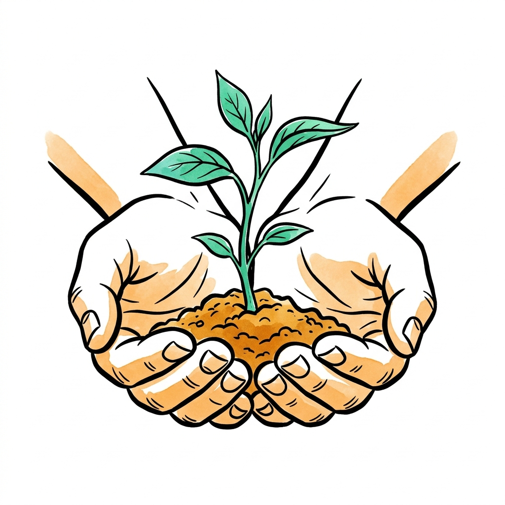
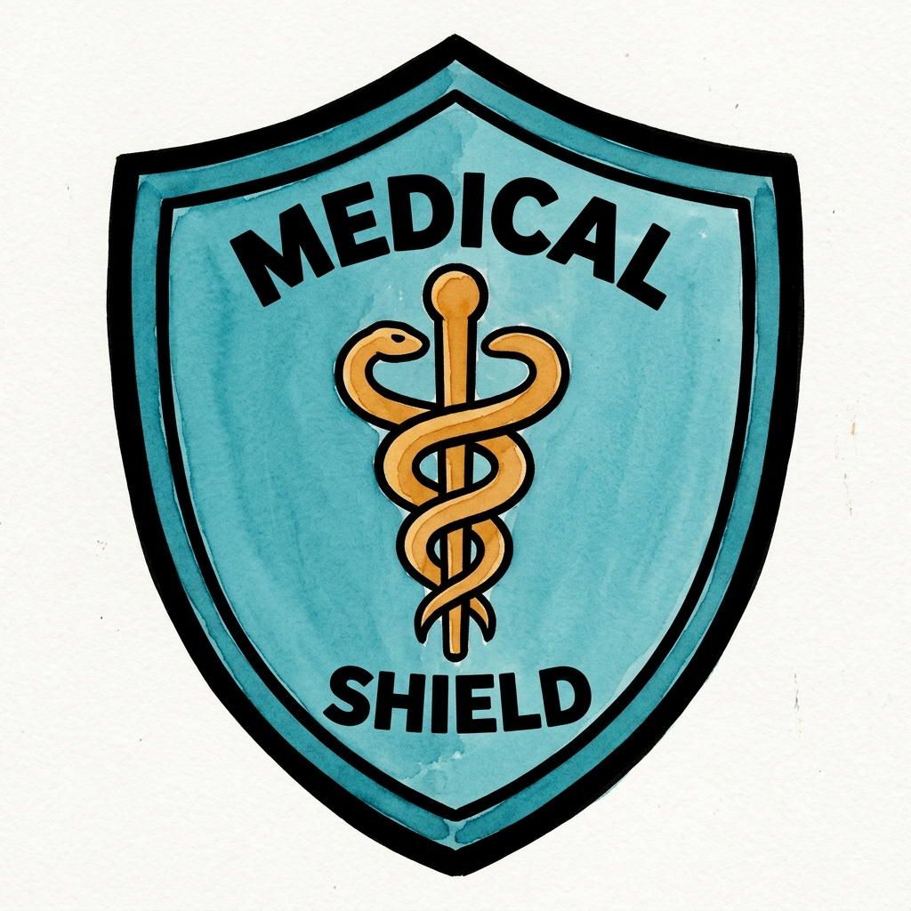
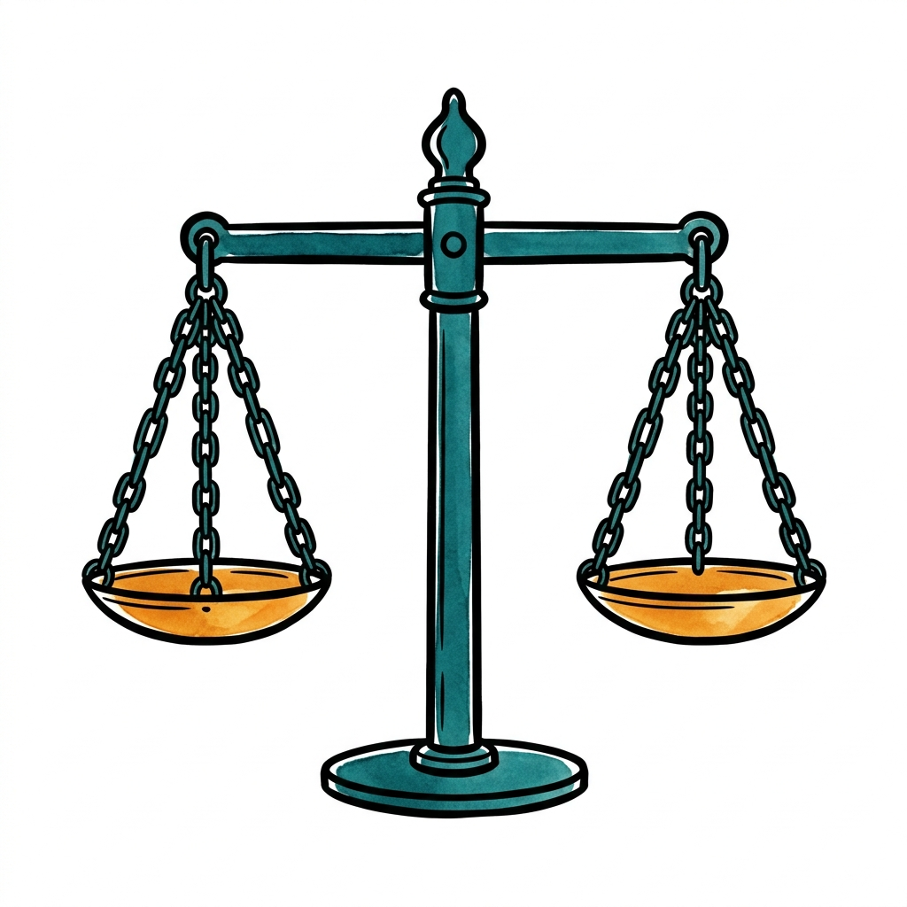

# A Case to Open With {.section-divider}

## A Quiet Tuesday on the Floor

::: {.columns}
::: {.column width="60%"}
::: {.thought-question}
A 34-year-old woman is in the trauma bay after a high-speed crash. Alert, oriented, full capacity. CT shows a grade IV splenic laceration; her hemoglobin has fallen from 13 to 7 in the last hour. The surgeon wants her in the OR, with pre-emptive transfusion. Tucked in her wallet is a signed, dated card declaring her a Jehovah's Witness and refusing all blood products. Her parents have just arrived and are pleading with the team to "do whatever it takes."

You are the nurse at her bedside.

- What questions would you want answered before doing anything?
- Who exactly is asking you to do what?
- What do you think the right move is — and why?
:::
:::
::: {.column width="40%"}
{width="100%" fig-alt="Silhouetted nurse at a desk in a quiet hospital at night"}
:::
:::

## After You've Discussed

::: {.callout-note}
**The legal frame.** U.S. courts have, in nearly every case involving a competent adult, upheld the patient's right to refuse blood — even when refusal is fatal. The harder cases involve **minors**, **pregnancy**, and **unclear capacity**. We will come back to all three later in the course.
:::

::: {.notes}
Let students sit with this. We'll come back to it after we have vocabulary. The whole rest of the lecture is, in a sense, equipping us to answer this question more carefully than "follow your gut."
:::

## Today — Foundations

::: {.learning-outcomes}
By the end of Part A, you will be able to:

- Define [bioethics]{.key-term} and explain why it emerged as a distinct field
- Place bioethics on the map of ethics: **descriptive**, **metaethical**, and **normative** (theoretical vs. practical)
- Distinguish ethical claims from [legal]{.key-term}, [religious]{.key-term}, and [personal-preference]{.key-term} claims
:::

## Today — The Toolkit

::: {.learning-outcomes}
You will also be able to:

- Explain the [four principles]{.key-term} as an *explication of common morality*
- **Balance** and **specify** principles — and say when one may override another
- Diagnose the *source* of a moral conflict, and tell a [moral conflict]{.key-term} from a [moral dilemma]{.key-term}
- Identify premises, conclusions, hidden assumptions, and common fallacies
:::

# What Is Bioethics? {.section-divider}

## A Working Definition

**Bioethics** is the systematic study of ethical questions arising in:

- The care of patients (clinical ethics)
- Biomedical research on humans and animals (research ethics)
- Public health policy and the allocation of scarce resources
- New biotechnologies — genetics, AI, reproductive technology

::: {.notes}
"Systematic" matters. Bioethics isn't just having opinions — it's *reasoning* about them in a way others can examine, challenge, and refine.
:::

## Why a Distinct Field?

A short list of mid-20th-century shocks:

- The **Nazi medical experiments** exposed at Nuremberg (1945–1947)
- The **Tuskegee** syphilis study (1932–1972), in which Black men were left untreated for decades
- New technology that *outran* old norms: ventilators, dialysis, organ transplants, IVF
- Patients and families demanding a voice the old paternalistic model didn't give them

Bioethics is what grew up to answer the question: **how should we govern this?**

## Three Sample Questions

::: {.incremental}
- *Clinical:* Can a 16-year-old refuse chemotherapy her parents want her to have?
- *Research:* Is it ethical to give half the participants a placebo when an effective drug already exists?
- *Policy:* When ICU beds run out in a pandemic, who gets one?
:::

::: {.notes}
Each of these is a recurring exam case. Same field, very different scales — bedside, study, society.
:::

# Three Kinds of Ethical Inquiry {.section-divider}

## Where Bioethics Sits

"Ethics" names three different activities, not one:

| Branch | The question it asks | How it works |
|---|---|---|
| **Descriptive ethics** | What do people *actually* believe and do? | Surveys, history, sociology, psychology |
| **Metaethics** | What *are* moral claims — true? objective? just feelings? | Conceptual and logical analysis |
| **Normative ethics** | What *ought* we to do, and why? | Reasoned argument, principles, theory |

Bioethics draws on all three — but its central job is **normative**.

## Descriptive and Metaethical Questions

[Descriptive ethics]{.key-term} — the *empirical* study of moral belief and behavior. It **reports**; it does not prescribe.

- *Example:* "In one survey, most ICU nurses reported moral distress about treatment they considered futile." A fact about attitudes — not yet a claim about what is right.

[Metaethics]{.key-term} — steps back to ask about morality *itself*.

- *Example:* "When we say 'this is wrong,' are we stating a fact, expressing a feeling, or applying a shared standard?"

::: {.callout-note}
Bioethics **uses** descriptive facts (you cannot weigh a harm you have not measured) and usually **brackets** metaethics — clinicians must act before philosophy settles whether morality is "objective."
:::

## Normative Ethics: Theory and Practice

[Normative ethics]{.key-term} asks which actions, policies, and characters are right — **and what reasons support that**. It works at two levels:

| Level | What it does | Examples |
|---|---|---|
| **Theoretical** | Builds general accounts of rightness | Utilitarianism, Kantian ethics *(Part B)* |
| **Practical / applied** | Brings moral norms into a real domain | **Bioethics**, business ethics, environmental ethics |

- Bioethics is **applied normative ethics**: real cases, real decisions
- It still leans on descriptive facts beneath it and moral theory behind it
- Most of this course lives here: *what should we do for this patient, this study, this policy — and why?*

# Ethics, Law, Religion, Preference {.section-divider}

## Why the Distinctions Matter

Students often collapse these. They are not the same — and confusing them is one of the most common mistakes in bioethical reasoning.

| Type of claim | Source of authority | Question it answers |
|---|---|---|
| **Ethical** | Reasons we can examine and share | What *ought* we to do? |
| **Legal** | Statutes, courts, regulators | What *may* or *must* we do under law? |
| **Religious** | Sacred texts, traditions, communities | What does this faith require? |
| **Preference** | Personal taste | What do *I* happen to want? |

## Ethics vs. Law

The law is not a reliable guide to what is ethical.

- **Slavery** in the United States was *legal* until 1865 — and was monstrously unethical the entire time.
- The Tuskegee study was *legal* in 1932. It was wrong in 1932.
- Conversely, **jaywalking** is illegal in most cities; almost no one thinks it is a moral failing.

::: {.callout-tip}
A useful test for nurses: "Is it legal?" and "Is it the right thing for this patient?" are two different questions. Sometimes the law lags behind ethics; sometimes it overreaches.
:::

## Ethics vs. Religion

Many of our patients — and many of you — draw moral guidance from religious tradition. That is appropriate. But:

- A religious tradition can give *its members* reasons to act, but cannot, on its own, give *non-members* reasons to act.
- Bioethical arguments need to work in a pluralistic society where patients, families, and clinicians come from many traditions and none.

We will treat religious commitments as **important data** about what patients value — not as conversation-stoppers in clinical reasoning.

## Ethics vs. Personal Preference

> "I just don't think it's right."

That is a feeling, not yet an argument. Ethical reasoning asks the next question: **why?** What reason, that another reasonable person could weigh, supports the conclusion?

::: {.notes}
This is the moment to flag that "I feel" / "I believe" are perfectly fine *starting points* — but bioethics asks us to take the next step.
:::

## Thought Question

::: {.thought-question}
A nurse on the L&D floor is asked to assist with a second-trimester abortion for a patient whose fetus has a lethal anomaly. The procedure is legal; her own physician is performing it. The nurse declines on religious grounds and asks to be reassigned. Her hospital has a **conscience clause** — a policy permitting clinicians to opt out of specific procedures — and she has invoked it formally.

- Is what she is doing *legal*? *Ethical*? *Religiously required*? *A personal preference*?
- Could the answers come apart? In what scenario?
- Now imagine the same refusal at 3 a.m. at a small rural hospital with no other nurse on shift. Anything change?
:::

## After You've Discussed

::: {.callout-note}
**Where the duty actually lands.** Most U.S. conscience-clause laws place the duty to *still care for the patient* on the **institution**, not on the individual clinician. That shifts the question from "can she refuse?" to "what does the institution owe the patient when she does?"
:::

# The Four Principles {.section-divider}

Beauchamp & Childress, 1979 — the working framework of clinical ethics for almost fifty years.

## A Brief Origin Story

In the wake of Tuskegee, a U.S. national commission produced the *Belmont Report* (1979) [@belmont1979]. That same year, philosophers **Tom Beauchamp** and **James Childress** published *Principles of Biomedical Ethics* [@beauchamp2019], proposing four principles meant to be:

- **Shared** across ethical traditions
- **Specific enough** to guide clinical decisions
- **General enough** to apply to new technologies

The result is what's often called **principlism** — and it remains the lingua franca of hospital ethics consults [@jonsen1998].

## What the Principles Are Made Of

Beauchamp and Childress did not invent a new morality. They drew the four principles out of the [common morality]{.key-term}.

- **Common morality** — the basic moral norms that essentially *all* morally serious people already accept, across cultures and eras
- It is **pre-theoretical**: you do not need a philosophy course to know it
- It is **shared ground**: a Kantian, a utilitarian, and a religious believer mostly agree on it

I call it **"fourth-grade morality"** — the rules a thoughtful ten-year-old already follows.

## "Fourth-Grade Morality," Made Precise

Norms almost no one seriously rejects — and what each becomes in medicine:

| Rule a child already knows | In the clinic it becomes… |
|---|---|
| "Ask first; don't push people around" | **Autonomy** |
| "Help people who are hurt" | **Beneficence** |
| "Don't hurt people" | **Non-maleficence** |
| "Share fairly; no favorites" | **Justice** |
| "Don't lie; keep your promises" | Truth-telling, consent, fidelity |

- The principles are an **explication** of this shared morality
- *Explication* = take a rough concept we already use and make it precise and usable — *without replacing it*

## Why "Common Morality" Matters

- **Authority** — the principles are not two philosophers' opinions; they restate what we *already* believe
- **Reach** — people who disagree about religion, politics, or theory can still share them
- **Limits** — common morality is *general*: "do no harm" does not tell you whether *this* risky surgery is a harm worth taking

::: {.callout-note}
This is why the four principles are a **starting point, not an answer key**. The real work — coming next — is turning shared general norms into a decision in one specific case.
:::

## 1. Autonomy

::: {.columns}
::: {.column width="60%"}
[Autonomy]{.key-term} — *self-rule.* Respect the patient's right to make informed decisions about her own body and care.

In practice, autonomy underwrites:

- Informed consent
- The right to refuse treatment (even life-saving treatment)
- Truth-telling and honest disclosure
- Confidentiality
:::
::: {.column width="40%"}
{width="90%" fig-alt="3D branching pathway representing choices and autonomy"}
:::
:::

::: {.notes}
The Jehovah's Witness case from the start of class is, at its core, an autonomy case. Hold that thought.
:::

## Autonomy in Practice

::: {.principle-marker}
[Autonomy]{.pill .pill-autonomy}  [self-rule]{.tag}
:::

::: {.context-box}
**The case.** A 28-year-old with type-1 diabetes (A1c 11.2) declines an insulin pump for the third time. She is tired of being told what to do.

**What respecting autonomy looks like here:**

- Make sure she understands the risks — *disclosure*
- Assess decision-making capacity (she has it)
- Document clearly; continue to offer support without coercion

Autonomy is the *floor.* It does not require us to abandon her — only not to override her.
:::

## 2. Beneficence

::: {.columns}
::: {.column width="60%"}
[Beneficence]{.key-term} — *do good.* Act in the patient's best interest; promote welfare.

This sounds obvious until you ask: **whose** account of the patient's good?

- The clinician's professional judgment?
- The patient's own values?
- The family's hopes?

Beneficence and autonomy can pull in opposite directions.
:::
::: {.column width="40%"}
{width="90%" fig-alt="3D abstract helping hand and a flower representing beneficence"}
:::
:::

## Beneficence in Practice

::: {.principle-marker}
[Beneficence]{.pill .pill-beneficence}  [do good]{.tag}
:::

::: {.context-box}
**The case.** An 82-year-old with end-stage heart failure, fifth admission this year. The team recommends comfort-focused care; he wants "everything done." His daughter asks the team to "talk him out of it."

**Whose idea of his good?**

- The team's clinical judgment about prognosis?
- His own stated wishes, formed over a long life?
- His daughter's fear of losing him?

Beneficence is not the same as paternalism. It is the discipline of finding out what *this person* counts as a life worth living — and acting in service of *that.*
:::

## 3. Non-Maleficence

[Non-maleficence]{.key-term} — *first, do no harm* (*primum non nocere*).

::: {.columns}

::: {.column width="60%"}
The oldest principle in Western medicine, traceable to the Hippocratic tradition (5th c. BCE). It does *not* mean "never do anything risky." It means: weigh the harms, and don't expose patients to harm without proportionate benefit.

Every chemotherapy regimen, every surgery, every medication is a deliberate small harm in service of a larger good.
:::

::: {.column width="40%"}
{width="80%" fig-alt="Engraved portrait of Hippocrates by Peter Paul Rubens"}

::: {.attribution}
Hippocrates, engraving by Peter Paul Rubens. Public domain (Wikimedia Commons).
:::
:::

::::

## Non-Maleficence in Practice

::: {.principle-marker}
[Non-Maleficence]{.pill .pill-nonmal}  [do no harm]{.tag}
:::

::: {.columns}
::: {.column width="60%"}
::: {.context-box}
**The case.** A new chemotherapy regimen offers a 30% chance of remission and a 5% chance of fatal cardiotoxicity. Standard care offers neither.

**The principle does not say "never harm." It asks:**

- Is the expected harm **proportionate** to the expected benefit?
- Does the patient understand both sides clearly enough to choose?

Every IV start is a small puncture wound. Every medication has side effects. The principle's job is to forbid *hidden, gratuitous, or disproportionate* risk — not all risk.
:::
:::
::: {.column width="40%"}
{width="90%" fig-alt="3D protective shield representing non-maleficence"}
:::
:::

## 4. Justice

::: {.columns}
::: {.column width="60%"}
[Justice]{.key-term} — *fair distribution of benefits and burdens.*

In bioethics, justice shows up in three main forms:

- **Distributive justice** — who gets the kidney, the ICU bed, the new drug?
- **Procedural justice** — was the *process* fair, even if the outcome is hard?
- **Social justice** — are we honest about the historical and structural causes of health disparities?
:::
::: {.column width="40%"}
{width="90%" fig-alt="3D balanced scale of justice representing fairness"}
:::
:::

::: {.notes}
We'll spend an entire later lecture on justice. For now, just plant the flag: bioethics is not only about individual encounters.
:::

## Justice in Practice

::: {.principle-marker}
[Justice]{.pill .pill-justice}  [treat fairly]{.tag}
:::

::: {.context-box}
**The case.** Two 55-year-olds arrive in the ED with chest pain and no obvious red flags. One is on Medicaid; the other has private insurance. Decades of research show that, on average, they will not get the same workup.

**Justice at the bedside is rarely a kidney allocation decision. It looks like:**

- Are we ordering tests for clinical reasons — or for who the patient appears to be?
- Are our floors and ICUs staffed and supplied equitably?
- Where do *we*, as nurses, push back against disparate care?

Justice asks us to look up from the individual patient and notice the pattern.
:::

## The Four Together

```{mermaid}
flowchart LR
  A[Autonomy<br/>respect choices] --- B[Beneficence<br/>do good]
  B --- N[Non-maleficence<br/>do no harm]
  N --- J[Justice<br/>treat fairly]
  J --- A
  style A fill:#cfe9ec,stroke:#0e7c86,stroke-width:2px
  style B fill:#fce9d6,stroke:#b07d1a,stroke-width:2px
  style N fill:#fad7d2,stroke:#c0392b,stroke-width:2px
  style J fill:#dfe6ee,stroke:#0f172a,stroke-width:2px
```

A *framework*, not an algorithm. The principles tell you what to weigh — not, by themselves, how to weigh it.

## Principles Are *Prima Facie*, Not Absolute

[Prima facie]{.key-term} ("at first sight") — a principle is **binding unless, in this case, it is outweighed** by a stronger competing principle. None of the four is absolute.

[Balancing]{.key-term} — the deliberate **weighing** of competing principles *in the situation in front of you*.

- There is **no fixed ranking**: autonomy does not always beat beneficence, or vice versa
- Balancing is judgment — but not whim: you must give reasons another reasonable person could weigh
- *Example:* a competent patient refuses a feeding tube. Autonomy and non-maleficence pull one way, beneficence the other. Balancing usually favors the refusal — *if the reasons are stated, not just felt*

## When May One Principle Override Another?

Disciplined balancing. Before letting principle **X** override principle **Y**, you should be able to say:

- **Effective** — overriding Y will realistically achieve the aim
- **Necessary** — no weaker option would work
- **Least infringement** — you intrude on Y as little as possible
- **Proportionate** — the good gained outweighs the norm set aside
- **Consistent** — you would judge any relevantly similar case the same way

*Example:* warning one named, seriously threatened person can meet these conditions; announcing a patient's diagnosis "just to be safe" cannot.

## Specification: From General Norm to Working Rule

[Specification]{.key-term} — narrowing a broad principle into concrete, action-guiding rules for particular contexts.

| Specified through… | "Respect autonomy" becomes… |
|---|---|
| **Law** | The right to refuse treatment; informed-consent statutes |
| **Institutional policy** | The hospital's consent form and capacity workflow |
| **Professional codes** | Nursing confidentiality and scope-of-practice duties |
| **Clinical protocol** | When a second clinician must confirm capacity |

- **Balancing** decides *this case*; **specification** builds *standing rules* so we do not re-argue every case from zero

## Why Do Careful People Still Disagree?

Most — though not all — people accept the common morality. So deep disagreement in bioethics is usually **not** good vs. evil. It has four main sources:

| Source | What is really in dispute | Example |
|---|---|---|
| **Facts** | The empirical situation | "*How likely* is this harm?" |
| **Balancing** | How to weigh shared norms here | Autonomy vs. beneficence in a refusal |
| **Specification** | Which concrete rule the norm becomes | What counts as *informed* consent |
| **Deep value clash** | A real disagreement at the margins | The moral status of an embryo |

Naming the source is the first move: a factual dispute is resolved very differently from a values dispute.

## Moral Conflict vs. Moral Dilemma

- [Moral conflict]{.key-term} — moral reasons pull both ways, but one course is, on balance, **better justified**. Most hard cases are like this.
- [Moral dilemma]{.key-term} — there are strong moral reasons for **incompatible** actions and **no clean option**: the better choice still breaks a real obligation.
- [Moral residue]{.key-term} — the regret or duty-to-repair that remains *even when you choose well*. Its presence signals a true dilemma, not just a tough call.

::: {.context-box}
**Example.** Two patients, one ICU bed, equal need. Choosing is not "solving" it — the patient not chosen was still owed care. The residue you feel is *appropriate*, not irrational.
:::

## When Principles Conflict

Most interesting bioethics cases are conflicts *between* principles, not conflicts between good and evil.

- [Autonomy]{.pill .pill-autonomy} vs. [Beneficence]{.pill .pill-beneficence} — the Jehovah's Witness refusing transfusion
- [Beneficence]{.pill .pill-beneficence} vs. [Non-Maleficence]{.pill .pill-nonmal} — risky surgery with a small chance of cure
- [Autonomy]{.pill .pill-autonomy} vs. [Justice]{.pill .pill-justice} — vaccine refusal during a pandemic
- [Beneficence]{.pill .pill-beneficence} vs. [Justice]{.pill .pill-justice} — spending heroic resources on one patient when others wait

The four principles do not resolve these tensions. They make them **visible** so we can argue about them carefully.

## Thought Question

::: {.thought-question}
Return to our trauma-bay patient — full capacity, signed refusal, parents at the door. Now you have vocabulary for what was hard.

- Which principles point *toward* transfusing her? Which point *away*?
- Which counts as the "harm" — letting her die, or doing something to her body she has explicitly refused?
- Which principle would you weight most heavily, and why?
- What single fact, if changed, would change your answer?
:::

## After You've Discussed

::: {.callout-note}
**How the principles typically map.**

- The case is often framed as [Beneficence]{.pill .pill-beneficence} and [Non-Maleficence]{.pill .pill-nonmal} pulling **toward** transfusion, [Autonomy]{.pill .pill-autonomy} pulling **against**.
- But notice the twist: respecting her refusal may itself be the most *beneficent* act, and transfusing a competent patient against her will is itself a form of *harm*.
- The principles do not decide the case. They give us shared language to *argue* about it.
:::

# Reading a Moral Argument {.section-divider}

A skill we will use in every remaining lecture.

## What Is an Argument?

An **argument**, in philosophy, is not a quarrel. It is a structured piece of reasoning:

- One or more **premises** (claims offered as support)
- A **conclusion** (the claim the premises are meant to support)

The job of the careful reader: **find the conclusion first, then the premises, then ask whether the premises are true and whether they actually support the conclusion.**

## Worked Example

A short argument you might hear on the floor:

> *"We have to transfuse her — she'll die otherwise, and our job is to save lives."*

```{dot}
//| fig-width: 6
//| fig-height: 2.4
digraph argument {
  rankdir=TB;
  bgcolor="transparent";
  node [shape=box, style="rounded,filled", fontname="Inter", fontsize=11, color="#94a3b8", fillcolor="#f8fafc", fontcolor="#0f172a", margin="0.15,0.08"];
  edge [color="#64748b", arrowsize=0.7];
  P1 [label="Premise 1\nWithout a transfusion,\nthe patient will die."];
  P2 [label="Premise 2\nOur job is\nto save lives."];
  C  [label="∴  Conclusion\nWe should transfuse her.", fillcolor="#e6f1f2", color="#0e7c86", fontcolor="#0e7c86"];
  P1 -> C;
  P2 -> C;
}
```

## Hidden Assumptions

Sounds airtight — until you notice what's *missing.* That argument quietly assumes:

- "Saving lives" *always* outweighs the patient's other wishes.
- The patient's refusal can be set aside because it's "irrational."
- A nurse's professional duty is identical to "extending biological life."

Each of those is contestable. **Surfacing hidden assumptions** is half the work of bioethics.

## What Is a Fallacy?

A **fallacy** is an error in *reasoning* — an argument that looks like good support but isn't.

- Not the same as a lie. The speaker may sincerely believe it.
- A fallacious argument can still have a **true conclusion** — the defect is in the *structure*, not the conclusion.
- Most bioethics fallacies are **informal**: the form looks fine, but the content misleads through irrelevance, ambiguity, or hidden assumption.

The next two slides cover the six you will see most often.

## Common Fallacies in Bioethics (1/2)

::: {.fallacy-grid}

::: {.fallacy-card}
[Appeal to Nature]{.name}
[Inferring that something is good (or bad) merely because it is natural (or unnatural).]{.defn}
[*"IVF lets older women conceive — but it's unnatural, so it must be wrong."*]{.ex}
:::

::: {.fallacy-card}
[Slippery Slope]{.name}
[Predicting that allowing X will inevitably lead to a much worse Y, without showing how the slide actually happens.]{.defn}
[*"If we permit medical aid in dying for the terminally ill, we'll end up euthanizing the disabled."*]{.ex}
:::

::: {.fallacy-card}
[Ad Hominem]{.name}
[Attacking the person making the argument rather than the argument itself.]{.defn}
[*"You can't take Peter Singer seriously on animal ethics — he holds a lot of unpopular views."*]{.ex}
:::

:::

## Common Fallacies in Bioethics (2/2)

::: {.fallacy-grid}

::: {.fallacy-card}
[Naturalistic Fallacy]{.name}
[Inferring an *ought* directly from an *is* — that what happens in nature shows what should happen morally.]{.defn}
[*"Humans evolved as omnivores, therefore eating meat is morally permissible."*]{.ex}
:::

::: {.fallacy-card}
[False Dichotomy]{.name}
[Framing a complex issue as if there were only two options, when others exist.]{.defn}
[*"Either we let the market ration health care, or the system will collapse."*]{.ex}
:::

::: {.fallacy-card}
[Appeal to Authority]{.name}
[Treating the testimony of an authority as decisive even when they speak outside their expertise — or when other experts disagree.]{.defn}
[*"My favorite podcaster says vaccines cause autism, and he has done a lot of research."*]{.ex}
:::

:::

## Practice — Spot the Fallacy

::: {.thought-question}
Identify the fallacy in each:

1. "Gene editing is wrong — it's playing God."
2. "If we let doctors help patients die, we'll end up euthanizing the disabled."
3. "You can't trust her opinion on vaccines — she's not even a real scientist."
4. "Either we ration care by ability to pay, or the system collapses."
:::

::: {.notes}
Answers (in order): appeal to nature, slippery slope, ad hominem, false dichotomy.
:::

## Wrapping Up Part A

::: {.recap}
Bioethics is the systematic study of moral questions in medicine, research, and policy. It is mostly *applied normative* ethics — distinct from descriptive and metaethical inquiry, and not the same as law, religion, or personal preference. The **four principles** — autonomy, beneficence, non-maleficence, justice — are an explication of the common morality we already share, made usable through **balancing** and **specification**, and they give us a shared vocabulary for the conflicts we'll see all semester. And every claim in this course will be evaluated as an *argument*: premises, conclusion, hidden assumptions, possible fallacies.

In **Part B**, we ask the next question: *where do these principles come from?* We meet the major ethical theories — utilitarian, Kantian, virtue, and care — that ground and sometimes contest the four principles.

<br/>
*All uncredited slide illustrations and scenario visualizations were generated using Gemini.*
:::

## Review Questions

Write a brief answer to each, or use them as discussion prompts.

::: {.review-questions}

::: {.review-item .review-recall}
[Recall]{.review-label}

What is the difference between descriptive ethics, normative ethics, and metaethics, and why is bioethics usually classified as applied normative ethics?
:::

::: {.review-item .review-apply}
[Apply]{.review-label}

A patient with newly diagnosed diabetes says insulin is "unnatural" and wants to rely only on an herbal regimen she found online. Identify the conclusion of her argument, one hidden assumption or fallacy in it, and the main principles a clinician should weigh in responding.
:::

::: {.review-item .review-debate}
[Debate]{.review-label}

In a pluralistic hospital, should policy be justified only with publicly shareable reasons that people across worldviews can assess, or is it legitimate to defend policy openly with religious reasons that not everyone accepts?
:::

:::

## References

::: {#refs}
:::
