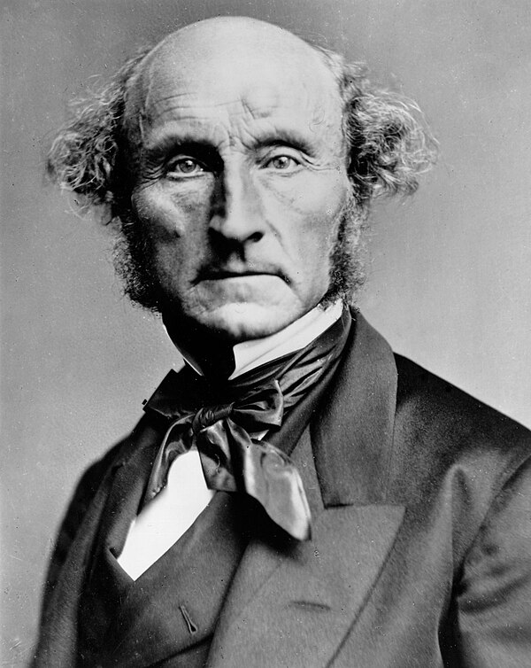
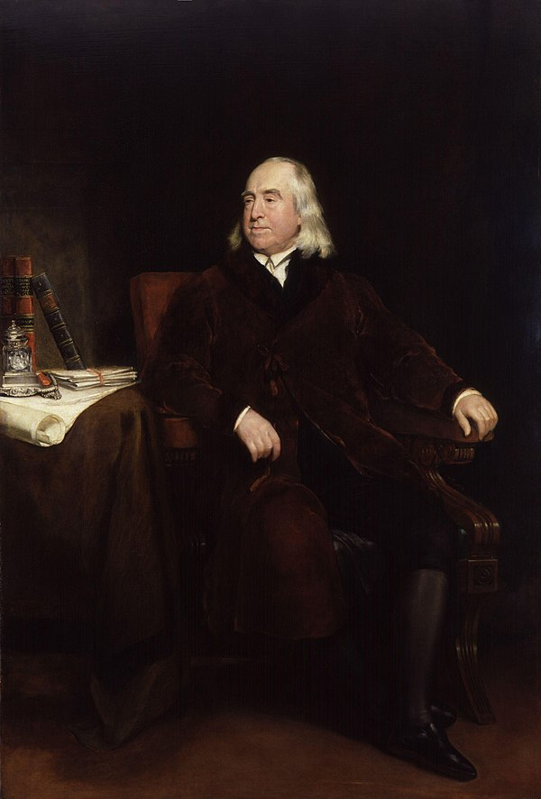
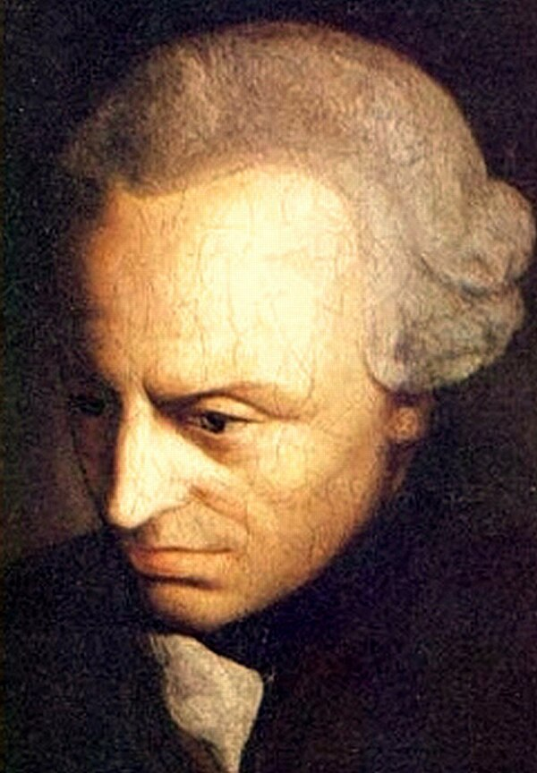
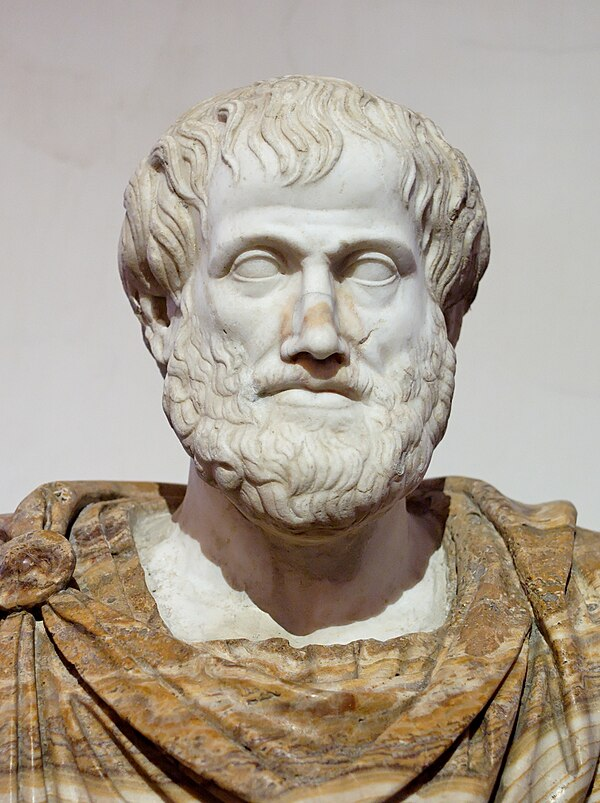

## Bridge from Part A

In Part A we asked: *what* are the four principles, and how do you read a moral argument?

Part B asks the next question:

> **Where do the principles come from — and how do we weigh them when they conflict?**

That is where ethical **theory** comes in.

::: {.learning-outcomes}
By the end of Part B, you will be able to:

- State the core commitment of utilitarian, Kantian, and character/tradition ethics (virtue, care, Confucian, natural law)
- Explain how each grounds or prioritizes the four principles differently
- Trace one contemporary debate — Singer versus O'Neill and Kamm — across global obligation, animals, and the end of life
- Apply at least two lenses to one clinical case and show they diverge
:::

# Why Theory? {.section-divider}

The four principles tell you *what* to weigh. Theories tell you *how.*

## What Theories Do

The four principles — autonomy, beneficence, non-maleficence, justice — give us a shared vocabulary. But they do not, by themselves, tell us which principle to prioritize when they conflict [@beauchamp2019].

Ethical theories fill that gap. Think of them as **lenses**:

- Each focuses on something real
- Each has blind spots
- No single lens sees everything

We will use these lenses throughout the course — not to pick a winner, but to see more of the problem.

## A Roadmap

| Lens | Core question | Key figures |
|---|---|---|
| **Utilitarianism** | What produces the best outcomes for all affected? | Bentham, Mill; Singer |
| **Kantian ethics** | What do we owe persons, regardless of outcome? | Kant; O'Neill, Kamm |
| **Character & traditions** | What kind of person, relationship, and community is good? | Aristotle; Gilligan/Held, Confucius, Aquinas |

The four principles are the shared backdrop all three lenses interpret — differently.

::: {.notes}
Remind students: these will appear in almost every subsequent lecture. Abortion, end of life, justice — each one sees these theories pulling differently.
:::

# Utilitarianism {.section-divider}

*The right action produces the greatest good for the greatest number.*

## Mill and Bentham

:::: {.columns}

::: {.column width="48%"}
{width="72%" fig-alt="Photograph of John Stuart Mill, c.1870"}

::: {.attribution}
J. S. Mill, c. 1870. London Stereoscopic Co. Public domain.
:::
:::

::: {.column width="48%"}
{width="72%" fig-alt="Portrait of Jeremy Bentham by Henry William Pickersgill"}

::: {.attribution}
Jeremy Bentham, by H. W. Pickersgill. Public domain.
:::
:::

::::

## Mill States the Principle

::: {.quote-card}
> "The creed which accepts as the foundation of morals, Utility, or the Greatest Happiness Principle, holds that actions are right in proportion as they tend to promote happiness, wrong as they tend to produce the reverse of happiness. By happiness is intended pleasure, and the absence of pain; by unhappiness, pain, and the privation of pleasure."

::: {.attribution}
J. S. Mill, *Utilitarianism* (1863) [@mill1863]
:::
:::

## The Greatest Happiness Principle

Utilitarianism judges actions entirely by their **consequences**:

- What matters is **welfare** — happiness, well-being, the absence of suffering
- All individuals count equally; no one gets extra weight
- The morally required action is the one that **maximizes** total welfare

Bentham called this the **hedonic calculus** — weigh the pleasures and pains produced, add them up, choose the highest score [@bentham1789].

## Utilitarianism and the Four Principles

[Beneficence]{.pill .pill-beneficence} is central — acting to maximize welfare just *is* acting beneficently.

[Justice]{.pill .pill-justice} emerges from **impartiality**: each person counts as one, so unfair distributions that reduce total welfare are wrong.

[Autonomy]{.pill .pill-autonomy} is valued **instrumentally** — respecting autonomy usually maximizes welfare — but can be overridden when it doesn't.

[Non-Maleficence]{.pill .pill-nonmal} is captured under the harm side of the ledger.

::: {.callout-note}
**The tension.** A strict utilitarian could justify deceiving a patient if the deception produces better outcomes. Most clinicians resist this — which is why other theories matter.
:::

## Utilitarianism: Weighing Harms and Benefits

```{dot}
//| fig-width: 8.5
//| fig-height: 2.5
//| fig-cap: "Utilitarian decision procedure: for each option, estimate the probability and magnitude of every likely outcome (benefits and harms), sum the weighted results, and choose the option with the highest overall expected benefit."
digraph util {
  rankdir=LR;
  bgcolor="transparent";
  graph [nodesep=0.35, ranksep=0.65];
  node [fontname="Inter", fontsize=11, style="rounded,filled", color="#94a3b8",
        fillcolor="#f8fafc", margin="0.14,0.10", shape=box];
  edge [color="#64748b", fontname="Inter", fontsize=10, arrowsize=0.65];

  Q  [label="Which option produces\nbetter expected outcomes?",
      fillcolor="#e6f1f2", color="#0e7c86"];

  A  [label="Drug A\n(aggressive)", fillcolor="#fce9d6", color="#b07d1a"];
  B  [label="Drug B\n(conservative)", fillcolor="#dfe6ee", color="#475569"];

  EA [label="Recovery: likely, benefit large\nSide effects: unlikely, harm serious\n→ Weighted benefit: HIGH",
      fillcolor="#e6f1f2", color="#0e7c86", fontcolor="#0e7c86"];
  EB [label="Recovery: possible, benefit moderate\nSide effects: likely, harm minor\n→ Weighted benefit: MODERATE",
      fillcolor="#f8fafc", color="#94a3b8"];

  R  [label="Prescribe Drug A\n(higher weighted benefit)",
      fillcolor="#cfe9ec", color="#0e7c86", fontcolor="#0e7c86", penwidth=2];

  Q -> A;
  Q -> B;
  A -> EA;
  B -> EB;
  EA -> R [color="#0e7c86", penwidth=1.5];
  EB -> R;

  {rank=same; A; B}
  {rank=same; EA; EB}
}
```

## Thought Question

::: {.thought-question}
A city has 10 ventilators and 15 patients who need one to survive. Five of the fifteen have a much higher probability of surviving with ventilator support.

A utilitarian protocol would allocate ventilators to maximize lives saved — which likely means the five highest-probability patients get priority.

- Is that fair to the other ten patients?
- Does it matter *why* some patients have lower survival odds — age, disability, underlying illness?
- What would the principle of justice say that utilitarianism might miss?
:::

## After You've Discussed

::: {.callout-note}
**The utilitarian reply.** A sophisticated utilitarian can say: the protocol maximizes welfare across the *group*, which is what justice requires. **The critique** is that it treats some lives as worth less, and that the reasons behind lower survival odds (disability, chronic illness) are often tied to existing inequities. We will return to this when we take up public health ethics and the just allocation of care.
:::

# Utilitarianism in Practice: Peter Singer {.section-divider}

## Utilitarianism, Followed All the Way

- Peter Singer is the most influential living utilitarian, known for following the theory's logic wherever it leads [@singer_practical].
- He defends [preference utilitarianism]{.key-term}: an act is right if it best satisfies the preferences of everyone affected, counted impartially.
- His master rule is the [principle of equal consideration of interests]{.key-term}: like interests get equal weight no matter whose they are.
- Impartiality is literal — your interests get no extra weight for being *yours*, your family's, your country's, or your species'.
- This makes the theory powerful *and* uncomfortable: it generates strong, sometimes radical, real-world obligations.

## Singer on Global Obligations

::: {.context-box}
**The drowning child.** You pass a shallow pond where a small child is drowning. Wading in ruins your expensive shoes — obviously you must save her. Singer asks: why is a child dying of a preventable disease overseas any different? [@singer_famine]
:::

- His principle: if we can prevent something very bad **without sacrificing anything of comparable importance**, we must — and distance does not change that.
- It launched the **effective altruism** movement: give substantially, where each dollar does the most good.
- The standard pushback is the **demandingness objection** — strictly applied, it seems to require giving until you are nearly as badly off as those you help.

## Singer on Animals

- In *Animal Liberation* (1975), Singer extended equal consideration beyond our own species [@singer_animal].
- The morally relevant feature is **sentience** — the capacity to suffer — not intelligence, language, or species.
- Giving humans' interests automatic priority over animals' like interests is [speciesism]{.key-term}, which he argues is, in form, like racism or sexism.
- This is *not* the claim that animals and humans are equal in all respects — only that comparable suffering deserves comparable weight.
- On these grounds he judges factory farming and much animal research to be vast, unjustified harm.

## Singer at the Edges of Life

- Singer separates being **biologically human** from being a [person]{.key-term} — a self-aware being with preferences about its own future.
- The wrongness of killing then tracks personhood and preferences, not species membership by itself.
- So he holds **abortion** permissible (an early fetus is not yet a person) and defends **voluntary euthanasia**.
- Most controversially, he argues that for some severely impaired newborns, ending life may be permissible.
- The **disability-rights objection** is sharp — this rates disabled lives as lower-value, a challenge we return to later.

::: {.notes}
Why teach the hardest case: Singer matters precisely because he refuses to stop where intuition gets uncomfortable. This slide is the hinge — the next section asks whether "follow the calculation wherever it leads" is the right method at all.
:::

# Kantian Ethics {.section-divider}

*Act from duty — treat persons always as ends, never merely as means.*

## Kant

::: {.columns}

::: {.column width="42%"}
{width="80%" fig-alt="Painted portrait of Immanuel Kant"}

::: {.attribution}
Immanuel Kant, painted portrait. Public domain (Wikimedia Commons).
:::
:::

::: {.column width="55%"}
**Immanuel Kant (1724–1804)** argued that morality is grounded in **reason**, not consequences.

The key test is his [Categorical Imperative]{.key-term} — a rule for whether an action is morally permissible, applied *before* you look at outcomes.
:::

::::

## The Humanity Formulation

The most clinically relevant form of the Categorical Imperative [@kant1785]:

::: {.quote-card}
> "Now I say: man and generally any rational being exists as an end in himself, not merely as a means to be arbitrarily used by this or that will.… So act as to treat humanity, whether in thine own person or in that of any other, in every case as an end withal, never as means only."

::: {.attribution}
Kant, *Groundwork of the Metaphysic of Morals* (1785), trans. T. K. Abbott [@kant1785]
:::
:::

## What the Formula Demands

- Every person has **dignity** — an unconditional worth that cannot be weighed against anyone else's benefit.
- To deceive, manipulate, or coerce a patient is to use them as a *mere means*, even when the outcome is good.
- **Informed consent** is therefore not mere policy or paperwork; it is a direct moral requirement.
- A competent patient may decline what is medically best, because respect does not depend on agreeing with the choice.
- The duty has a limit: where rational agency is genuinely impaired, treating someone as an end can require *protecting* them, not only deferring to them.

## Kantian Ethics and the Four Principles

[Autonomy]{.pill .pill-autonomy} is Kant's **central** principle — respecting autonomy is what it means to treat persons as ends.

[Non-Maleficence]{.pill .pill-nonmal} reflects the duty not to harm persons who have inherent dignity.

[Beneficence]{.pill .pill-beneficence} is a genuine duty, but cannot override autonomy — benefiting someone by deceiving them is still wrong.

[Justice]{.pill .pill-justice} flows from treating persons equally as ends — no one's dignity is worth more than another's.

::: {.callout-note}
**Contrast with utilitarianism.** Kant would say: you must never lie to the Jehovah's Witness patient about her prognosis to get her to consent, *even if* lying would save her life.
:::

## Kantian Ethics: Perfect and Imperfect Duties

```{dot}
//| fig-width: 9.5
//| fig-height: 2.8
//| fig-cap: "Perfect duties (amber, from the humanity principle) are absolute constraints checked first — any violation makes the action impermissible. The imperfect duty to benefit the patient comes after: it must be fulfilled in some form, but the clinician has latitude in how."
digraph kant {
  rankdir=LR;
  bgcolor="transparent";
  graph [nodesep=0.5, ranksep=0.65];
  node [fontname="Inter", fontsize=11, margin="0.13,0.10"];
  edge [color="#64748b", fontname="Inter", fontsize=10, arrowsize=0.65];

  A  [label="Proposed clinical action\n(e.g., withhold\nbad news to spare distress)",
      shape=box, style="rounded,filled", fillcolor="#e6f1f2", color="#0e7c86"];

  Q  [label="Perfect duties\n(humanity principle):\nRespect autonomy?\nAvoid harm?\nTreat justly?",
      shape=diamond, style=filled, fillcolor="#fff3cd", color="#b07d1a", fontsize=10];

  W  [label="IMPERMISSIBLE\nPatient treated as\nmere means",
      shape=box, style="rounded,filled", fillcolor="#fad7d2",
      color="#c0392b", fontcolor="#9d2f23", penwidth=2];

  Imp [label="Imperfect duty:\nbenefit / aid the patient\n(must be fulfilled;\nhow is flexible)",
       shape=box, style="rounded,filled", fillcolor="#fce9d6", color="#b07d1a"];

  How [label="Deliberate:\nhow to best fulfill\nthis duty here",
       shape=box, style="rounded,filled", fillcolor="#dfe6ee", color="#475569"];

  Act [label="ACT\n(latitude in method,\ntiming, approach)",
       shape=box, style="rounded,filled",
       fillcolor="#e6f1f2", color="#0e7c86", fontcolor="#0e7c86", penwidth=2];

  A   -> Q;
  Q   -> W   [label="Any violated", color="#c0392b", fontcolor="#c0392b"];
  Q   -> Imp [label="All pass"];
  Imp -> How;
  How -> Act;

  {rank=same; Q; W}
}
```

## Thought Question

::: {.thought-question}
A patient with severe depression has been refusing an antidepressant. His psychiatrist suspects the refusal is itself a symptom of the illness — that his depression is preventing him from appreciating how treatment could help him.

- Does the Kantian view help here — or complicate it?
- When, if ever, does treating the illness require overriding the patient's expressed wishes?
- How is this different from the Jehovah's Witness case?
:::

## After You've Discussed

::: {.callout-note}
**The Kantian tension.** Kant's framework requires that the patient be capable of rational self-governance for autonomy to apply fully. If the illness itself impairs that capacity, overriding expressed wishes *may* be consistent with treating him as an end — but this reasoning can also be abused to justify paternalism. **Decision-making capacity assessment** is how clinical ethics tries to hold this line carefully.
:::

# The Nonconsequentialist Reply {.section-divider}

## Answering Singer

- If Singer is utilitarianism with the gloves off, the Kantian tradition is the main reply.
- The **separateness of persons**: people are not interchangeable vessels of welfare, so a serious harm to one is not cancelled by benefits to others.
- Morality includes **constraints**: using, deceiving, or killing an innocent person can be wrong *even when* it would maximize good.
- **Doing vs. allowing**: actively harming someone differs from failing to benefit a stranger — so the "distance and numbers don't matter" move is contested.
- The reply is not "ignore consequences"; it is "consequences are not the *only* moral currency."

## Kantian Ethics and "Just Sign Here"

- A utilitarian can accept a rushed or spun consent if the outcome is good; a Kantian cannot.
- Treating a patient as an *end* means the consent process must be one a reasonable person could actually trust [@oneill_autonomy].
- That rules out manipulation, euphemism, and "technically true" disclosure — even when they would steer the patient toward the better outcome.
- It shifts the question from "did they sign?" to "did we give them what they would need to decide for themselves?"
- Practical upshot: honest disclosure and trustworthy institutions are obligations, not customer service.

## Why You Can't Harvest One to Save Five

- Five patients will die without organs; one healthy person in the waiting room is a match — the arithmetic says harvest.
- Kantian ethics says no, flatly: a person is not a resource, even when the numbers are overwhelming [@kamm_bioethical].
- *How* a harm comes about matters — **intending** a death differs from **foreseeing** it, which is why pain relief that may shorten life can still be permissible.
- You also have **prerogatives**: you need not sacrifice everything to maximize good, so Singer's unlimited demand is rejected.
- The bedside payoff: some lines — deceiving, using, or killing a patient — hold even when crossing them would help more people.

## Singer vs. Kantian Ethics, Side by Side

| Issue | Singer (preference utilitarian) | Kantian ethics (constraints, dignity) |
|---|---|---|
| **Global poverty** | Strong duty to give; distance irrelevant; very demanding | A real but bounded duty to aid; owed first to particular others |
| **Animals** | Equal consideration of like interests; speciesism is a bias | Treatment is still constrained, but duties often track rational agency |
| **End of life** | Personhood and preferences decide; voluntary euthanasia permissible | Persons have dignity; you may not use or kill a person for net benefit |
| **Method** | Sum the interests, choose the maximum | Apply constraints first; numbers do not settle everything |

Same cases, different moral currency — which is why we keep both lenses on the table.

# Character & Traditions {.section-divider}

*The third lens: not "what rule?" or "what calculation?" but "what kind of person, relationship, and community is good?"*

## One Family, Four Traditions

These traditions judge the *agent and the relationship*, not only the isolated act — but they differ sharply:

- **Aristotelian virtue ethics** — flourishing through stable, cultivated traits of character.
- **Care ethics** — morality begins in concrete, dependent relationships; even Beauchamp and Childress list *care* among the focal virtues [@beauchamp2019].
- **Confucian ethics** — the self is constituted by roles and relationships, refined through lifelong practice [@fan_confucian].
- **Natural law** — reason discerns the basic human goods every life needs, and the duty to pursue them [@gomezlobo_naturallaw].

## Aristotle and Eudaimonia

::: {.columns}

::: {.column width="42%"}
{width="80%" fig-alt="Marble bust of Aristotle, Altemps Collection"}

::: {.attribution}
Aristotle (copy of Lysippos bust). Palazzo Altemps. Public domain.
:::
:::

::: {.column width="55%"}
Aristotle asked not "what should I do?" but "what kind of person should I be?" [@aristotle_ne]

[Eudaimonia]{.key-term} — often translated *flourishing* — is the goal of human life: living and acting in accordance with the virtues of a fully developed human being.

A virtue is a **stable character trait** — developed through practice — that reliably disposes a person to act and feel well.
:::

::::

## The Virtues of the Good Nurse

Virtue ethics is especially useful in professional ethics, because professions define **role-specific excellences**.

The ANA Code of Ethics [@ana2015] describes the good nurse as someone who embodies:

- **Compassion** — genuine concern for the patient's suffering
- **Integrity** — consistency between values and actions, even under pressure
- **Fidelity** — keeping commitments made to patients and profession
- **Practical wisdom** (*phronesis*) — knowing how to apply general principles to particular situations

These are not policies. They are traits you develop by practicing them.

## Virtue Ethics and the Four Principles

Virtue ethics asks: what would a *person of good character* do in this situation?

[Beneficence]{.pill .pill-beneficence} — the virtuous clinician genuinely *cares* about the patient's good, not just follows protocols.

[Non-Maleficence]{.pill .pill-nonmal} — integrity means honesty about what you can and cannot do.

[Autonomy]{.pill .pill-autonomy} — respect for persons flows from compassion and fidelity, not just rules.

[Justice]{.pill .pill-justice} — fairness requires the virtue of impartiality even toward patients you find difficult.

## Virtue Ethics: The Cycle of Character Development

```{dot}
//| fig-width: 9
//| fig-height: 2.4
//| fig-cap: "Virtue ethics is developmental — good character is built through repeated intentional action, not rule-following. The dashed return edge marks the cycle: over time, virtuous action becomes more natural and less effortful."
digraph virtue {
  rankdir=LR;
  bgcolor="transparent";
  graph [nodesep=0.4, ranksep=0.55];
  node [fontname="Inter", fontsize=11, style="rounded,filled",
        color="#94a3b8", fillcolor="#f8fafc", margin="0.14,0.10", shape=box];
  edge [color="#64748b", fontname="Inter", fontsize=9, arrowsize=0.7];

  A [label="Ask: what would a\nvirtuous nurse do?",
     fillcolor="#e6f1f2", color="#0e7c86"];
  B [label="Deliberate:\nwhat does this\npatient need?",
     fillcolor="#fce9d6", color="#b07d1a"];
  C [label="Act with compassion,\nintegrity, fidelity",
     fillcolor="#e6f1f2", color="#0e7c86"];
  D [label="Reflect on outcomes\nand relationships",
     fillcolor="#dfe6ee", color="#475569"];
  E [label="Character deepens;\nphronesis grows",
     fillcolor="#fce9d6", color="#b07d1a"];

  A -> B -> C -> D -> E;
  E -> A [style=dashed, label="more natural\nover time",
          fontsize=9, color="#94a3b8", fontcolor="#64748b",
          constraint=false];
}
```

## Care as a Virtue

- Care ethics treats responsiveness to others as a cultivated disposition, not a rule to apply.
- It grew from Carol Gilligan's claim that mainstream theory missed a whole moral "voice" [@gilligan1982].
- Virginia Held built it into a full account in which **relationship and dependency** are morally basic [@held2006].
- The good clinician's *care* is itself a trait — attentiveness, responsiveness, responsibility — like an Aristotelian virtue.
- Its risk mirrors its strength: relationships can be unequal or controlling, so care still needs justice.

## Gilligan and the Ethics of Care

Carol Gilligan [@gilligan1982] argued that dominant moral theories — utilitarian and Kantian — were built around **abstract rules** applied to strangers. They missed what actually structures most moral life: **relationships, dependency, and the responsibility that comes with them**.

> "[T]he moral problem arises from conflicting responsibilities rather than from competing rights and requires for its resolution a mode of thinking that is contextual and narrative rather than formal and abstract."
> — Gilligan, *In a Different Voice* (1982)


## Care Ethics: The Web of Relationships

```{dot}
//| fig-width: 7.5
//| fig-height: 2.8
//| fig-cap: "Care ethics centers the patient within a web of concrete relationships. Moral obligations arise from these particular connections — not from abstract rules applied to strangers. The nurse–patient relationship (bold edge) is the immediate site of care."
digraph care {
  rankdir=LR;
  bgcolor="transparent";
  graph [nodesep=0.3, ranksep=0.65];
  node [fontname="Inter", fontsize=9, style="rounded,filled",
        color="#94a3b8", fillcolor="#f8fafc", margin="0.12,0.09", shape=box];
  edge [arrowhead=none, color="#94a3b8"];

  // Clinical / professional context (left)
  N  [label="Nurse /\nClinician",    fillcolor="#fce9d6", color="#b07d1a", penwidth=2];
  T  [label="Healthcare\nteam",      fillcolor="#fce9d6", color="#b07d1a"];
  Pr [label="Professional\nobligations", fillcolor="#f8fafc", color="#94a3b8"];

  // Center
  C  [label="Patient\n(clinical situation)",
      fillcolor="#e6f1f2", color="#0e7c86", fontcolor="#0e7c86",
      penwidth=3, fontsize=10];

  // Personal / social context (right)
  F  [label="Family &\nloved ones",  fillcolor="#dfe6ee", color="#475569"];
  Cm [label="Community\n& culture",  fillcolor="#dfe6ee", color="#475569"];
  H  [label="Personal history\n& values", fillcolor="#f8fafc", color="#94a3b8"];

  {rank=same; N; T; Pr}
  {rank=same; F; Cm; H}

  N  -> C [penwidth=2.5, color="#b07d1a"];
  T  -> C;
  Pr -> C;
  C  -> F;
  C  -> Cm;
  C  -> H;
}
```

## Confucian Virtue Ethics

- One of the world's oldest virtue traditions, increasingly important as care globalizes [@fan_confucian].
- **Ren** (benevolence, humaneness) is the central virtue: wholehearted concern for others.
- **Li** (ritual propriety) governs how that concern is expressed appropriately within each relationship.
- **Xiao** (filial piety) makes obligations to parents and family morally fundamental, not optional sentiment.
- The self is **relational and role-constituted** — always someone's child, parent, or clinician — and the exemplar (**junzi**) is formed over a lifetime of practice.

## Confucian Ethics in the Clinic

- The Confucian frame changes what "respecting the patient" looks like in practice.
- Decisions are often **family-determined**: the family, not the solitary patient, is the natural decision unit.
- This collides with Western informed consent — e.g., a family asking that a grave diagnosis not be told directly to an elder.
- It is not simply paternalism: it expresses *xiao* and a duty to shield a loved one from a crushing burden.
- So it reframes autonomy as **relational** rather than individual — a theme that returns when we discuss cross-cultural truth-telling.

## Natural Law

- Rooted in Aristotle and developed by the Catholic theologian Aquinas: reason can read how we ought to live from the goods proper to human nature [@gomezlobo_naturallaw].
- Its first principle is to **do good and avoid evil**: pursue, and never act directly against, the basic human goods.
- Those **basic goods** include life and health, knowledge, friendship, and reasonable practical judgment.
- Right action respects *every* basic good — you may not destroy one good simply to promote another.
- It is **secular in form** (argued from reason and human nature) yet underlies the **sanctity-of-life** language especially common in Catholic bioethics.

## Natural Law in Bioethics

- Natural law gives bioethics one of its most-used tools: the **Doctrine of Double Effect (DDE)**.
- DDE permits an act with a grave bad side effect *if* the harm is foreseen but not intended and the good is proportionate.
- Classic case: opioid doses that relieve pain (intended) while possibly hastening death (foreseen) — permissible.
- The same logic shapes Catholic health systems on end-of-life and reproductive care.
- It draws a line utilitarianism rejects and Kant/Kamm rebuild differently — *intending* harm vs. *allowing* it; applied later to palliative sedation in end-of-life care.

## Four Strands of Character Ethics

| Strand | Central idea | Key figure(s) | Bioethics payoff |
|---|---|---|---|
| **Aristotelian** | Flourishing through virtuous character | Aristotle | The virtues of the good clinician |
| **Care** | Morality begins in relationship | Gilligan, Held | The bedside relationship is not a checklist |
| **Confucian** | The self is role- and family-constituted | Confucius; Fan | Family-centered decisions; relational autonomy |
| **Natural law** | Reason discerns basic human goods | Aquinas | Double effect; sanctity-of-life arguments |

## Thought Question

::: {.thought-question}
A 78-year-old woman with mild cognitive impairment makes decisions that worry her adult children. She insists on living alone; she sometimes forgets meals; she declines the assisted living facility they have arranged.

- A utilitarian weighs her risk profile and long-term welfare; a Kantian asks about her decision-making capacity; the character lenses ask what a caring daughter, a virtuous clinician, or a filial family would do.
- What do the **relationship-centered** traditions (care, Confucian) add that the act-focused theories miss?
- Is there anything they might **obscure**?
:::

## After You've Discussed

::: {.callout-note}
**What the relational lenses add.** They center the *relationship* and her embeddedness in family and community — her story, not just her risk score; the Confucian frame even treats the family as a proper decision-maker. **What they can obscure:** a caring family can also be a controlling one, so these lenses still need *justice* to ask whether the relationships are themselves fair. This is why the four principles are used alongside the theories, not replaced by any single one.
:::

# Putting It Together {.section-divider}

Four lenses. One case. Different things come into view.

## The Theories as Lenses

| Lens | Foundational commitment | Role of the four principles |
|---|---|---|
| Utilitarianism | Maximize welfare for all affected | Principles are *derived* — follow them because doing so usually produces the best outcomes |
| Kantian ethics | Respect persons as ends | Principles are *duties* grounded in rational dignity — especially autonomy |
| Character & traditions | Cultivate good character and right relationship | Principles are *expressions* of virtue and relationship — wisdom and context tell you how to apply them |


## Which Theory Is Right?

Probably none of them — completely. Each illuminates something the others miss:

- Utilitarianism sees the **population** and the aggregate — Singer shows how far that reaches.
- Kantian ethics sees the **dignity** of the individual that cannot be traded away — O'Neill and Kamm rebuild the constraints.
- The **character and tradition** lenses see the clinician's virtue, the bedside relationship, and the family and community that abstract rules erase.

The four principles work in part because they are *theory-agnostic*: a Kantian and a utilitarian can both endorse autonomy, beneficence, non-maleficence, and justice — they just disagree about why and how to weight them.

## Wrapping Up

::: {.recap}
Bioethics uses a **four-principle framework** as its shared vocabulary, supported by major ethical theories that answer *how to weigh* those principles differently. Utilitarianism focuses on outcomes and aggregate welfare — Singer pushes that logic to its hardest conclusions. Kantian ethics focuses on duties and the dignity of persons — O'Neill and Kamm answer Singer by rebuilding moral constraints. The character traditions — virtue, care, Confucian, and natural law — focus on the kind of person, relationship, and community we should sustain. No single theory is correct; used as lenses, they let us see more of what is morally at stake in any clinical situation.

**Next**, we turn to the history that gave these principles their urgency, and the clinical relationship where they are daily tested.
:::

## Review Questions

Write a brief answer to each, or use them as discussion prompts.

::: {.review-questions}

::: {.review-item .review-recall}
#### Recall

What makes an action right for a utilitarian, for a Kantian, and for a virtue or care ethicist?
:::

::: {.review-item .review-apply}
#### Apply

A clinician considers giving a placebo pill without disclosing it to a patient with chronic pain because it may relieve symptoms and seems harmless. How would a utilitarian, a Kantian, and a care or virtue ethicist evaluate that choice?
:::

::: {.review-item .review-debate}
#### Debate

Should global-health funding be directed mainly by cost-effectiveness calculations that maximize total benefit, or should relationship-based duties, local priorities, and historical injustice sometimes override that math?
:::

:::

## References

::: {#refs}
:::
