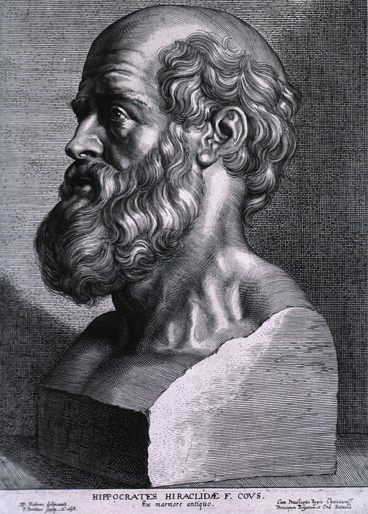
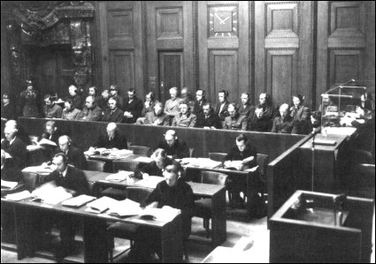

# A Case to Open With {.section-divider}

## A Study You Should Refuse

::: {.thought-question}
You are a physician asked to help run a syphilis study.

- The subjects are poor Black men in Alabama.
- They are told they have "bad blood," not syphilis.
- Penicillin now works, but the study keeps going.
- Your supervisors say the knowledge will help future patients.

Do you stay in the study? If not, what principle tells you to walk away?
:::

## After You've Discussed

::: {.callout-note}
**Hold onto your answer.** Several of the reasons you gave for walking away were not obvious to physicians at the time. They had to be learned case by case, and eventually written down. Part A traces how that happened.
:::

::: {.notes}
Start with moral discomfort before giving students the vocabulary. The point is to make the historical material feel like an answer to a real problem they already feel.
:::

## Today

::: {.learning-outcomes}
By the end of Part A, you will be able to:

- Trace the move from "doctor knows best" to patient consent
- Tell what actually happened in the Carrie Buck, Nuremberg, Willowbrook, and Tuskegee cases
- Explain which protection each scandal forced into existence
- Compare the Nuremberg Code, Helsinki, and the Belmont Report
- Explain why IRBs and ethics committees exist today
:::

# The Old Deal: Doctor Knows Best {.section-divider}

## The Deal in One Sentence

:::: {.columns}

::: {.column width="58%"}
For most of Western medical history the arrangement was simple: the doctor decided, the patient trusted, and no one else asked questions. It traces back to the Hippocratic tradition of the 5th century BCE, which framed medicine as a moral calling with real duties — to help the sick, to avoid harm, and to keep confidences. What it did *not* include was any idea that the patient should be informed or asked. The name for caring *for* someone by deciding *for* them is [paternalism]{.key-term}, and it was the default for roughly 2,400 years.
:::

::: {.column width="42%"}
{width="78%" fig-alt="Engraving of Hippocrates"}

::: {.attribution}
Hippocrates of Kos. Public domain. [@hippocraticoath_nlm]
:::
:::

::::

## The Oath: Myth vs. Fact

| What people think it says | What it actually says |
|---|---|
| "First, do no harm" | That phrase is from *Epidemics*, not the Oath; the Oath says to help and not injure |
| It centers the patient's rights | It is sworn to Apollo and Asclepius and binds the physician to a *guild* of teachers and students |
| Doctors may do whatever heals | It **forbids** giving a deadly drug, providing an abortive remedy, and performing surgery ("cutting for stone") |
| It established informed consent | Consent, disclosure, and patient choice appear **nowhere** in it |

The Oath gave medicine a conscience and a professional identity — but the patient in it is silent.

## What Paternalism Got Right — and Wrong

:::: {.columns}

::: {.column width="50%"}
**It was not simply arrogance.** Clinicians genuinely did know more, emergencies genuinely did demand fast judgment, and frightened patients often *wanted* a confident recommendation rather than a menu of options. Medicine cannot function without expert judgment, and a purely hands-off clinician would also fail the patient.
:::

::: {.column width="50%"}
**But the model had no brakes.** Expertise slid easily into domination, and good intentions could quietly mask coercion. The patient became an object that medicine acted *upon* rather than a person it reasoned *with* — and when the profession policed only itself, it tended to protect its own reputation first.
:::

::::

## A Bedside Moment

::: {.context-box}
**Protective lying.** A physician tells the family of a seriously ill man, "Don't tell him it's cancer yet — he'll give up." Everyone in the room means well, and for most of medical history this was considered good practice, even kind.

- Is this kindness, or is it control?
- Is it beneficence — or a failure of respect dressed up as beneficence?
- The patient is the only person not in the conversation about his own life. What is missing from this encounter?
:::

::: {.notes}
Paternalism was usually defended as expertise plus benevolence, not cruelty. That is exactly why it lasted so long — and why the abuses ahead were so hard to see from the inside.
:::

# When Medicine Serves the State {.section-divider}

## The Idea Called Eugenics

- [Eugenics]{.key-term} was the belief that society could be improved by controlling who is allowed to reproduce — encouraging the "fit" and preventing the "unfit."
- It was not fringe pseudoscience: it was taught at major universities, funded by foundations, and run from Charles Davenport's Eugenics Record Office at Cold Spring Harbor (1910).
- Roughly 32 U.S. states passed sterilization laws, and an estimated 60,000+ Americans were sterilized without meaningful consent.
- Its targets were the people with the least power: disabled people, the poor, immigrants, and Black and Indigenous Americans.
- Nazi Germany's 1933 sterilization law was modeled in part on these American statutes — especially California's.

## Carrie Buck, Age 17

- In Virginia in 1924, Carrie Buck was a poor 17-year-old who had been placed with a foster family.
- She became pregnant after being raped by a relative of that family.
- To hide the family's shame, she was labeled "feebleminded" and committed to a state institution.
- Her infant daughter, Vivian, was judged "defective" by a social worker who observed the baby for only a few minutes.
- In fact Carrie was of ordinary intelligence, and Vivian later made her school's honor roll before dying young.

## "Three Generations of Imbeciles"

::: {.quote-card}
> "It is better for all the world if, instead of waiting to execute degenerate offspring for crime or to let them starve for their imbecility, society can prevent those who are manifestly unfit from continuing their kind.… Three generations of imbeciles are enough."

::: {.attribution}
Justice Oliver Wendell Holmes Jr., *Buck v. Bell* (1927), 8–1 decision [@buck1927]
:::
:::

The Court did not merely permit Carrie's sterilization — it endorsed the reasoning. *Buck v. Bell* has never been formally overturned. Here, the law did not fail to stop the harm; the law **ordered** it.

## The Scoreboard So Far

| Scandal | What was missing | The rule we got |
|---|---|---|
| **Eugenics & Carrie Buck (1927)** | Your body is yours; the state cannot breed people | **Nothing yet — the courts called this legal** |

::: {.notes}
The scoreboard is our running spine. Each disaster leaves a gap; later, a code fills it. Right now the gap is wide open.
:::

## Thought Question

::: {.thought-question}
You are the physician at the Virginia institution in 1927. The court order to sterilize Carrie has arrived.

- Your supervisor calls it legal, routine, and "kind to society."
- You suspect Carrie's "feeblemindedness" is really poverty and a pregnancy from rape.

1. Do you perform the operation? If you refuse, what are you appealing to — the law says *you* are the one in the wrong.
2. Would it change anything if Carrie herself said yes? Could she give real consent in this situation?
3. The state's reasoning is "fewer 'unfit' children means a better society." What is wrong with that argument even when it is sincere?
:::

## Make It Contemporary

::: {.thought-question}
This is not safely in the past:

- 2006–2010: about 150 women in California prisons were sterilized, many under pressure and without proper approval.
- 2017: a Tennessee judge offered reduced jail time to inmates who agreed to a vasectomy or a long-acting contraceptive.

Same question: where is the line between an *offer*, *pressure*, and *coercion* — and who is too constrained to truly say yes?
:::

## After You've Discussed

::: {.callout-note}
Three things to draw out:

- **"Legal" did not mean "right."** *Buck v. Bell* has never been formally overturned — law can lag ethics by decades.
- **Consent does not erase coercion.** A "yes" from a confined, dependent person may not be free. Ask *who is asking* and *what saying no would cost*.
- **"For the good of society" is the move to watch.** Trading one person's body for a population-level gain treats her as a means — exactly the reasoning the later codes were written to block.
:::

# Atrocity and the First Rule {.section-divider}

## Medicine Inside the Camps

- In Nazi concentration camps, physicians used prisoners as experimental material; the prisoners had no possibility of refusing.
- The experiments included immersion in ice water, low-pressure (high-altitude) chambers, forced seawater ingestion, deliberate wound infection, and mass sterilization.
- These were run by credentialed doctors and presented as legitimate military and scientific research.
- Many subjects were permanently injured; many were killed, sometimes by the experiment itself.
- "Scientific progress" was offered as the justification — which is precisely why progress alone can never be one.

## The Doctors' Trial (1946–1947)

:::: {.columns}

::: {.column width="56%"}
At Nuremberg, a U.S. military tribunal tried 23 defendants — 20 of them physicians — in *United States v. Karl Brandt et al.* The charges were war crimes and crimes against humanity. Sixteen were convicted and seven were sentenced to death, including Karl Brandt, Hitler's escort physician. The judges had outrage but no agreed international standard of research ethics to point to — so, with expert medical advisers, they wrote one.
:::

::: {.column width="44%"}
{width="96%" fig-alt="Nuremberg Doctors' Trial photograph"}

::: {.attribution}
Nuremberg Doctors' Trial. Public domain.
:::
:::

::::

## Nuremberg Code: The First Principle

::: {.quote-card}
> "The voluntary consent of the human subject is absolutely essential. This means that the person involved should have legal capacity to give consent; should be so situated as to be able to exercise free power of choice, without the intervention of any element of force, fraud, deceit, duress, over-reaching, or other ulterior form of constraint or coercion; and should have sufficient knowledge and comprehension of the elements of the subject matter involved, as to enable him to make an understanding and enlightened decision."

::: {.attribution}
The Nuremberg Code, Principle 1 (1947) [@nuremberg1947]
:::
:::

## The Code's Nine Other Rules

- The Code has ten points; voluntary consent is only the first.
- The research must promise real social value that cannot be obtained another way, and must rest on prior animal study and sound science.
- Physical and mental risks must be minimized and must never be disproportionate to the expected benefit.
- The subject may withdraw at any time, and the investigator must halt the study if continuing it becomes dangerous.
- Its great weakness: the Code had little legal force, and most American physicians read it as a verdict on Nazis, not as rules for ordinary medicine.

## The Scoreboard So Far

| Scandal | What was missing | The rule we got |
|---|---|---|
| Eugenics & Carrie Buck (1927) | Your body is yours | *(gap still open)* |
| **Nazi experiments → Nuremberg Code (1947)** | The subject's free "yes" | **Voluntary consent is absolutely essential** |

# "It Can't Happen Here" {.section-divider}

## Why One Code Was Not Enough

- Nuremberg came from judges, about Nazis, so U.S. doctors filed it under "not us."
- To make research ethics medicine's *own* responsibility, the World Medical Association issued the [Declaration of Helsinki]{.key-term} in 1964 [@world1964].
- Helsinki has been revised many times; the 1975 Tokyo revision was the first to require review by an independent committee — the seed of the modern IRB.
- But a code on paper changes nothing if no one outside the laboratory ever checks the work.
- Two American cases proved that respectable, well-funded medicine could fail just as badly.

## Willowbrook

:::: {.columns}

::: {.column width="56%"}
Willowbrook State School on Staten Island was a severely overcrowded institution for children with intellectual disabilities, and hepatitis spread constantly through its wards. Beginning in 1956, a research team deliberately infected newly admitted children with the hepatitis virus to study its natural course and test gamma globulin as a preventive. The defense offered was that the children would almost certainly have been infected at Willowbrook anyway.
:::

::: {.column width="44%"}
{width="96%" fig-alt="Postcard of Willowbrook State School administration building"}

::: {.attribution}
Willowbrook State School administration building postcard, via Wikimedia Commons and the New York Public Library, public domain.
:::
:::

::::

## Was the Consent Real?

::: {.context-box}
**The catch.** For periods of time, Willowbrook's general wards were closed to new admissions — but the research unit had space.

In effect, parents who could not care for a severely disabled child at home were told: enroll your child in the hepatitis study, or keep waiting. Desperate parents signed. A signature obtained under those conditions is what makes the word *voluntary* so hard — it looks like consent, but the choice was not free.
:::

## Beecher's Warning (1966)

- Henry Beecher was a Harvard anesthesiologist and a respected insider, not an activist critic.
- In a 1966 *New England Journal of Medicine* article he laid out 22 unethical studies — drawn from a larger file of roughly 50 — all already published in reputable journals [@beecher1966].
- His examples included penicillin withheld from servicemen to study rheumatic fever, live cancer cells injected into debilitated patients at the Jewish Chronic Disease Hospital (1963), and the Willowbrook hepatitis studies.
- None of this was done by villains: the work was funded, peer-reviewed, presented at conferences, and professionally rewarded.
- His unsettling point was that unethical research in America looked completely ordinary.

## What Beecher Actually Argued

- Beecher's sharpest claim was that the consent form is *not* the real safeguard — consent can be a signature collected on a frightened patient who understands nothing.
- He argued the journals were complicit, since publishing the studies rewarded and normalized them.
- He placed his trust in the conscientious, virtuous investigator rather than in paperwork.
- History drew the opposite lesson: individual character is not enough, and oversight had to become *structural* — the coming IRB.

::: {.notes}
The tension is the teaching point: Beecher bet on individual virtue; the system that followed bet on structure. A good aside: do we actually need both, and does either work without the other?
:::

## The Scoreboard So Far

| Scandal | What was missing | The rule we got |
|---|---|---|
| Eugenics & Carrie Buck (1927) | Your body is yours | *(gap still open)* |
| Nazi experiments → Nuremberg (1947) | The subject's free "yes" | Voluntary consent |
| **Willowbrook & Beecher (1956–66)** | Someone *outside* the team must say yes | **Independent review — the future IRB** |

## Thought Question

::: {.thought-question}
Your child has a severe intellectual disability and you cannot care for him at home.

- The only institution with an open bed will admit him — but only into the hepatitis research ward.
- The wait for a non-research bed is years.

1. You sign the form. Was your consent *voluntary*? What would have to be true for it to count?
2. Researchers said the children "would have caught hepatitis here anyway." Is that a good reason to deliberately give it to them?
3. Suppose instead the research ward simply had better staffing and nicer conditions. Is *that* offer fine, or still a problem?
:::

## Make It Contemporary

::: {.thought-question}
The same shape recurs today:

- A patient enrolls in a drug trial because it is the only way to afford a medication they need.
- A Phase I study offers $5,000 to healthy volunteers; the people who sign up are mostly those who most need the money.

No one lied; everyone signed. Is the trial still *taking advantage* of these people?
:::

## After You've Discussed

::: {.callout-note}
Three different failures hide in this one case — keep them apart:

- **Coercion** — a *threat* ("no bed unless you enroll"). The choice is not free.
- **Undue inducement** — an *offer* so strong it clouds judgment ($5,000; the better ward).
- **Exploitation** — taking unfair advantage of someone's bad situation, *even with* honest consent and no deception.

And the "they'd get it anyway" defense fails: a background risk does not license *deliberately* imposing harm [@jonsen1998].
:::

# Forty Years: Tuskegee {.section-divider}

## Tuskegee: The Setup

:::: {.columns}

::: {.column width="58%"}
The U.S. Public Health Service began the study in 1932 in Macon County, Alabama. It enrolled 600 Black men — 399 with latent syphilis and 201 uninfected controls — and was designed to observe untreated syphilis all the way to autopsy. The men were poor sharecroppers with almost no access to medical care, which is exactly why they were chosen. A trusted Black public-health nurse, Eunice Rivers, served as the constant liaison who kept them enrolled for decades.
:::

::: {.column width="42%"}
{width="88%" fig-alt="Tuskegee study blood draw"}

::: {.attribution}
CDC Archives. Public domain.
:::
:::

::::

## What They Were Told vs. What Was True

| The men were told… | The reality was… |
|---|---|
| They had "bad blood" | They had latent syphilis, never named to them |
| They were getting "special free treatment" | Painful diagnostic spinal taps were given *as* the "treatment" |
| The study was for their health | The goal was to observe the disease until they died and could be autopsied |
| Care was a gift for joining | Free meals, exams, and burial insurance were incentives to stay until death |
| — | When penicillin became standard (~1947), it was deliberately **withheld**, and the draft board was asked not to treat them |

## Forty Years — and What Finally Broke It

```{dot}
//| fig-width: 10.5
//| fig-height: 2.7
//| fig-cap: "The Tuskegee study ran for forty years. No internal review stopped it; a single whistleblower and the press did."
digraph tuskegee {
  rankdir=LR;
  bgcolor="transparent";
  graph [nodesep=0.32, ranksep=0.6];
  node [fontname="Inter", fontsize=10, style="rounded,filled", shape=box,
        margin="0.14,0.10", color="#94a3b8", fillcolor="#f8fafc"];
  edge [color="#64748b", arrowsize=0.7, penwidth=1.1];

  A [label="1932\nStudy\nbegins", fillcolor="#fad7d2", color="#c0392b"];
  B [label="1947\nPenicillin standard\n— still withheld", fillcolor="#fad7d2", color="#c0392b"];
  C [label="1966–69\nBuxtun objects,\nrebuffed", fillcolor="#fce9d6", color="#b07d1a"];
  D [label="1972\nAP breaks\nthe story", fillcolor="#fce9d6", color="#b07d1a"];
  E [label="1972\nStudy\nends", fillcolor="#dfe6ee", color="#475569"];
  F [label="1974\nNational\nResearch Act", fillcolor="#e6f1f2", color="#0e7c86"];
  G [label="1997\nFederal\napology", fillcolor="#e6f1f2", color="#0e7c86", penwidth=2];

  A -> B -> C -> D -> E -> F -> G;
}
```

## Why It Lasted

- The subjects were poor, Black, and politically powerless, and racism made their suffering easy for officials to discount.
- The study was bureaucratically routine — renewed and re-funded for forty years without anyone with power asking whether it should continue.
- Professional deference meant the doubts that were raised internally went nowhere.
- There was no external body with the authority to stop it, and the internal warnings that did come were dismissed for years.
- The damage to public trust — especially in Black communities — was profound, and self-policing was finished: the 1974 National Research Act and the Belmont Report followed directly.

## The Whistleblower Nobody Wanted to Hear

- Peter Buxtun, a Public Health Service venereal-disease interviewer, learned of the study soon after joining in 1965.
- He filed formal ethical objections with the CDC in 1966, and pressed them again in 1968.
- Rather than stop the study, a CDC blue-ribbon panel reviewed it in 1969 and decided it should *continue*.
- Buxtun was junior and powerless, and the institution simply outlasted his complaints for years.
- Only in 1972, after being rebuffed repeatedly, did he give the documents to journalist Jean Heller, whose Associated Press story finally forced the study to end.

## Thought Question

::: {.thought-question}
What was the deepest wrong in Tuskegee?

- The deception?
- The withholding of treatment?
- The racist choice of subjects?
- The 40 years of institutional indifference?

You can argue for more than one answer, but which wrong seems most central?
:::

## Make It Contemporary

::: {.thought-question}
- In 1997 the U.S. government formally apologized for Tuskegee — 25 years after it ended.
- The justice worry has partly *flipped*: women and minority groups have often been **left out** of trials, so treatments are less well tested on them.

Is excluding a group from research a justice failure of the same family as Tuskegee, or a different kind of wrong?
:::

## After You've Discussed

::: {.callout-note}
Two payoffs worth the time:

- **Map each wrong to a principle.** Deception → respect for persons; withheld penicillin → beneficence; choosing poor Black men → justice. The **40 years of silence** maps to none of them cleanly — codes do not legislate moral courage.
- **Justice runs both ways.** Tuskegee was wrongful *inclusion under exploitation*. Modern ethics also worries about wrongful *exclusion* — fair selection means neither dumping risk on the vulnerable nor denying them benefit.
:::

# Belmont and the Rise of Bioethics {.section-divider}

## The Birth of "Bioethics"

- Van Rensselaer Potter coined "[bioethics]{.key-term}" in 1970, calling it a "bridge to the future" between scientific knowledge and human values [@potter1970].
- The field grew quickly because medicine now faced public, not merely professional, moral questions.
- New institutions gave it a home: the Hastings Center (1969) and Georgetown's Kennedy Institute of Ethics (1971).
- High-profile cases — Tuskegee, and soon Karen Ann Quinlan — gave the field urgency and an audience.
- Medicine needed a shared *public* moral language, not just internal etiquette among physicians.

## From Scandal to Statute: The 1974 Act

- The exposure of Tuskegee in 1972 created political pressure Congress could not ignore.
- The National Research Act (1974) created the National Commission for the Protection of Human Subjects.
- It required IRB review for federally funded human research for the first time.
- It also charged the Commission with naming the ethical principles that *should* govern all such research.
- The goal was a durable framework, not merely punishment for past abuse.

## The Belmont Report (1979)

- The Belmont Report was written by that Commission and drafted at a 1976 retreat at the Smithsonian's Belmont Conference Center [@belmont1979].
- It is deliberately brief — a *framework*, not a checklist and not a criminal code.
- It names three principles: **respect for persons, beneficence, and justice**.
- Its decisive move is pairing each principle with a concrete protection rather than leaving it abstract.
- Those pairings became the backbone of all U.S. human-research regulation (the "Common Rule").

## Belmont's Three Principles

| Principle | Plain meaning | The protection it became | The scandal that exposed the need |
|---|---|---|---|
| **Respect for persons** | People are agents; protect those with reduced autonomy | Informed consent | Willowbrook & Tuskegee deception |
| **Beneficence** | Secure welfare; minimize harm; justify every risk | Risk–benefit assessment | Nazi & Willowbrook harm |
| **Justice** | Burdens and benefits must be distributed fairly | Fair subject selection | Tuskegee's targeting of the poor and Black |

## Three Foundational Documents Compared

| Document | Origin | Main emphasis | Best one-line summary |
|---|---|---|---|
| **Nuremberg Code** | War-crimes tribunal | Voluntary consent | Persons are not raw material |
| **Helsinki** | Medical profession | Research governance by physicians | Research needs disciplined review |
| **Belmont** | U.S. national commission | Respect, beneficence, justice | Turn principles into oversight |

## Bioethics Timeline

```{dot}
//| fig-width: 10.5
//| fig-height: 2.7
//| fig-cap: "A slide-sized timeline of the key milestones in this lecture. The sequence matters: atrocity produces a code, ordinary abuses expose deeper problems, and oversight emerges only after repeated failure."
digraph timeline {
  rankdir=LR;
  bgcolor="transparent";
  graph [nodesep=0.35, ranksep=0.65];
  node [fontname="Inter", fontsize=10, style="rounded,filled", shape=box,
        margin="0.15,0.10", color="#94a3b8", fillcolor="#f8fafc"];
  edge [color="#64748b", arrowsize=0.7, penwidth=1.1];

  A [label="1932\nTuskegee\nbegins", fillcolor="#fad7d2", color="#c0392b"];
  B [label="1947\nNuremberg\nCode", fillcolor="#e6f1f2", color="#0e7c86"];
  C [label="1964\nHelsinki", fillcolor="#dfe6ee", color="#475569"];
  D [label="1966\nBeecher\narticle", fillcolor="#fce9d6", color="#b07d1a"];
  E [label="1970\n'Bioethics'\npopularized", fillcolor="#e6f1f2", color="#0e7c86"];
  F [label="1972\nTuskegee\nexposed", fillcolor="#fad7d2", color="#c0392b"];
  G [label="1974\nNational Research\nAct", fillcolor="#dfe6ee", color="#475569"];
  H [label="1979\nBelmont\nReport", fillcolor="#e6f1f2", color="#0e7c86", penwidth=2];

  A -> B -> C -> D -> E -> F -> G -> H;
}
```

# Oversight Today {.section-divider}

## Two Kinds of Oversight

- An [IRB]{.key-term} (Institutional Review Board) reviews proposed human-subjects research *before* it begins, asking whether risks are minimized and justified, subjects are selected fairly, and consent is adequate.
- A clinical ethics committee works *during* care, advising on active bedside conflicts — capacity, surrogates, end-of-life decisions, and team disagreement.
- Both are deliberately multidisciplinary, because the lesson of this lecture is that one person's conscience is an unreliable safeguard.
- Hospital ethics committees spread after the 1976 Karen Ann Quinlan case; the 1962 Seattle "God committee," which rationed dialysis, was an earlier and troubling forerunner.
- The common thread is structural review: not "trust the good doctor" but "make the reasoning answerable to others."

## How an IRB Thinks

```{dot}
//| fig-width: 10
//| fig-height: 2.8
//| fig-cap: "An IRB turns Belmont-style principles into review questions. Each gate reflects a lesson learned from earlier research abuses."
digraph irb {
  rankdir=LR;
  bgcolor="transparent";
  graph [nodesep=0.45, ranksep=0.65];
  node [fontname="Inter", fontsize=10, margin="0.14,0.10"];
  edge [color="#64748b", fontname="Inter", fontsize=9, arrowsize=0.7];

  A [label="Protocol\nsubmitted", shape=box, style="rounded,filled",
      fillcolor="#e6f1f2", color="#0e7c86"];
  B [label="Scientific\nvalue?", shape=diamond, style=filled,
      fillcolor="#f8fafc", color="#94a3b8"];
  C [label="Risks\nminimized?", shape=diamond, style=filled,
      fillcolor="#f8fafc", color="#94a3b8"];
  D [label="Selection\nfair?", shape=diamond, style=filled,
      fillcolor="#f8fafc", color="#94a3b8"];
  E [label="Consent\nstrong enough?", shape=diamond, style=filled,
      fillcolor="#f8fafc", color="#94a3b8"];
  R [label="Revise or\nreject", shape=box, style="rounded,filled",
      fillcolor="#fad7d2", color="#c0392b", fontcolor="#9d2f23"];
  F [label="Approve and\nmonitor", shape=box, style="rounded,filled",
      fillcolor="#cfe9ec", color="#0e7c86", fontcolor="#0e7c86", penwidth=2];

  A -> B;
  B -> R [label="no", color="#c0392b", fontcolor="#c0392b"];
  B -> C [label="yes"];
  C -> R [label="no", color="#c0392b", fontcolor="#c0392b"];
  C -> D [label="yes"];
  D -> R [label="no", color="#c0392b", fontcolor="#c0392b"];
  D -> E [label="yes"];
  E -> R [label="no", color="#c0392b", fontcolor="#c0392b"];
  E -> F [label="yes", color="#0e7c86", fontcolor="#0e7c86"];
}
```

## Why This Still Matters at the Bedside

- The reforms that began in research ethics reshaped ordinary clinical ethics too.
- Patients came to be seen as agents who decide, not passive recipients who are managed.
- Consent, the right to refuse, truth-telling, and confidentiality moved from the margins to the center of care.
- The governing question changed from "What should the doctor do?" to "How should clinicians decide *with* patients?"
- That question is exactly where Part B begins.

## The Rulebook You Just Built

| Scandal | What was missing | What it became |
|---|---|---|
| Carrie Buck (1927) | Your body is yours | The body-autonomy idea the law had skipped |
| Nuremberg (1947) | The subject's free "yes" | **Voluntary consent** |
| Willowbrook & Beecher (1956–66) | An outside check | **Independent review (IRBs)** |
| Tuskegee (1932–72) | Honesty, treatment, fair selection | **Belmont: respect, beneficence, justice** |

: Together, these are why research today requires documented consent and independent review.

## Wrapping Up Part A

::: {.recap}
Medical ethics moved from professional paternalism toward explicit respect for persons because abuse made the older model impossible to defend. Nuremberg named consent. Willowbrook and Beecher showed abuse can look respectable. Tuskegee exposed racism, deception, and 40 years of institutional failure. Belmont turned these lessons into a framework that still governs research and echoes through bedside care.
:::

## Review Questions

Write a brief answer to each, or use them as discussion prompts.

::: {.review-questions}

::: {.review-item .review-recall}
[Recall]{.review-label}

How did Nuremberg, Willowbrook and Beecher, and Tuskegee each add a different safeguard to the modern research-ethics rulebook?
:::

::: {.review-item .review-apply}
[Apply]{.review-label}

A hospital wants its IRB for a new drug study to be made up entirely of physicians from the sponsoring department because "they understand the science best." Using the history in this lecture, explain why self-policing is not enough and what safeguards an adequate review process needs.
:::

::: {.review-item .review-debate}
[Debate]{.review-label}

Do health systems and governments owe material repair for past medical abuses such as forced sterilization and Tuskegee, or are apology, memorialization, and better oversight enough?
:::

:::

## References

::: {#refs}
:::
