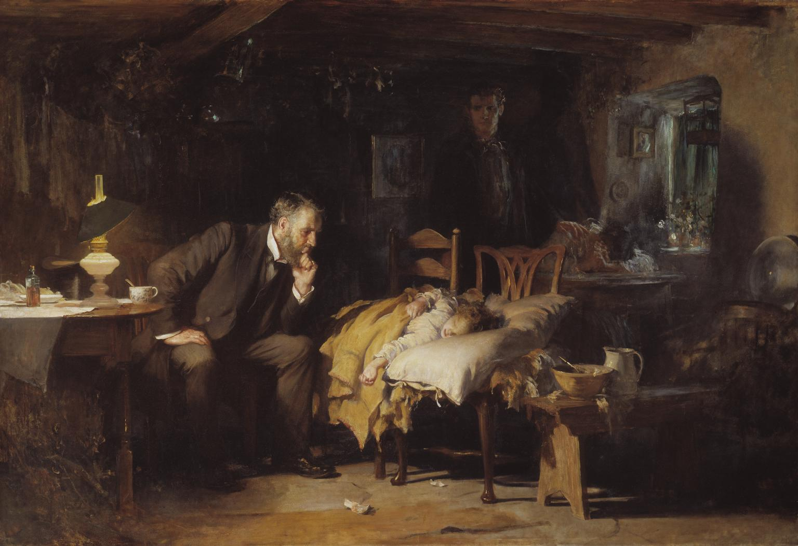

# Where We Left Off {.section-divider}

## The New Question

- Part A showed why unchecked professional authority became impossible to defend after Nuremberg, Willowbrook, and Tuskegee.
- But the cure cannot simply be "the doctor never decides": clinicians still hold real expertise, real duties, and real time pressure.
- Patients, too, usually come to medicine wanting guidance, not just a list of facts to sort alone.
- So the question for Part B is constructive, not just critical: what should *replace* "doctor knows best"?
- The answer this lecture builds is **shared, transparent, autonomy-respecting care** — and the tools that make it real.

## Today

::: {.learning-outcomes}
By the end of Part B, you will be able to:

- Distinguish the four Emanuel & Emanuel models of the clinician–patient relationship
- Explain the four elements of valid informed consent and where consent law came from
- Tell an unwise decision apart from an incapacitated one, using a capacity standard
- Identify the main limits on confidentiality, including Tarasoff and modern record access
- Work through a truth-telling conflict involving family and culture
:::

# Meet Mrs. R {.section-divider}

## Meet Mrs. R

- Mrs. R is 61. She came in for fatigue and weight loss.
- The colonoscopy found colon cancer — serious, but treatable.
- She is frightened. Her daughter, Dana, drives her to every appointment and does most of the talking.
- We will follow Mrs. R through the whole class. Every idea today will land on her.

## What's Missing From This Picture?

:::: {.columns}

::: {.column width="50%"}
{width="96%" fig-alt="Luke Fildes, The Doctor"}

::: {.attribution}
Sir Luke Fildes, *The Doctor* (1891), via Wikimedia Commons, public domain.
:::
:::

::: {.column width="50%"}
Fildes's *The Doctor* became the most reproduced image of medicine in the English-speaking world, and for a century it was how the profession liked to see itself. The physician watches, interprets, and quietly decides; the parents wait helplessly in the shadows. It is genuinely moving — and that is the trap. The one person with no voice in the picture is the patient, and the entire modern apparatus of consent exists to put that voice back.
:::

::::

## Three Sources of Asymmetry

```{dot}
//| fig-width: 7.6
//| fig-height: 3.2
//| fig-cap: "A compact map of the clinical asymmetry: the patient sits at the center, but expertise, institutions, and family pressures all shape the decision space."
digraph asym {
  layout=neato;
  splines=true;
  overlap=false;
  bgcolor="transparent";
  node [fontname="Inter", fontsize=10, style="rounded,filled", shape=box,
      margin="0.16,0.10", color="#94a3b8", fillcolor="#f8fafc"];
  edge [color="#94a3b8", arrowsize=0.7];

  P [label="Patient\nill, vulnerable,\ntime-pressured",
    pos="2.2,1.65!", fillcolor="#e6f1f2", color="#0e7c86", penwidth=2];
  C [label="Clinician\nexpertise, options,\ninterpretation",
    pos="0.45,3.15!", fillcolor="#fce9d6", color="#b07d1a"];
  I [label="Institution\npolicy, cost,\nworkflow",
    pos="3.95,3.15!", fillcolor="#dfe6ee", color="#475569"];
  F [label="Family / others\nexpectations, pressure,\ncare roles",
    pos="2.2,0.1!", fillcolor="#fad7d2", color="#c0392b"];

  C -> P [dir=both];
  I -> P [dir=both];
  F -> P [dir=both];
}
```

The relationship is hard because the patient is sick, frightened, and often in pain, while the information is unequal from the very first minute. What is at stake is rarely just a technical fact — it is what kind of life is worth living, which is the patient's question, not the clinician's. Ethical care does not pretend this asymmetry away; it manages it openly.

## The Core Tension

::: {.principle-marker}
[Autonomy]{.pill .pill-autonomy} versus [Beneficence]{.pill .pill-beneficence}
:::

[Autonomy]{.key-term} is the patient's right to make informed choices about her own body; [beneficence]{.key-term} is the clinician's duty to act for her welfare. Most of the time these run together — good information and a good recommendation are *both* in the patient's interest. The hard cases arrive when they pull apart: when what the clinician judges best is exactly what the patient does not want. A competent patient who refuses a recommended surgery has not created a misunderstanding to be fixed; she has created a genuine conflict of values. Almost everything in this lecture is a tool for handling that conflict honestly rather than hiding it.

# Four Ways to Be in the Room {.section-divider}

## Four Models at a Glance

Ezekiel and Linda Emanuel mapped the clinician–patient relationship into four models in a 1992 *JAMA* paper that is still the standard reference [@emanuel1992]:

| Model | Main clinician role | Main risk |
|---|---|---|
| **Paternalistic** | Decide what is best | Patient becomes passive |
| **Informative** | Provide facts and options | Clinician becomes a vending machine |
| **Interpretive** | Help clarify the patient's values | Clinician may over-read the patient |
| **Deliberative** | Recommend and reason about values | Persuasion can slide into pressure |

## One Map of the Models

```{dot}
//| fig-width: 10.2
//| fig-height: 3.0
//| fig-cap: "The Emanuel models differ mainly in what the clinician does with professional authority once a patient's values are more or less clear."
digraph models {
  rankdir=LR;
  bgcolor="transparent";
  graph [nodesep=0.5, ranksep=0.7];
  node [fontname="Inter", fontsize=10, margin="0.15,0.10"];
  edge [color="#64748b", fontname="Inter", fontsize=9, arrowsize=0.7];

  A [label="How should a clinician\nuse authority?", shape=box, style="rounded,filled",
    fillcolor="#e6f1f2", color="#0e7c86"];
  B [label="Patient values\nalready clear?", shape=diamond, style=filled,
    fillcolor="#f8fafc", color="#94a3b8"];
  C [label="If yes, what should\nthe clinician do?", shape=diamond, style=filled,
    fillcolor="#f8fafc", color="#94a3b8"];
  P [label="Paternalistic\nclinician chooses\nthe end", shape=box, style="rounded,filled",
    fillcolor="#fad7d2", color="#c0392b", fontcolor="#9d2f23"];
  I [label="Informative\nprovide facts", shape=box, style="rounded,filled",
    fillcolor="#dfe6ee", color="#475569"];
  R [label="Interpretive\nclarify the\npatient's values", shape=box, style="rounded,filled",
    fillcolor="#fce9d6", color="#b07d1a"];
  D [label="Deliberative\nrecommend and\ngive reasons", shape=box, style="rounded,filled",
    fillcolor="#cfe9ec", color="#0e7c86", fontcolor="#0e7c86", penwidth=2];

  A -> B;
  B -> P [label="no", color="#c0392b", fontcolor="#c0392b"];
  B -> C [label="yes"];
  C -> I [label="facts only"];
  C -> R [label="clarify values"];
  C -> D [label="recommend values"];
}
```

## The Same News, Four Ways (1)

Mrs. R asks: *"So what happens now?"* Same clinician, same facts, four models:

- **[Paternalistic]{.key-term}** — "The right move is surgery. We'll get you scheduled."
  - *Risk:* Mrs. R becomes a passenger in her own care
- **[Informative]{.key-term}** — "Here are three options with their survival numbers. Which do you want?"
  - *Risk:* the facts get dumped; she's left to interpret them alone

## The Same News, Four Ways (2)

- **[Interpretive]{.key-term}** — "Before we choose: what matters most to you — more time, or fewer side effects?"
  - *Risk:* the clinician may over-read what she "really" wants
- **[Deliberative]{.key-term}** — "Here's what I'd weigh in your situation, and why. What do you think?"
  - *Risk:* good persuasion can tip into pressure

::: {.notes}
Read these aloud in four different voices. The point students should feel: the *facts* never changed — only what the clinician did with authority.
:::

## What the Research Actually Shows

- The dominant model today is **shared decision-making**: the clinician supplies expertise about options and risks, the patient supplies expertise about her own values, and they decide together.
- Structured **decision aids** (booklets, videos, option grids) measurably improve patients' knowledge and produce choices that better match their values.
- But patients differ sharply: most want *full information*, yet how much *decision control* they want ranges from "you decide, doctor" to "I decide, period."
- That variation is the empirical case for the slide before — there is no single correct model.
- The professional skill is to *ask* how much steering this patient wants, and to revisit it as illness and confidence change.

## Which Model Fits?

::: {.thought-question}
Match a model to each case — and say *why*:

- An unconscious trauma patient in the ED
- A patient choosing between two cancer regimens with similar odds
- An older adult unsure whether dialysis still fits her goals
- A patient who asks you, "What would you do if it were your mom?"

And: should Mrs. R get the *same* model at every visit?
:::

## Make It Contemporary

::: {.thought-question}
Mrs. R arrives at the next visit having read everything online. She is convinced she needs a specific drug she saw in an ad, and an AI chatbot agreed with her.

- Does the "informative" model still work when a patient can't judge their own information?
- Is telling her the source is wrong *paternalistic*, or just honest?
- What does respecting her autonomy actually require here?
:::

## After You've Discussed

::: {.callout-note}
- **No model wins everywhere.** Emergencies push left toward paternalism; chronic illness usually works best in the interpretive/deliberative middle.
- **Choosing the model is itself a shared decision.** The deepest move is to *ask the patient how much steering they want* — and to revisit it as the illness, and the patient, change. "Advice" with the steering hidden is the move to watch for.
:::

# Mrs. R Signs a Form {.section-divider}

## Consent Is a Process, Not a Signature

- [Informed consent]{.key-term} is how the abstract principle "respect for persons" becomes a concrete clinical act [@faden1986].
- A signed form can *document* that a conversation happened; it can never *substitute* for the conversation.
- A competent refusal is just as valid an exercise of consent as a yes — consent is the right to decide, not the duty to agree.
- Outside genuine emergencies, valid consent must come *before* the intervention, not be backfilled afterward.
- The legal doctrine is roughly a century old, and it began not with a form but with a single sentence from a judge.

## Where Consent Law Begins

::: {.quote-card}
> "Every human being of adult years and sound mind has a right to determine what shall be done with his own body; and a surgeon who performs an operation without his patient's consent commits an assault."

::: {.attribution}
Justice Benjamin Cardozo, *Schloendorff v. Society of New York Hospital* (1914) [@schloendorff1914]
:::
:::

The term "informed consent" itself was not coined until *Salgo* (1957). The modern standard for *how much* to disclose was set in *Canterbury v. Spence* (1972).

## How Much Must You Disclose?

| Standard | The test it uses | The problem it has |
|---|---|---|
| **"Reasonable physician"** (older) | Disclose what a typical doctor would disclose | Lets the profession set its own bar |
| **"Reasonable patient"** (*Canterbury*, 1972) | Disclose what a reasonable patient would consider **material** to the decision | Whose "reasonable patient"? |
| **Subjective / this patient** (emerging) | Disclose what *this* patient would find material | Hard to prove, but closest to real autonomy |

Most U.S. jurisdictions now use some version of the *Canterbury* "reasonable patient" rule — disclosure is measured from the patient's side of the table, not the doctor's.

## The Four Elements of Valid Consent

| Element | The practical question |
|---|---|
| **Disclosure** | Was the relevant information provided? |
| **Understanding** | Does the patient actually grasp it? |
| **Voluntariness** | Is the choice free from controlling pressure? |
| **Capacity** | Can the patient make this decision now? |

## Disclosure & Understanding, with Mrs. R

- **Disclosure** — you explain the cancer, the surgery, the major risks, the alternatives, and what happens if she does *nothing*.
- **Understanding** — you ask her to say it back: *"What did you hear?"* She says, "You're removing part of my colon, and I might need a bag for a while."
- That is real understanding; signing while nodding is not. Studies of recall after consent discussions are sobering — patients routinely forget or misunderstand much of what they were told.
- "Teach-back" — having the patient restate the plan in her own words — is the single most reliable, low-tech check that disclosure actually landed.
- Use plain language, an interpreter when indicated, and slow down when fear or pain has narrowed her attention.

## Voluntariness, with Mrs. R

- Dana answers every question before her mother can, and gradually the appointment becomes a conversation between you and the daughter.
- Asked directly what *she* wants, Mrs. R says quietly, "Whatever my daughter thinks is best."
- That sentence is the whole problem in miniature: it may be authentic deference, or it may be pressure wearing the face of family love.
- Voluntariness is not destroyed by *influence* — families always influence — but it is destroyed by *control*.
- A neatly signed form can still document a choice that was never really the patient's, which is why you sometimes have to see the patient alone.

## Capacity Is Not What People Think

- [Capacity]{.key-term} is **decision-specific and time-specific**: a patient can lack it for a complex surgery at 3 a.m. and have it for a simple choice the next morning.
- It is **not** the same as intelligence, a psychiatric diagnosis, or agreeing with the clinician — a person can be floridly eccentric and still have capacity.
- It runs on a **sliding scale**: the graver and more irreversible the consequences, the higher the bar you should require before accepting the decision.
- This is why a low-stakes refusal is honored almost automatically while a life-or-death refusal triggers a careful reassessment — appropriately, not as a trick.
- Capacity is a clinical judgment about *this decision*, not a global verdict on the person.

## A Practical Capacity Check

::: {.context-box}
The standard clinical test (Appelbaum & Grisso's four abilities) asks whether the patient can [@appelbaum2007]:

- **communicate** a stable choice
- **understand** the relevant information
- **appreciate** how it applies to *them* specifically
- **reason** through the options coherently

Failing only the last two — appreciation and reasoning — is what usually distinguishes incapacity from a merely unusual choice.
:::

## The Consent Checklist

```{dot}
//| fig-width: 10.8
//| fig-height: 3.0
//| fig-cap: "A slide-sized informed-consent checklist. Each gate asks a different question, so a signed form alone is never enough."
digraph consent {
  rankdir=LR;
  bgcolor="transparent";
  graph [nodesep=0.45, ranksep=0.65];
  node [fontname="Inter", fontsize=10, margin="0.14,0.10"];
  edge [color="#64748b", fontname="Inter", fontsize=9, arrowsize=0.7];

  A [label="Intervention\nproposed", shape=box, style="rounded,filled",
    fillcolor="#e6f1f2", color="#0e7c86"];
  B [label="Disclosure\nadequate?", shape=diamond, style=filled,
    fillcolor="#f8fafc", color="#94a3b8"];
  C [label="Understanding\nadequate?", shape=diamond, style=filled,
    fillcolor="#f8fafc", color="#94a3b8"];
  D [label="Voluntary\nchoice?", shape=diamond, style=filled,
    fillcolor="#f8fafc", color="#94a3b8"];
  E [label="Capacity for\nthis decision?", shape=diamond, style=filled,
    fillcolor="#f8fafc", color="#94a3b8"];
  B1 [label="Explain diagnosis,\noptions, risks,\nbenefits, alternatives", shape=box, style="rounded,filled",
    fillcolor="#fad7d2", color="#c0392b", fontcolor="#9d2f23"];
  C1 [label="Use teach-back,\nplain language,\ninterpreter, visuals", shape=box, style="rounded,filled",
    fillcolor="#fad7d2", color="#c0392b", fontcolor="#9d2f23"];
  D1 [label="Address coercion\nor pressure", shape=box, style="rounded,filled",
    fillcolor="#fad7d2", color="#c0392b", fontcolor="#9d2f23"];
  E1 [label="Seek surrogate or\nfurther assessment", shape=box, style="rounded,filled",
    fillcolor="#fad7d2", color="#c0392b", fontcolor="#9d2f23"];
  F [label="Consent or refusal\nis valid", shape=box, style="rounded,filled",
    fillcolor="#cfe9ec", color="#0e7c86", fontcolor="#0e7c86", penwidth=2];

  A -> B;
  B -> B1 [label="no", color="#c0392b", fontcolor="#c0392b"];
  B -> C [label="yes"];
  C -> C1 [label="no", color="#c0392b", fontcolor="#c0392b"];
  C -> D [label="yes"];
  D -> D1 [label="no", color="#c0392b", fontcolor="#c0392b"];
  D -> E [label="yes"];
  E -> E1 [label="no", color="#c0392b", fontcolor="#c0392b"];
  E -> F [label="yes", color="#0e7c86", fontcolor="#0e7c86"];
}
```

## Refusal Is the Real Test

- Easy cases are consent cases: the patient wants what is offered, and everyone relaxes.
- The hard cases are *refusals*, where a competent person says no to something that would clearly help.
- An **informed refusal** demands the same four elements as an informed consent — disclosure, understanding, voluntariness, capacity.
- The landmark refusals are concrete: Jehovah's Witness patients declining life-saving transfusion, and *Bouvia v. Superior Court* (1986), where a woman with cerebral palsy won the right to refuse force-feeding [@bouvia1986].
- The course's hardest refusal case, and your paired case study, is Dax Cowart.

## Dax Cowart

- In 1973 a propane explosion killed Dax Cowart's father and left Dax, then 25, severely burned and blinded.
- Throughout roughly fourteen months of agonizing treatment he repeatedly and lucidly demanded that it stop; clinicians treated him anyway.
- He went on to earn a law degree, marry, and become a patient-rights advocate; his case is preserved in the films *Please Let Me Die* (1974) and *Dax's Case* (1985).
- Until his death in 2019 he held a deliberately uncomfortable position: he was glad to be alive *and* insisted his autonomy had been gravely violated.
- That paradox — a good outcome reached by a wrong route — is exactly why the case refuses to resolve neatly [@cowart1998].

::: {.notes}
This is the paired case study. Students don't need the full facts now — only enough to feel the autonomy/beneficence collision before they read it.
:::

## Thought Question

::: {.thought-question}
A competent adult refuses a blood transfusion that would almost certainly save their life.

1. Is honoring the refusal *respect* — or *abandonment*?
2. What is the clinician still obligated to keep doing after the refusal?
3. Mrs. R, in tears, says "I can't even think about this right now." Is that a refusal, indecision, or lost capacity — and how would you tell?
:::

## Make It Contemporary

::: {.thought-question}
Change one fact: the refusal isn't religious. The patient read online that transfusions are dangerous and won't budge.

- Same legal right. Does the *reason* change what you owe them?
- Does correcting the misinformation respect her autonomy — or undermine it?
:::

## After You've Discussed

::: {.callout-note}
- **Respecting a decision is not endorsing the reasoning.** You can believe she is wrong and still be bound by her refusal.
- **The capacity bar is applied unevenly.** We rarely test capacity when patients say *yes*; we scrutinize it when they say *no*. If every risky refusal counted as incapacity, informed consent collapses back into paternalism. The honest question is what danger is enough to *re-assess* — not to *override*.
:::

# Confidentiality and Hard Conversations {.section-divider}

## Why Confidentiality Matters

- Confidentiality is one of medicine's oldest promises — it is in the Hippocratic Oath, long before it was in any statute.
- Its value is partly **instrumental**: patients only disclose stigmatized, decision-critical facts (drug use, sexual history, suicidal thoughts) if they trust the information will be held.
- Its value is also **intrinsic**: control over who knows your medical story is part of being treated as a person, not a case.
- The evidence is concrete — when adolescents doubt confidentiality, they measurably withhold information and forgo care.
- So [confidentiality]{.key-term} is ethical before it is legal, and breaking it quietly damages care even when no one finds out.

## HIPAA Is Not a Gag Order

- [HIPAA]{.key-term} is the U.S. federal health-privacy rule, and it is one of the most misunderstood laws in medicine [@hipaa_hhs].
- It explicitly *permits* sharing for treatment, payment, and operations, and to avert a serious and imminent threat — it is not a vow of silence.
- It runs on a **"minimum necessary"** principle: access and share only what the task in front of you actually requires.
- Misreading it has real costs: families are stonewalled and care coordination suffers because staff wrongly believe HIPAA forbids all disclosure.
- Concretely, if Mrs. R's sister calls for an update, you generally cannot even confirm she is a patient without Mrs. R's authorization — and *that* is the rule working as intended.

## HHS on the Privacy Rule

::: {.quote-card}
> "A major goal of the Privacy Rule is to assure that individuals' health information is properly protected while allowing the flow of health information needed to provide and promote high quality health care and to protect the public's health and well being. The Rule strikes a balance that permits important uses of information, while protecting the privacy of people who seek care and healing."

::: {.attribution}
U.S. Department of Health and Human Services, *Summary of the HIPAA Privacy Rule* [@hipaa_hhs]
:::
:::

## May Disclose vs. Must Disclose

:::: {.columns}

::: {.column width="50%"}
**You *may* disclose when**

- The patient authorizes it
- It is necessary for treatment
- Law permits limited operational use
- A serious threat may justify a warning
- Legal process requires a response
:::

::: {.column width="50%"}
**You *must* disclose**

- Suspected child abuse or neglect
- Certain infectious diseases
- Some court-ordered disclosures
- Some state-mandated reporting
- (The exact list varies by state)
:::

::::

## Confidentiality: Default and Exceptions

```{dot}
//| fig-width: 9.6
//| fig-height: 2.8
//| fig-cap: "Confidentiality starts from privacy, not disclosure. The legal and ethical question is which exceptions are strong enough to override that default."
digraph conf {
  rankdir=LR;
  bgcolor="transparent";
  graph [nodesep=0.45, ranksep=0.65];
  node [fontname="Inter", fontsize=10, style="rounded,filled", shape=box,
        margin="0.15,0.10", color="#94a3b8", fillcolor="#f8fafc"];
  edge [color="#64748b", fontname="Inter", fontsize=9, arrowsize=0.7];

  A [label="Protected health\ninformation", fillcolor="#dfe6ee", color="#475569"];
  B [label="Default:\nkeep private", fillcolor="#e6f1f2", color="#0e7c86", penwidth=2];
  C [label="Patient authorizes\nsharing", fillcolor="#fce9d6", color="#b07d1a"];
  D [label="Law requires\nreporting", fillcolor="#fad7d2", color="#c0392b"];
  E [label="Serious threat\nmay justify warning", fillcolor="#fce9d6", color="#b07d1a"];

  A -> B;
  B -> C [label="exception"];
  B -> D [label="exception"];
  B -> E [label="exception"];
}
```

## The Chart Is Now a Letter to the Patient

- Since 2021, the 21st Century Cures Act's information-blocking rule gives patients near-immediate electronic access to their notes and most results.
- "Open notes" is now the default: the patient will very likely read exactly what you wrote, often before you discuss it.
- The upside is real — transparency improves trust, recall, and error-catching, and patients report feeling more in control.
- The hard cases are also real: how to document a suspected abuse, a stigmatizing differential, or "patient appears to be a poor historian," knowing the patient will see it.
- The emerging norm is to write the chart *as if* it were addressed to the patient, because now it effectively is.

## Tarasoff: Two Rulings, One Lesson

- Prosenjit Poddar, a UC Berkeley student, told campus psychologist Lawrence Moore he intended to kill Tatiana Tarasoff after she rejected him.
- Moore alerted campus police, who briefly detained Poddar and released him; no one warned Tatiana or her family, and Poddar killed her in 1969.
- The California Supreme Court ruled **twice**: *Tarasoff I* (1974) created a duty to **warn**, and *Tarasoff II* (1976) broadened it to a duty to **protect** [@tarasoff1976].
- The famous dissent argued the rule would chill therapy and deter the very patients who most need help from speaking freely.
- That tradeoff was never settled — it was handed to fifty state legislatures, which is why the duty looks different depending on where you practice.

## Tarasoff I vs. Tarasoff II

| | *Tarasoff I* (1974) | *Tarasoff II* (1976) |
|---|---|---|
| **Duty** | Duty to **warn** the victim | Duty to **protect** the victim |
| **Options** | Tell the identifiable target | Warn, notify police, hospitalize — whatever a reasonable clinician would do |
| **Trigger** | A serious threat to an identifiable person | Same — but the response is broader and clinically judged |
| **Today** | Some states still use a narrow "warn" rule | Many adopted "protect"; some make it permissive, a few reject it entirely |

The exam point: there is no single national Tarasoff rule — only a default ethical question (serious, specific danger to an identifiable person) answered differently by each state.

## In the Court's Words

::: {.quote-card}
> "We conclude that the public policy favoring protection of the confidential character of patient-psychotherapist communications must yield to the extent to which disclosure is essential to avert danger to others. The protective privilege ends where the public peril begins."

::: {.attribution}
*Tarasoff v. Regents of the University of California* (1976) [@tarasoff1976]
:::
:::

## The Case Nobody Warns You About

::: {.context-box}
You are a nursing student on a med-surg unit. Your old roommate is admitted two doors down — and you have chart access.

You're genuinely worried about her. You open her chart "just to see if she's okay." You tell no one. No one is harmed.
:::

## Snooping Is Not Hypothetical

- Every chart access is logged; modern systems run automated audits that flag a record opened by someone not on the care team.
- After staff repeatedly accessed celebrities' records, UCLA's health system fired employees, faced a federal settlement, and one worker was criminally convicted.
- "I only looked, I didn't tell anyone" is not a defense — the unauthorized *access* is itself the violation.
- For a clinician, the realistic consequences stack: termination, loss of licensure, HIPAA penalties, and in some cases prosecution.
- The trigger is almost always personal curiosity about someone the snooper knows or recognizes — exactly the roommate scenario.

## Thought Question

::: {.thought-question}
Start with the roommate's chart, then turn the privacy default on its head:

1. You looked "just to check she's okay." What exactly is the wrong, if no one ever finds out?
2. Does it change if she *were* your patient? If she'd *want* you to know? If you tell no one?
3. Now a patient tells you: *"Sometimes I think about killing my ex — I know where she works."* What would you need to know before warning anyone?
:::

## Make It Contemporary

::: {.thought-question}
- Hospitals run automated access audits; every year nurses are fired for snooping on relatives, exes, and celebrities
- A patient posts a specific threat on Instagram, not in your office

Does "do I need this to care for this patient?" still draw the line in the digital version — both for the snooping and for the threat?
:::

## After You've Discussed

::: {.callout-note}
- **Access is not authorization.** Being *able* to open a chart is not permission. The test is "do I need this to care for *this* patient?" Curiosity, worry, and good intentions are not exceptions.
- **The default flips, but the question doesn't.** Snooping *over*-discloses; Tarasoff *under*-discloses. Both are answered the same way — by asking what is genuinely *necessary*: to provide care, or to prevent serious, specific harm.
:::

## How Truth-Telling Flipped

```{dot}
//| fig-width: 9.5
//| fig-height: 2.4
//| fig-cap: "In one human generation, the professional norm on disclosing a cancer diagnosis reversed almost completely."
digraph truth {
  rankdir=LR;
  bgcolor="transparent";
  graph [nodesep=0.4, ranksep=0.9];
  node [fontname="Inter", fontsize=11, style="rounded,filled", shape=box,
        margin="0.18,0.12", color="#94a3b8", fillcolor="#f8fafc"];
  edge [color="#64748b", arrowsize=0.7, penwidth=1.2];

  A [label="1961 (Oken)\n~90% of physicians did NOT\ntell a cancer diagnosis",
     fillcolor="#fad7d2", color="#c0392b"];
  B [label="1979 (Novack)\n~97% of physicians DID\ntell the diagnosis",
     fillcolor="#cfe9ec", color="#0e7c86", penwidth=2];

  A -> B [label="  one generation  ", fontname="Inter", fontsize=10, fontcolor="#475569"];
}
```

In 1961 Oken found that roughly nine in ten physicians withheld a cancer diagnosis to "protect" the patient; by 1979 Novack found the norm had almost exactly reversed [@oken1961; @novack1979]. The lesson is humbling: what felt like obvious kindness was a *convention*, not a moral fact — and conventions about disclosure still vary widely across cultures.

## Back to Mrs. R: "Please Don't Tell Her"

::: {.context-box}
The biopsy is worse than expected. Before you go in, Dana stops you in the hallway:

> "In our family, we don't tell elders news like this. It will crush her. Please talk to me, not her."

The team wants to respect the family's culture. The team also wants to respect Mrs. R.
:::

## Thought Question

::: {.thought-question}
1. Whose decision is this — Mrs. R's, Dana's, or the team's?
2. What is the *first* thing you should find out, and who do you ask?
3. What if you ask Mrs. R and she says, "I don't want the details — talk to Dana"?
:::

## Make It Contemporary

::: {.thought-question}
A genetic test shows Mrs. R carries a mutation her adult siblings may also carry.

- She does not want them told. They may be making medical decisions without information that could protect them.
- Does her privacy outweigh their need to know? Is this the *same* problem as the family request, or a different one?
:::

## After You've Discussed

::: {.callout-note}
- **Only Mrs. R can waive her own right to know.** A competent patient may *autonomously choose* not to receive information ("just talk to my daughter") — that is respected autonomy. The family *withholding* it from her, unasked, is not their call.
- So it isn't "autonomy vs. culture." The move is to ask Mrs. R — *before* the bad news — how much she wants to know and whom she wants involved. Culturally informed, and still hers.
- The genetic case is **different in kind**: a third party's welfare is now at stake. That is closer to Tarasoff than to truth-telling.
:::

# Pulling It Together {.section-divider}

## Mrs. R, Start to Finish

- You met her as a frightened patient with a daughter who spoke for her
- You chose a model *with* her, not *for* her
- You made consent a conversation — and took her tears seriously without calling them incapacity
- You kept her information private by default — and asked *her*, not Dana, how she wanted the truth handled

## Common Mistakes to Avoid

- **Reducing autonomy to consumerism** — handing the patient a menu and calling abandonment "respect for choice."
- **Pathologizing disagreement** — treating every unwise or emotional decision as proof of lost capacity.
- **Treating HIPAA as a gag order** — shutting out families and stalling care in the name of a rule that does not require it.
- **Assuming one cultural script** — defaulting either to blunt disclosure or to family control instead of asking this patient.
- **Confusing the form with the process** — believing a signature settles a question the conversation never actually reached.

## Wrapping Up Part B

::: {.recap}
Part A explained why modern medicine rejects unchecked paternalism. Part B asked what replaces it: guided, transparent, autonomy-respecting care. Following Mrs. R, we saw the four clinician–patient models, the four elements of valid consent and the case law (Schloendorff → Canterbury) behind them, the difference between an unwise choice and an incapacitated one, and confidentiality and truth-telling as defaults with disciplined, evolving exceptions — from Tarasoff to open notes.
:::

## Review Questions

Write a brief answer to each, or use them as discussion prompts.

::: {.review-questions}

::: {.review-item .review-recall}
[Recall]{.review-label}

What are the four elements of valid informed consent, and why is a signature by itself not enough?
:::

::: {.review-item .review-apply}
[Apply]{.review-label}

A patient with kidney failure clearly explains the risks of refusing dialysis, but her son insists that no "reasonable" mother would refuse treatment and asks the team to override her. How should the team assess capacity and respond to the son's demand?
:::

::: {.review-item .review-debate}
[Debate]{.review-label}

Should patients usually get near-immediate electronic access to clinicians' notes, test interpretations, and differential diagnoses, even when that may increase anxiety, misunderstanding, or conflict?
:::

:::

## Key Terms

- **Paternalistic model** — Emanuel & Emanuel's first model: the clinician decides what is best and presents only the recommended course.
- **Informative model** — the clinician supplies the facts and the patient chooses; values are treated as the patient's private business.
- **Interpretive model** — the clinician helps the patient clarify and articulate values, then maps them to options.
- **Deliberative model** — the clinician engages the patient in moral discussion about which health-related values are best worth pursuing.
- **Informed consent** — a valid authorization with four elements: disclosure, understanding, voluntariness, and competence/capacity.
- **Capacity** — the clinical judgment that a patient can understand, appreciate, reason about, and communicate a choice; decision-specific, not global.
- **Confidentiality** — the duty to protect information patients share in the clinical relationship.
- **HIPAA** — the U.S. statute setting baseline rules for the privacy and security of identifiable health information.

## References

::: {#refs}
:::
