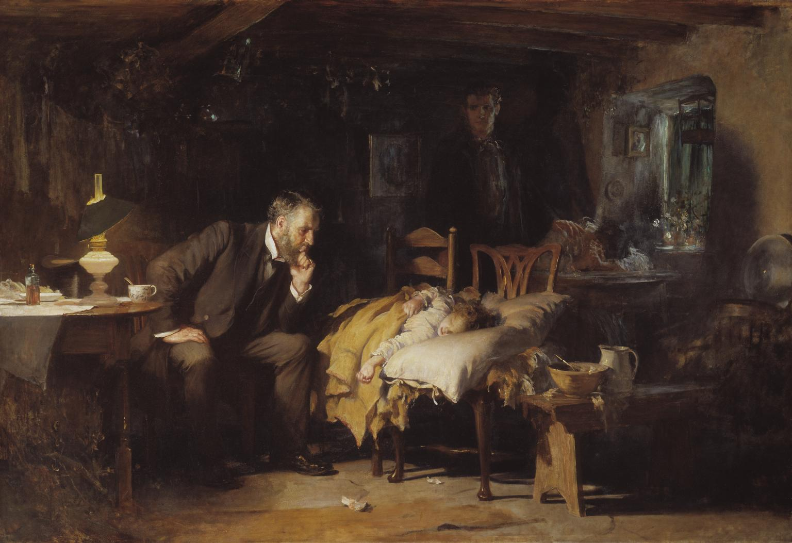

# Where We Left Off {.section-divider}

## The New Question

- Part A showed why unchecked professional authority became impossible to defend after Nuremberg, Willowbrook, and Tuskegee.
- The cure cannot be "the doctor never decides." Clinicians still hold real expertise, real duties, and real time pressure.
- Patients usually come to medicine wanting guidance, not a list of facts to sort alone.
- So Part B's question is constructive: what should *replace* "doctor knows best"?
- The answer this lecture builds is **shared, transparent, autonomy-respecting care** — and the tools that make it real.

## Today

::: {.learning-outcomes}
By the end of Part B, you will be able to:

- Distinguish the four Emanuel & Emanuel models of the clinician–patient relationship
- Explain the four elements of valid informed consent and where consent law came from
- Tell an unwise decision apart from an incapacitated one, using a capacity standard
- Identify the main limits on confidentiality, including Tarasoff and modern record access
- Work through a truth-telling conflict involving family and culture
:::

# Meet Mrs. R {.section-divider}

## Meet Mrs. R

- **Mrs. R** is 61. She came in for fatigue and weight loss.
- The colonoscopy found colon cancer — serious, but treatable.
- She is frightened. Her daughter, **Dana**, drives her to every appointment and does most of the talking.
- We will follow Mrs. R through the whole class. Every idea today will land on her.

## What's Missing From This Picture?

:::: {.columns}

::: {.column width="50%"}
{width="96%" fig-alt="Luke Fildes, The Doctor"}

::: {.attribution}
Sir Luke Fildes, *The Doctor* (1891), via Wikimedia Commons, public domain.
:::
:::

::: {.column width="50%"}
**Luke Fildes**'s *The Doctor* became the most reproduced image of medicine in the English-speaking world, and for a century it was how the profession liked to see itself. The physician watches, interprets, and quietly decides; the parents wait in the shadows. The one person with no voice in the picture is the patient, and the entire modern apparatus of consent exists to put that voice back.
:::

::::

## Three Sources of Asymmetry

```{dot}
//| fig-width: 7.6
//| fig-height: 3.2
//| fig-cap: "A compact map of the clinical asymmetry: the patient sits at the center, but expertise, institutions, and family pressures all shape the decision space."
digraph asym {
  layout=neato;
  splines=true;
  overlap=false;
  bgcolor="transparent";
  node [fontname="Inter", fontsize=10, style="rounded,filled", shape=box,
      margin="0.16,0.10", color="#94a3b8", fillcolor="#f8fafc"];
  edge [color="#94a3b8", arrowsize=0.7];

  P [label="Patient\nill, vulnerable,\ntime-pressured",
    pos="2.2,1.65!", fillcolor="#e6f1f2", color="#0e7c86", penwidth=2];
  C [label="Clinician\nexpertise, options,\ninterpretation",
    pos="0.45,3.15!", fillcolor="#fce9d6", color="#b07d1a"];
  I [label="Institution\npolicy, cost,\nworkflow",
    pos="3.95,3.15!", fillcolor="#dfe6ee", color="#475569"];
  F [label="Family / others\nexpectations, pressure,\ncare roles",
    pos="2.2,0.1!", fillcolor="#fad7d2", color="#c0392b"];

  C -> P [dir=both];
  I -> P [dir=both];
  F -> P [dir=both];
}
```

The patient is sick, frightened, and often in pain, and the information is unequal from the first minute. What is at stake is rarely a technical fact. It is what kind of life is worth living, which is the patient's question, not the clinician's. Ethical care does not pretend this asymmetry away; it manages it openly.

## The Core Tension

::: {.principle-marker}
[Autonomy]{.pill .pill-autonomy} versus [Beneficence]{.pill .pill-beneficence}
:::

[Autonomy]{.key-term} is the patient's right to make informed choices about her own body. [Beneficence]{.key-term} is the clinician's duty to act for her welfare. Most of the time they run together: good information and a good recommendation are *both* in her interest.

The hard cases arrive when they pull apart, and what the clinician judges best is exactly what the patient does not want. A competent patient refusing a recommended surgery has not created a misunderstanding to be fixed. She has created a genuine conflict of values.

# Four Ways to Be in the Room {.section-divider}

## Four Models at a Glance

**Ezekiel and Linda Emanuel** mapped the clinician–patient relationship into four models in a 1992 *JAMA* paper that is still the standard reference [@emanuel1992]:

| Model | Main clinician role | Main risk |
|---|---|---|
| **Paternalistic** | Decide what is best | Patient becomes passive |
| **Informative** | Provide facts and options | Clinician becomes a vending machine |
| **Interpretive** | Help clarify the patient's values | Clinician may over-read the patient |
| **Deliberative** | Recommend and reason about values | Persuasion can slide into pressure |

## The Same News, Four Ways (1)

Mrs. R asks: *"So what happens now?"* Same clinician, same facts, four models:

- **[Paternalistic]{.key-term}** — "The right move is surgery. We'll get you scheduled."
  - *Risk:* Mrs. R becomes a passenger in her own care
- **[Informative]{.key-term}** — "Here are three options with their survival numbers. Which do you want?"
  - *Risk:* the facts get dumped; she's left to interpret them alone

## The Same News, Four Ways (2)

- **[Interpretive]{.key-term}** — "Before we choose: what matters most to you — more time, or fewer side effects?"
  - *Risk:* the clinician may over-read what she "really" wants
- **[Deliberative]{.key-term}** — "Here's what I'd weigh in your situation, and why. What do you think?"
  - *Risk:* good persuasion can tip into pressure

::: {.aside-note}
Read all four aloud, in four different voices. The *facts* never change across them; only what the clinician does with authority changes.
:::

## What the Research Actually Shows

- The dominant model today is **shared decision-making**: the clinician brings expertise about options and risks, the patient brings expertise about her own values.
- Structured **decision aids** (booklets, videos, option grids) measurably improve knowledge and produce choices that better match patients' values.
- Patients differ sharply. Most want *full information*, but the *decision control* they want ranges from "you decide, doctor" to "I decide, period."
- That variation is the empirical case against a single correct model.
- The professional skill is to *ask* how much steering this patient wants, and to revisit it as illness and confidence change.

## Which Model Fits?

::: {.thought-question}
Match a model to each case — and say *why*:

- An unconscious trauma patient in the ED
- A patient choosing between two cancer regimens with similar odds
- An older adult unsure whether dialysis still fits her goals
- A patient who asks you, "What would you do if it were your mom?"

And: should Mrs. R get the *same* model at every visit?

Now Mrs. R arrives having read everything online, convinced by an ad and an AI chatbot that she needs one specific drug. Does the informative model still work when a patient cannot judge her own information?
:::

## After You've Discussed

::: {.callout-note}
- **No model wins everywhere.** Emergencies push left toward paternalism; chronic illness usually works best in the interpretive/deliberative middle.
- **Choosing the model is itself a shared decision.** The deepest move is to *ask the patient how much steering they want* — and to revisit it as the illness, and the patient, change. "Advice" with the steering hidden is the move to watch for.
:::

# Mrs. R Signs a Form {.section-divider}

## Consent Is a Process, Not a Signature

- [Informed consent]{.key-term} is how the abstract principle "respect for persons" becomes a concrete clinical act [@faden1986].
- A signed form can *document* that a conversation happened; it can never *substitute* for the conversation.
- A competent refusal is as valid an exercise of consent as a yes. Consent is the right to decide, not the duty to agree.
- Outside emergencies, valid consent must come *before* the intervention, not be backfilled after.
- The legal doctrine is roughly a century old, and it began with a single sentence from a judge.

## Where Consent Law Begins

::: {.quote-card}
> "Every human being of adult years and sound mind has a right to determine what shall be done with his own body; and a surgeon who performs an operation without his patient's consent commits an assault."

::: {.attribution}
Justice Benjamin Cardozo, *Schloendorff v. Society of New York Hospital* (1914) [@schloendorff1914]
:::
:::

The term "informed consent" was not coined until ***Salgo*** (1957). The modern standard for *how much* to disclose was set in ***Canterbury v. Spence*** (1972).

## How Much Must You Disclose?

| Standard | The test it uses | The problem it has |
|---|---|---|
| **"Reasonable physician"** (older) | Disclose what a typical doctor would disclose | Lets the profession set its own bar |
| **"Reasonable patient"** (*Canterbury*, 1972) | Disclose what a reasonable patient would consider **material** to the decision | Whose "reasonable patient"? |
| **Subjective / this patient** (emerging) | Disclose what *this* patient would find material | Hard to prove, but closest to real autonomy |

Most U.S. jurisdictions now use some version of the *Canterbury* "reasonable patient" rule — disclosure is measured from the patient's side of the table, not the doctor's.

## The Four Elements of Valid Consent

| Element | The practical question |
|---|---|
| **Disclosure** | Was the relevant information provided? |
| **Understanding** | Does the patient actually grasp it? |
| **Voluntariness** | Is the choice free from controlling pressure? |
| **Capacity** | Can the patient make this decision now? |

## Disclosure & Understanding, with Mrs. R

- **Disclosure** — you explain the cancer, the surgery, the major risks, the alternatives, and what happens if she does *nothing*.
- **Understanding** — you ask her to say it back: *"What did you hear?"* She says, "You're removing part of my colon, and I might need a bag for a while."
- That is real understanding. Signing while nodding is not: patients routinely forget or misunderstand much of what they were told.
- **Teach-back**, having the patient restate the plan in her own words, is the most reliable low-tech check that disclosure landed.
- Use plain language, an interpreter when indicated, and slow down when fear or pain has narrowed her attention.

## Voluntariness, with Mrs. R

- Dana answers every question before her mother can, and the appointment becomes a conversation between you and the daughter.
- Asked directly what *she* wants, Mrs. R says quietly, "Whatever my daughter thinks is best."
- That may be authentic deference, or it may be pressure wearing the face of family love.
- **Influence** does not destroy voluntariness; families always influence. **Control** does.
- A signed form can still document a choice that was never the patient's, which is why you sometimes see the patient alone.

## Capacity Is Not What People Think

- [Capacity]{.key-term} is **decision-specific and time-specific**: a patient can lack it for a complex surgery at 3 a.m. and have it for a simple choice the next morning.
- It is **not** intelligence, a psychiatric diagnosis, or agreeing with the clinician. A person can be floridly eccentric and still have capacity.
- It runs on a **sliding scale**: the graver and more irreversible the consequences, the higher the bar before accepting the decision.
- So a low-stakes refusal is honored almost automatically, while a life-or-death refusal triggers careful reassessment.
- Capacity is a judgment about *this decision*, not a verdict on the person.

## A Practical Capacity Check

::: {.context-box}
The standard clinical test, **Appelbaum and Grisso's** four abilities, asks whether the patient can [@appelbaum2007]:

- **communicate** a stable choice
- **understand** the relevant information
- **appreciate** how it applies to *them* specifically
- **reason** through the options coherently

Failing only the last two — appreciation and reasoning — is what usually distinguishes incapacity from a merely unusual choice.
:::

## The Consent Checklist

```{dot}
//| fig-width: 10.8
//| fig-height: 3.0
//| fig-cap: "A slide-sized informed-consent checklist. Each gate asks a different question, so a signed form alone is never enough."
digraph consent {
  rankdir=LR;
  bgcolor="transparent";
  graph [nodesep=0.45, ranksep=0.65];
  node [fontname="Inter", fontsize=10, margin="0.14,0.10"];
  edge [color="#64748b", fontname="Inter", fontsize=9, arrowsize=0.7];

  A [label="Intervention\nproposed", shape=box, style="rounded,filled",
    fillcolor="#e6f1f2", color="#0e7c86"];
  B [label="Disclosure\nadequate?", shape=diamond, style=filled,
    fillcolor="#f8fafc", color="#94a3b8"];
  C [label="Understanding\nadequate?", shape=diamond, style=filled,
    fillcolor="#f8fafc", color="#94a3b8"];
  D [label="Voluntary\nchoice?", shape=diamond, style=filled,
    fillcolor="#f8fafc", color="#94a3b8"];
  E [label="Capacity for\nthis decision?", shape=diamond, style=filled,
    fillcolor="#f8fafc", color="#94a3b8"];
  B1 [label="Explain diagnosis,\noptions, risks,\nbenefits, alternatives", shape=box, style="rounded,filled",
    fillcolor="#fad7d2", color="#c0392b", fontcolor="#9d2f23"];
  C1 [label="Use teach-back,\nplain language,\ninterpreter, visuals", shape=box, style="rounded,filled",
    fillcolor="#fad7d2", color="#c0392b", fontcolor="#9d2f23"];
  D1 [label="Address coercion\nor pressure", shape=box, style="rounded,filled",
    fillcolor="#fad7d2", color="#c0392b", fontcolor="#9d2f23"];
  E1 [label="Seek surrogate or\nfurther assessment", shape=box, style="rounded,filled",
    fillcolor="#fad7d2", color="#c0392b", fontcolor="#9d2f23"];
  F [label="Consent or refusal\nis valid", shape=box, style="rounded,filled",
    fillcolor="#cfe9ec", color="#0e7c86", fontcolor="#0e7c86", penwidth=2];

  A -> B;
  B -> B1 [label="no", color="#c0392b", fontcolor="#c0392b"];
  B -> C [label="yes"];
  C -> C1 [label="no", color="#c0392b", fontcolor="#c0392b"];
  C -> D [label="yes"];
  D -> D1 [label="no", color="#c0392b", fontcolor="#c0392b"];
  D -> E [label="yes"];
  E -> E1 [label="no", color="#c0392b", fontcolor="#c0392b"];
  E -> F [label="yes", color="#0e7c86", fontcolor="#0e7c86"];
}
```

## Refusal Is the Real Test

- Easy cases are consent cases. The hard cases are *refusals*, where a competent person says no to something that would clearly help.
- An **informed refusal** demands the same four elements as an informed consent.
- The landmarks: Jehovah's Witness patients refusing transfusion, and *Bouvia v. Superior Court* (1986), where a woman with cerebral palsy won the right to refuse force-feeding [@bouvia1986].
- **Dax Cowart**, burned and blinded at 25 in a 1973 explosion, lucidly demanded through fourteen months of treatment that it stop. He was treated anyway. Until his death in 2019 he insisted he was glad to be alive *and* gravely wronged [@cowart1998].

::: {.aside-note}
This is the chapter's paired case study. You don't need the full facts yet — only enough to feel the autonomy/beneficence collision before you read it properly.
:::

## Thought Question

::: {.thought-question}
A competent adult refuses a blood transfusion that would almost certainly save their life.

1. Is honoring the refusal *respect* — or *abandonment*?
2. What is the clinician still obligated to keep doing after the refusal?
3. Mrs. R, in tears, says "I can't even think about this right now." Is that a refusal, indecision, or lost capacity — and how would you tell?
4. Change one fact: the refusal is not religious. She read online that transfusions are dangerous. Does the *reason* change what you owe her?
:::

## After You've Discussed

::: {.callout-note}
- **Respecting a decision is not endorsing the reasoning.** You can believe she is wrong and still be bound by her refusal.
- **The capacity bar is applied unevenly.** We rarely test capacity when patients say *yes*; we scrutinize it when they say *no*. If every risky refusal counted as incapacity, informed consent collapses back into paternalism. The honest question is what danger is enough to *re-assess* — not to *override*.
:::

# Confidentiality and Hard Conversations {.section-divider}

## Why Confidentiality Matters

- Confidentiality is one of medicine's oldest promises, in the Hippocratic Oath long before any statute.
- Its value is partly **instrumental**: patients disclose stigmatized facts (drug use, sexual history, suicidal thoughts) only if they trust the information will be held.
- Its value is also **intrinsic**: control over who knows your medical story is part of being treated as a person, not a case.
- When adolescents doubt confidentiality, they measurably withhold information and forgo care.
- So [confidentiality]{.key-term} is ethical before it is legal, and breaking it damages care even when no one finds out.

## HIPAA Is Not a Gag Order

- [HIPAA]{.key-term} is the U.S. federal health-privacy rule, and one of the most misunderstood laws in medicine [@hipaa_hhs].
- It *permits* sharing for treatment, payment, and operations, and to avert a serious and imminent threat. It is not a vow of silence.
- It runs on a **"minimum necessary"** principle: access and share only what the task in front of you requires.
- Misreading it has real costs. Families get stonewalled and care coordination suffers because staff believe it forbids all disclosure.
- If Mrs. R's sister calls for an update, you generally cannot confirm she is a patient without Mrs. R's authorization. *That* is the rule working.

## May Disclose vs. Must Disclose

:::: {.columns}

::: {.column width="50%"}
**You *may* disclose when**

- The patient authorizes it
- It is necessary for treatment
- Law permits limited operational use
- A serious threat may justify a warning
- Legal process requires a response
:::

::: {.column width="50%"}
**You *must* disclose**

- Suspected child abuse or neglect
- Certain infectious diseases
- Some court-ordered disclosures
- Some state-mandated reporting
- (The exact list varies by state)
:::

::::

## The Chart Is Now a Letter to the Patient

- Since 2021, the **21st Century Cures Act**'s information-blocking rule gives patients near-immediate access to their notes and most results.
- **Open notes** is now the default. The patient will likely read exactly what you wrote, often before you discuss it.
- Transparency improves trust, recall, and error-catching, and patients report feeling more in control.
- The hard cases are real: documenting a suspected abuse, a stigmatizing differential, or "poor historian," knowing she will read it.
- The emerging norm is to write the chart *as if* addressed to the patient, because now it effectively is.

## Tarasoff: Two Rulings, One Lesson

- **Prosenjit Poddar**, a UC Berkeley student, told campus psychologist **Lawrence Moore** he intended to kill **Tatiana Tarasoff** after she rejected him.
- Moore alerted campus police, who detained Poddar and released him. No one warned Tatiana, and Poddar killed her in 1969.
- The California Supreme Court ruled **twice**: *Tarasoff I* (1974) created a duty to **warn**, *Tarasoff II* (1976) a duty to **protect** [@tarasoff1976].
- The dissent argued the rule would chill therapy and deter the patients who most need help from speaking freely.
- That tradeoff was never settled. It went to fifty state legislatures, which is why the duty differs by where you practice.

## Tarasoff I vs. Tarasoff II

| | *Tarasoff I* (1974) | *Tarasoff II* (1976) |
|---|---|---|
| **Duty** | Duty to **warn** the victim | Duty to **protect** the victim |
| **Options** | Tell the identifiable target | Warn, notify police, hospitalize — whatever a reasonable clinician would do |
| **Trigger** | A serious threat to an identifiable person | Same — but the response is broader and clinically judged |
| **Today** | Some states still use a narrow "warn" rule | Many adopted "protect"; some make it permissive, a few reject it entirely |

The exam point: there is no single national Tarasoff rule — only a default ethical question (serious, specific danger to an identifiable person) answered differently by each state.

## In the Court's Words

::: {.quote-card}
> "We conclude that the public policy favoring protection of the confidential character of patient-psychotherapist communications must yield to the extent to which disclosure is essential to avert danger to others. The protective privilege ends where the public peril begins."

::: {.attribution}
*Tarasoff v. Regents of the University of California* (1976) [@tarasoff1976]
:::
:::

## The Case Nobody Warns You About

::: {.context-box}
You are a nursing student on a med-surg unit. Your old roommate is admitted two doors down — and you have chart access.

You're genuinely worried about her. You open her chart "just to see if she's okay." You tell no one. No one is harmed.
:::

## Snooping Is Not Hypothetical

- Every chart access is logged, and automated audits flag a record opened by someone not on the care team.
- After staff repeatedly accessed celebrities' records, **UCLA**'s health system fired employees, faced a federal settlement, and saw one worker criminally convicted.
- "I only looked, I didn't tell anyone" is not a defense. The unauthorized **access** is itself the violation.
- The consequences stack: termination, loss of licensure, HIPAA penalties, sometimes prosecution.
- The trigger is almost always curiosity about someone the snooper knows, which is exactly the roommate scenario.

## Thought Question

::: {.thought-question}
Start with the roommate's chart, then turn the privacy default on its head:

1. You looked "just to check she's okay." What exactly is the wrong, if no one ever finds out?
2. Does it change if she *were* your patient? If she'd *want* you to know? If you tell no one?
3. Now a patient tells you: *"Sometimes I think about killing my ex — I know where she works."* What would you need to know before warning anyone?
4. What if the threat is posted on Instagram rather than said in your office? Does that change what you owe the person named?
:::

## After You've Discussed

::: {.callout-note}
- **Access is not authorization.** Being *able* to open a chart is not permission. The test is "do I need this to care for *this* patient?" Curiosity, worry, and good intentions are not exceptions.
- **The default flips, but the question doesn't.** Snooping *over*-discloses; Tarasoff *under*-discloses. Both are answered the same way — by asking what is genuinely *necessary*: to provide care, or to prevent serious, specific harm.
:::

## How Truth-Telling Flipped

```{dot}
//| fig-width: 9.5
//| fig-height: 2.4
//| fig-cap: "In one human generation, the professional norm on disclosing a cancer diagnosis reversed almost completely."
digraph truth {
  rankdir=LR;
  bgcolor="transparent";
  graph [nodesep=0.4, ranksep=0.9];
  node [fontname="Inter", fontsize=11, style="rounded,filled", shape=box,
        margin="0.18,0.12", color="#94a3b8", fillcolor="#f8fafc"];
  edge [color="#64748b", arrowsize=0.7, penwidth=1.2];

  A [label="1961 (Oken)\n~90% of physicians did NOT\ntell a cancer diagnosis",
     fillcolor="#fad7d2", color="#c0392b"];
  B [label="1979 (Novack)\n~97% of physicians DID\ntell the diagnosis",
     fillcolor="#cfe9ec", color="#0e7c86", penwidth=2];

  A -> B [label="  one generation  ", fontname="Inter", fontsize=10, fontcolor="#475569"];
}
```

In 1961 **Oken** found that roughly nine in ten physicians withheld a cancer diagnosis to "protect" the patient. By 1979 **Novack** found the norm almost exactly reversed [@oken1961; @novack1979]. What felt like obvious kindness was a *convention*, not a moral fact, and conventions about disclosure still vary widely across cultures.

## Back to Mrs. R: "Please Don't Tell Her"

::: {.context-box}
The biopsy is worse than expected. Before you go in, Dana stops you in the hallway:

> "In our family, we don't tell elders news like this. It will crush her. Please talk to me, not her."

The team wants to respect the family's culture. The team also wants to respect Mrs. R.
:::

## Thought Question

::: {.thought-question}
1. Whose decision is this — Mrs. R's, Dana's, or the team's?
2. What is the *first* thing you should find out, and who do you ask?
3. What if you ask Mrs. R and she says, "I don't want the details — talk to Dana"?
4. Now a genetic test shows Mrs. R carries a mutation her adult siblings may also carry, and she does not want them told. Same problem, or a different one?
:::

## After You've Discussed

::: {.callout-note}
- **Only Mrs. R can waive her own right to know.** A competent patient may choose not to receive information ("just talk to my daughter") — that is respected autonomy; the family withholding it from her, unasked, is not. So it isn't "autonomy vs. culture": ask *her*, before the bad news, how much she wants to know and whom she wants involved.
- The genetic case is **different in kind**: a third party's welfare is now at stake. That is closer to Tarasoff than to truth-telling.
:::

# Pulling It Together {.section-divider}

## Common Mistakes to Avoid

- **Reducing autonomy to consumerism** — handing the patient a menu and calling abandonment "respect for choice."
- **Pathologizing disagreement** — treating every unwise or emotional decision as proof of lost capacity.
- **Treating HIPAA as a gag order** — shutting out families and stalling care in the name of a rule that does not require it.
- **Assuming one cultural script** — defaulting either to blunt disclosure or to family control instead of asking this patient.
- **Confusing the form with the process** — believing a signature settles a question the conversation never actually reached.

## Wrapping Up Part B

::: {.recap}
Part A explained why modern medicine rejects unchecked paternalism. Part B asked what replaces it: guided, transparent, autonomy-respecting care. Following Mrs. R, we saw the four clinician–patient models, the four elements of valid consent and the case law (Schloendorff → Canterbury) behind them, the difference between an unwise choice and an incapacitated one, and confidentiality and truth-telling as defaults with disciplined, evolving exceptions — from Tarasoff to open notes. Through all of it you chose a model *with* Mrs. R rather than *for* her, and asked her, not Dana, how she wanted the truth handled.
:::

## Review Questions

Write a brief answer to each, or use them as discussion prompts.

::: {.review-questions}

::: {.review-item .review-recall}
[Recall]{.review-label}

What are the four elements of valid informed consent, and why is a signature by itself not enough?
:::

::: {.review-item .review-apply}
[Apply]{.review-label}

A patient with kidney failure clearly explains the risks of refusing dialysis, but her son insists that no "reasonable" mother would refuse treatment and asks the team to override her. How should the team assess capacity and respond to the son's demand?
:::

::: {.review-item .review-debate}
[Debate]{.review-label}

Should patients usually get near-immediate electronic access to clinicians' notes, test interpretations, and differential diagnoses, even when that may increase anxiety, misunderstanding, or conflict?
:::

:::

## Key Terms

- **Paternalistic model** — Emanuel & Emanuel's first model: the clinician decides what is best and presents only the recommended course.
- **Informative model** — the clinician supplies the facts and the patient chooses; values are treated as the patient's private business.
- **Interpretive model** — the clinician helps the patient clarify and articulate values, then maps them to options.
- **Deliberative model** — the clinician engages the patient in moral discussion about which health-related values are best worth pursuing.
- **Informed consent** — a valid authorization with four elements: disclosure, understanding, voluntariness, and competence/capacity.
- **Capacity** — the clinical judgment that a patient can understand, appreciate, reason about, and communicate a choice; decision-specific, not global.
- **Confidentiality** — the duty to protect information patients share in the clinical relationship.
- **HIPAA** — the U.S. statute setting baseline rules for the privacy and security of identifiable health information.

## References

::: {#refs}
:::
