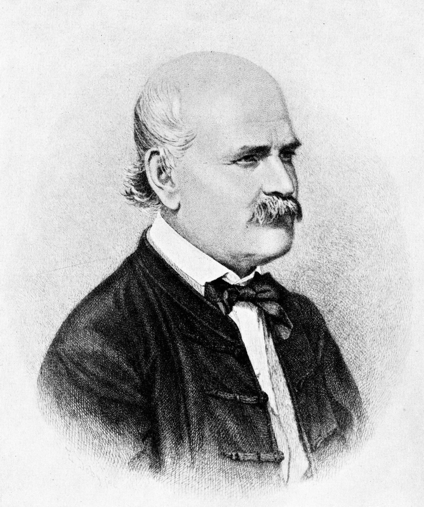
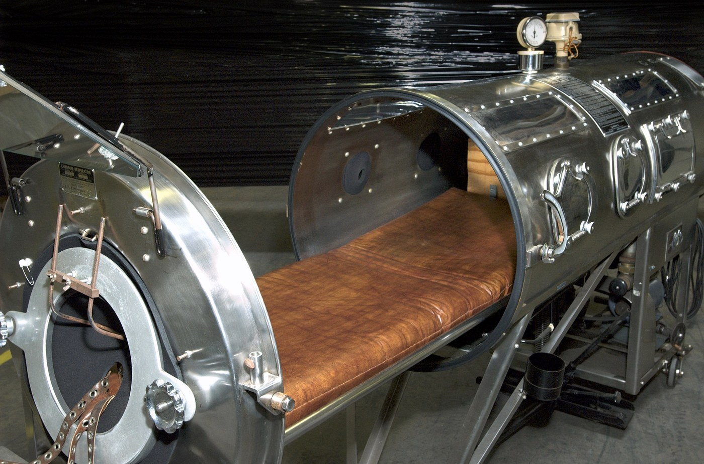

# A Case to Open With {.section-divider}

## Two Wards, One Hospital

:::: {.columns}

::: {.column width="64%"}
::: {.thought-question}
Vienna, 1847. You run the maternity hospital's First Clinic. Women who deliver there die of "childbed fever" at about one in ten. In the Second Clinic it is under one in twenty-five. Same hospital, same kinds of patients.

- The First Clinic is staffed by physicians and medical students; the Second by midwives.
- Women beg to be admitted to the Second. Some give birth in the street rather than enter the First.
- Women who deliver in the street and are admitted afterward almost never get the fever.
- A colleague has just died after cutting his finger at an autopsy. His illness looked exactly like childbed fever.

How would you figure out what is going on? What would you change — and how would you know it worked?
:::
:::

::: {.column width="36%"}
{width="90%" fig-alt="Copperplate engraving of Ignaz Semmelweis, 1860"}

::: {.attribution}
Ignaz Semmelweis, engraving by Jenő Doby, 1860. Public domain (Wikimedia Commons).
:::
:::

::::

## After You've Discussed

::: {.callout-note}
**What Semmelweis did, and what he lacked.** In May 1847 **Ignaz Semmelweis** made doctors and students wash in chlorinated lime before examining patients. The First Clinic's death rate fell from 18% in April to 2% by June [@semmelweis1861]. He had a control group he never designed, the Second Clinic, and an intervention he did design. He had no randomization, no blinding, and a before-and-after comparison that time alone could have produced. The profession did not accept his result, and he died in an asylum in 1865.

The tools in the rest of this lecture are what it would have taken to be believed. The 1954 polio trial used every one of them.
:::

## Today

::: {.learning-outcomes}
By the end of Part A, you will be able to:

- Tell clinical care apart from clinical research, and say why the difference changes consent and oversight
- Explain randomization, control, placebo, and blinding by walking from Semmelweis to the 1954 polio trial
- Tell a clinical endpoint from a surrogate, and judge whether a result could be chance
- Summarize what trial phases I–IV are for
- Explain the therapeutic misconception and why it matters at the bedside
- Use the opioid-evidence story to say what a given study can and cannot support
:::

# Research and Care Are Not the Same {.section-divider}

## One Crucial Difference

- [Clinical care]{.key-term} aims to help the patient in front of you
- [Clinical research]{.key-term} aims to produce knowledge that applies to many patients [@emanuel2000research]
- Both can help a patient
- But direct patient benefit is not what makes an activity research
- That difference changes consent, oversight, and what risks are acceptable

## The Same Room Can Hide the Difference

:::: {.columns}

::: {.column width="50%"}
**Why it feels like care**

- Same hospital
- Same white coats
- Same lab draws and imaging
- Same reassuring language of "options"
- Often the same physician
:::

::: {.column width="50%"}
**Why it is not the same**

- The protocol fixes what can happen
- A coin flip may assign the arm
- The main goal is learning, not tailoring
- The results are meant to guide future care
- Independent review must happen before it begins
:::

::::

## Why Research Exists

- Without research, medicine would freeze in place
- New drugs, devices, and procedures must be tested before they become standard
- Even old treatments need comparison, follow-up, and correction
- Ethical research is not the enemy of patient care
- Ethical research is one reason patient care can improve at all

## Research vs. Clinical Care at a Glance

| Question | Clinical care | Clinical research |
|---|---|---|
| **Main goal** | Help this patient now | Produce reliable knowledge |
| **Who should benefit first?** | This patient | Future patients, and sometimes current ones |
| **Who sets the plan?** | Clinician and patient | The protocol, eligibility rules, and study design |
| **What governs it?** | Professional standards, licensure, ordinary consent | IRB review, protocol rules, research consent [@commonrule_hhs] |
| **What counts as success?** | Good care for this person | Valid evidence that answers the research question |

## The Physician-Investigator Tension

- A clinician may also be a [physician-investigator]{.key-term}
- That can be efficient and helpful
- It can also blur whether the advice is coming from the doctor or the researcher
- Modern research ethics treats this tension as real and common, not rare [@helsinki2024]
- That is one reason independent review matters

# Inside a Randomized Trial {.section-divider}

## Why Randomize?

- If doctors picked the groups, healthier and sicker patients could cluster without anyone meaning to [@nci_trials2024]
- Randomization assigns people by chance
- That keeps the comparison scientifically fair
- It also means the clinician is no longer hand-picking a treatment for this patient
- So randomization is ethically important, not just useful in statistics

## When Is It OK to Randomize a Sick Person?

- The answer needs a concept: [clinical equipoise]{.key-term}, meaning the expert community is *genuinely unsure* which arm is better
- If we already knew, randomizing would be wrong: we would be sending some patients to the worse option on purpose
- Equipoise is the moral license for a trial
- "I'd just give everyone the new drug" assumes we already know it is better. We do not.
- The first randomized trial, the **MRC streptomycin trial** of 1948, had a second reason too: the drug was scarce, so a coin flip was the *fair* way to decide who got it [@mrc1948]

## One Map of a Parallel-Group Trial

```{dot}
//| fig-width: 10.6
//| fig-height: 3.1
//| fig-cap: "A plain-language map of a parallel-group randomized trial. The key ethical moment is the middle: once people consent and are randomized, no one chooses the arm just for that patient's benefit."
digraph rct {
  rankdir=LR;
  bgcolor="transparent";
  graph [nodesep=0.45, ranksep=0.7];
  node [fontname="Inter", fontsize=10, margin="0.14,0.10"];
  edge [color="#64748b", fontname="Inter", fontsize=9, arrowsize=0.7];

  A [label="People with the\ncondition", shape=box, style="rounded,filled",
     fillcolor="#dfe6ee", color="#475569"];
  B [label="Eligibility check\nand consent", shape=box, style="rounded,filled",
     fillcolor="#e6f1f2", color="#0e7c86"];
  C [label="Randomize", shape=diamond, style=filled,
     fillcolor="#f8fafc", color="#94a3b8"];
  D [label="Arm 1\nnew treatment", shape=box, style="rounded,filled",
     fillcolor="#cfe9ec", color="#0e7c86", fontcolor="#0e7c86", penwidth=2];
  E [label="Arm 2\nstandard care or\ncontrol", shape=box, style="rounded,filled",
     fillcolor="#fce9d6", color="#b07d1a"];
  F [label="Follow-up\nand outcome data", shape=box, style="rounded,filled",
     fillcolor="#dfe6ee", color="#475569"];
  G [label="Compare results", shape=box, style="rounded,filled",
     fillcolor="#fad7d2", color="#c0392b", fontcolor="#9d2f23"];

  A -> B -> C;
  C -> D;
  C -> E;
  D -> F;
  E -> F;
  F -> G;
}
```

## A Real Trial: Polio, 1954

:::: {.columns}

::: {.column width="62%"}
- In 1952 the United States recorded about 58,000 polio cases, most of them children.
- **Jonas Salk**'s killed-virus vaccine looked promising. Promising vaccines had failed before, and some had harmed children.
- So the country ran the largest medical experiment in history: 1.8 million schoolchildren, the "Polio Pioneers," run by the **March of Dimes** under **Thomas Francis Jr.**
- Its job was not to *deliver* a cure but to *prove* one. Randomize, control, blind, compare: the design decided whether anyone could believe the result [@francis1955].
:::

::: {.column width="38%"}
{width="100%" fig-alt="An opened iron lung of the type polio patients depended on in the 1950s"}

::: {.attribution}
Iron lung, 1950s. CDC Public Health Image Library, #6536. Public domain.
:::
:::

::::

## Two Designs, One Trial

The 1954 trial ran **two designs at once**:

| | Placebo-controlled areas | Observed-control areas |
|---|---|---|
| **Who got vaccine** | Grades 1–3 **randomized** to vaccine or saline | Only 2nd-grade **volunteers** vaccinated |
| **The controls** | Randomized peers given a saline shot | Grades 1 and 3, simply observed |
| **Blinding** | **Double-blind** — no one knew who got what | Not blinded |
| **How trustworthy** | High — groups comparable, judgment unbiased | Weaker — volunteers differ; diagnosis can be swayed |

Same disease, same year, same vaccine. The **design**, not the vaccine, is what made one half of the trial believable.

## What the Control Group Gets

- Sometimes the control group gets current standard care, sometimes standard care plus a placebo
- If no proven treatment exists, it may get placebo or no active treatment [@nci_trials2024; @helsinki2024]
- Control does not mean "ignored": everyone in the study is still watched under a protocol
- The idea is old. In 1747 **James Lind** gave twelve scurvy-stricken sailors six different treatments, two each; only the pair given citrus recovered [@lind1753]

## Placebo Does Not Always Mean "Nothing"

::: {.context-box}
**A placebo can do different jobs.**

- If no proven treatment exists, placebo may stand in for no active treatment.
- If a proven treatment already exists, placebo is often added *on top of* standard care so no one is denied basic treatment.
- The ethical question is not just "placebo or no placebo?" It is **what participants are missing by being in that arm** [@nci_trials2024; @helsinki2024].
:::

## What Blinding Actually Does

- [Blinding]{.key-term} means some people in the trial do not know which arm a participant is in
- Single-blind usually means the participant does not know
- Double-blind usually means the participant *and* the treating team do not know
- Its job is to reduce expectation effects and biased judgment
- "Double-blind" is about cleaner evidence, not secrecy for its own sake

## Why Blinding Mattered in 1954

::: {.context-box}
Diagnosing mild polio is partly a judgment call. A borderline weak limb can be read either way. In the 1954 trial's observed-control areas, the examining doctors knew which children had been vaccinated. A doctor who *hoped* the vaccine worked could, without any dishonesty, lean toward "not polio" in a vaccinated child.

So the placebo-controlled areas were **double-blind**. No one at the bedside knew, and hope could not tip the count.
:::

## Who Watches the Trial While It Runs?

- A trial is not left alone until it ends
- An independent [data safety monitoring board]{.key-term} (DSMB) reads the data as it comes in
- It can **stop a trial early for harm**. The **CAST** trial's board did exactly that in April 1989, when the drugs under test were killing patients [@cast1989]
- It can also **stop early for benefit** — one arm is so clearly better that continuing the other is no longer fair
- Equipoise has a deadline. Once the evidence is in, the trial must end

## The Same Machinery, Today

- The 2020 COVID-19 vaccine trials used the 1954 logic at modern scale: tens of thousands of volunteers, randomized, double-blind, placebo-controlled.
- The primary endpoint was **clinical**, lab-confirmed symptomatic COVID-19, not an antibody level in the blood.
- An independent monitoring board read the data at planned checkpoints.
- Seventy years apart, the polio and COVID trials are the same instrument. Both used it carefully because the stakes were enormous.

# Reading a Trial's Result {.section-divider}

## What Are We Even Measuring? Endpoints

- A **clinical endpoint** is something a patient can feel or would obviously care about: living longer, avoiding a stroke, walking without pain.
- A **surrogate endpoint** is a stand-in. It is measured because it is faster or cheaper — a lab number, a scan finding, a blood pressure reading.
- Surrogates speed research up. But a treatment can move the surrogate and still not help patients. It can even harm them.
- The classic warning is **CAST**. Drugs that "fixed" an abnormal heart rhythm on the monitor *increased* deaths [@cast1989].
- So the first question to ask of any trial is: did patients actually do better, or did a number just move?

## Could It Just Be Chance?

- Any two groups differ a little by luck. Statistics ask how likely a difference *this big* is if the treatment did nothing.
- "Statistically significant" roughly means "probably not just luck." It does **not** mean large, important, or certain.
- Small trials are easily fooled by chance, which is why large samples and **independent replication** matter.
- Slice a trial into enough subgroups and some "fail" by luck. **ISIS-2** proved aspirin saves lives, then reported it "failed" for Geminis and Libras, on purpose [@isis1988].
- A single significant result is a lead worth following, not a verdict to act on alone.

## Honest Trials Can Still Mislead

- A result can mislead even when no one lied or faked anything.
- **Who got into the trial** limits who the answer applies to. Narrow eligibility rules can leave out the very patients you treat.
- People who **drop out** are usually different from those who finish. So looking only at the "completers" quietly flatters the treatment.
- **Intention-to-treat** analysis is the standard guard against that. It counts everyone in the group they were randomized to, even if they quit.
- Always ask who is missing from this result, and which way that would bias it.

## When a Letter Becomes "Evidence"

- In 1980, a five-sentence *letter to the editor* by **Porter and Jick** reported that, among **hospitalized** patients given opioids, addiction was rare [@porter1980].
- It was not a trial. No randomization. No control. No long-term or outpatient follow-up.
- Over the next two decades it was cited hundreds of times — as if it had proven that long-term outpatient opioids rarely cause addiction.
- The *type* of study and *who was in it* cap what any result can support. A letter is not an RCT.
- How that misreading was promoted is a research-integrity story we return to in Part B.

## Thought Question

::: {.thought-question}
A new drug's Phase III trial is reported as "positive."

- It significantly improved a **surrogate** marker on a scan.
- The trial was **small**. About **25%** of participants dropped out.
- The analysis included only those who completed.

1. Name the three weaknesses you can already see.
2. What would you want to know before telling a patient this drug "works"?
3. Is "the FDA might approve it" the same as "it helps patients"?
4. Regulators sometimes grant **accelerated approval** on a surrogate endpoint, with a confirming trial promised later. Some confirming trials never finish. Is faster access worth weaker evidence?
:::

## After You've Discussed

::: {.callout-note}
- **Statistically significant ≠ clinically meaningful.** A real but tiny effect on a surrogate can be true and still not worth having.
- **Regulatory approval ≠ proven patient benefit.** Approval is a decision under uncertainty, not a guarantee.
- **The standing questions are always the same:** what was measured, in whom, and who is missing from the result?
:::

# Trial Phases {.section-divider}

## Four Phases, Four Questions

| Phase | The main question | Typical scale |
|---|---|---|
| **I** | Is it safe? What dose can people tolerate? | Small |
| **II** | Does it seem to work? | Larger |
| **III** | Is it better than the current standard? | Large, often randomized |
| **IV** | What happens after approval in the real world? | Very large, longer-term |

## The Same Four Phases: COVID-19 Vaccines

| Phase | When | Scale | What it answered |
|---|---|---|---|
| **I** | March 2020; first dose March 16 | About 45 people | Dose and safety |
| **II** | Spring to summer 2020 | Hundreds | Immune response; which dose to carry forward |
| **III** | July to November 2020 | About 30,000 (Moderna); about 44,000 (Pfizer) | Roughly 95% efficacy against placebo. Emergency authorization, December 2020 |
| **IV** | 2021 onward | Tens of millions | **Myocarditis** in young men, detected through safety reporting in spring 2021. Full approval August 2021 (Pfizer) and January 2022 (Moderna) |

The Phase IV row is the point of Phase IV: a rare harm too uncommon for a 30,000-person trial to see, caught once the vaccine reached tens of millions.

## What Each Phase Is Really Asking

- **Phase I** is small, often 15–30 people in cancer. It asks what dose is tolerable and what harms appear. Direct benefit is not the point, which is what makes it ethically hard [@nci_trials2024].
- **Phase II** enrolls more people and asks whether the treatment *seems* to work. Many promising drugs fail here.
- **Phase III** is the large, usually randomized comparison against the best existing option. Its result becomes the new standard.
- **Phase IV** runs after approval and catches rare harms that controlled trials miss.
- "Clinical trial" is not one thing. Consent should match the phase, not follow a generic script.

# The Participant's Problem {.section-divider}

## The Therapeutic Misconception

- [Therapeutic misconception]{.key-term} happens when participants think the study is being chosen mainly for their personal medical benefit [@appelbaum1982tm]
- The mistake is not just "I hope this helps"
- It is more like "my doctor is picking this because it is best for me"
- That is often false once protocol rules and randomization control the options
- A person can sign a form and still misunderstand the basic situation

## Why It Happens So Easily

- Recruitment often comes from a trusted clinician
- Serious illness makes hope urgent
- Research visits look like treatment visits
- Words like "option" and "opportunity" blur the categories
- Many people hear "new" and assume "better"

## A Research Consent Is Not a Treatment Consent

- Valid consent has four elements. Research adds requirements on top of them.
- It must say, in plain words, **"this is research"** — not treatment chosen for you
- It must disclose **randomization**. A chance process, not your clinician, may pick your arm
- It must state the goal is **knowledge**. Direct benefit is uncertain or unlikely
- It must make **withdrawal at any time, without penalty,** explicit
- The nurse is often the one who notices a form was signed but not understood

## The Dangerous Sentence

::: {.quote-card}
> "This study may help you" can be true.
> "This study is being chosen because it is the best treatment for you" is often false.

::: {.attribution}
The distinction is what the therapeutic misconception tries to protect [@appelbaum1982tm; @emanuel2000research].
:::
:::

## Early-Phase Trials and Thin Personal Benefit

- Healthy volunteers and desperate patients join studies for very different reasons
- In Phase I, researchers mainly ask what dose is tolerable and what harms appear
- Some participants may benefit. Many will not.
- Payment, hope, and lack of alternatives can all cloud judgment
- Ethical recruitment has to say this plainly

## Thought Question

::: {.thought-question}
You are a research nurse enrolling patients in a first-in-human cancer trial.

- A patient says, "If you are offering this, you must think it gives me the best chance."
- The oncologist who is also the principal investigator is standing beside you.

1. What is the most important misunderstanding to correct?
2. How blunt should you be about the low chance of direct benefit?
3. If the patient says, "I know the odds are low, but I want to try anyway," has the misconception been fixed?
4. Down the hall, a healthy adult joins a Phase I trial mainly because the payment covers two months of rent. Voluntary, yes. Equally informed, and equally free?
:::

## After You've Discussed

::: {.callout-note}
- **Hope is allowed.** The goal is not to turn participants cynical. It is to keep hope from masquerading as evidence.
- **Misunderstanding is not the same as irrationality.** A person may fully understand that a study is not personal care and still choose it.
- **The hardest part is relational.** When a trusted clinician recruits for a study, the burden to separate care from research falls more heavily on the professional, not less [@helsinki2024].
:::

# Wrapping Up Part A {.section-divider}

## Six Trials, Six Tools

| Year | Trial | The tool it gave us |
|---|---|---|
| 1747 | **Lind**, scurvy | A controlled comparison: twelve sailors, six treatments |
| 1847 | **Semmelweis**, handwashing | An intervention with a natural control, but no randomization, and no one believed it |
| 1948 | **MRC streptomycin** | Randomization. The drug was scarce, so chance was the fair way to allocate it |
| 1954 | **Salk polio field trial** | Placebo and blinding at scale: 1.8 million children |
| 1988 | **ISIS-2** | A warning about subgroups: aspirin "failed" for Geminis and Libras |
| 1989 | **CAST** | A warning about surrogates: fixing the rhythm raised deaths |

Everything after 1847 is a tool Semmelweis did not have.

## Wrapping Up Part A

::: {.recap}
Clinical research is not ordinary care with extra paperwork. Its purpose is to produce reliable knowledge. That is why it uses randomization, control groups, blinding, and staged phases. You can see all of these in one real instrument: the 1954 polio trial. The same tools showed up again in the COVID-19 vaccine trials.

Those tools also teach you to *read* a study. What did it measure — a clinical endpoint or a surrogate? Could the result be chance? Who dropped out or was left out?

The key task in Part A is learning to say, clearly and without panic: this is research, not just treatment by another name — and here is how good its evidence actually is.
:::

## Review Questions

Write a brief answer to each, or use them as discussion prompts.

::: {.review-questions}

::: {.review-item .review-recall}
[Recall]{.review-label}

What is *clinical equipoise*, and why is it the standard ethical condition for randomizing patients between two arms of a trial?
:::

::: {.review-item .review-apply}
[Apply]{.review-label}

A cancer doctor enrolls her own patients in a drug company's trial of a new chemotherapy, while continuing to be their regular doctor. Name one way this dual role could pressure patients, and one way it could distort the science.
:::

::: {.review-item .review-debate}
[Debate]{.review-label}

Halfway through a trial, the new drug looks like it is saving lives. Should the trial stop now and give the drug to everyone, or keep going so we learn whether the drug has long-term harms? Defend your answer.
:::

:::

## Key Terms

- **Clinical care** — what a clinician does to benefit *this* patient.
- **Clinical research** — what an investigator does to produce knowledge about a class of patients.
- **Physician-investigator** — a clinician who is both at once; the source of the structural conflict at the heart of research ethics.
- **Clinical equipoise** — real uncertainty in the expert community about which trial arm is better; the standard reason for randomizing.
- **Randomization** — assigning subjects to study arms by chance, to keep known and unknown differences balanced.
- **Blinding** — hiding the arm assignment from subjects (single-blind) and/or from clinicians and assessors (double-blind), to prevent expectation effects.
- **Phases I–IV** — first-in-human safety (I), small efficacy and dose-finding (II), pivotal efficacy and safety (III), post-marketing surveillance (IV).
- **Clinical vs. surrogate endpoint** — outcomes patients feel (death, MI, stroke) versus measurable stand-ins (LDL, tumor shrinkage) that may or may not track them.
- **Data safety monitoring board (DSMB)** — an independent panel that reads unblinded interim data and may stop a trial for harm, benefit, or futility.
- **Therapeutic misconception** — the patient's mistaken belief that decisions in a trial are being made for *their* personal benefit rather than to answer a research question.

## References

::: {#refs}
:::
