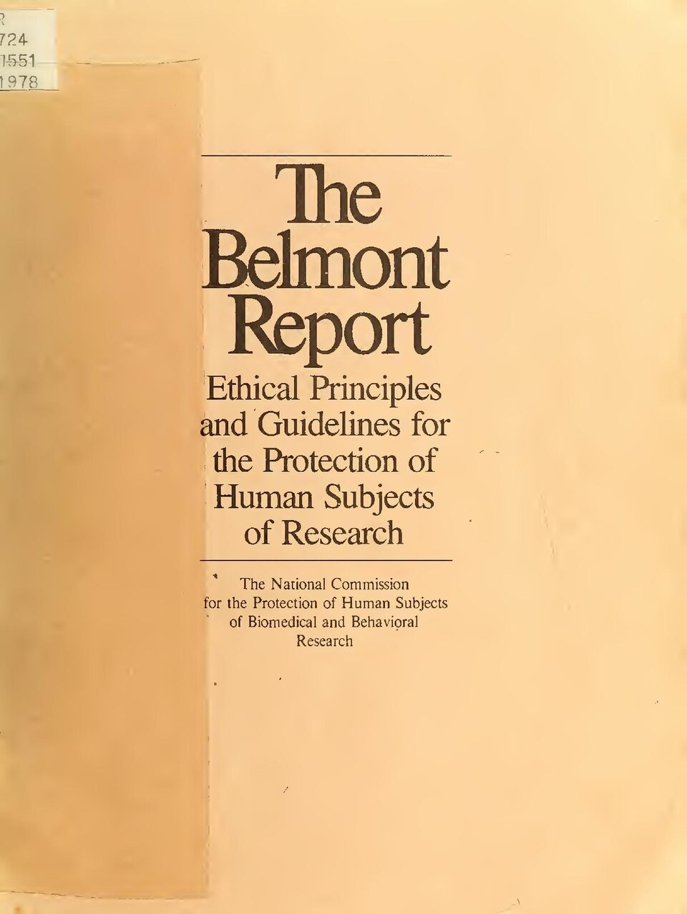
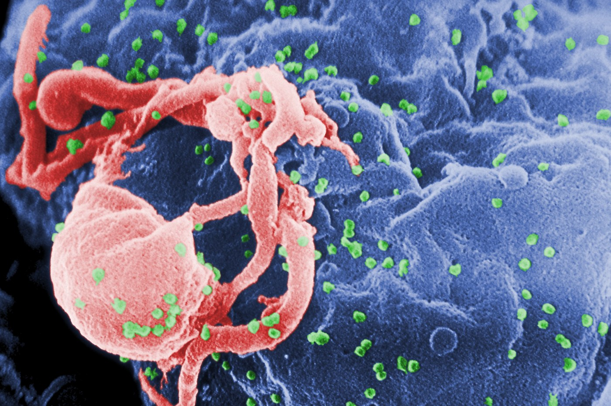
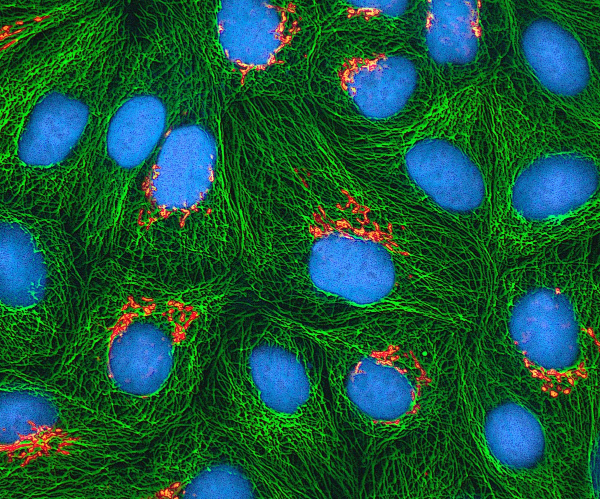
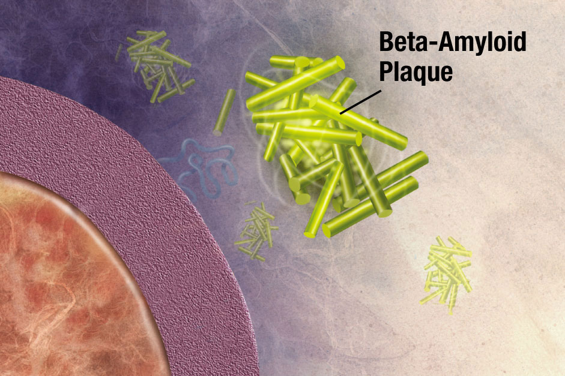

## Before We Start

::: {.thought-question}
You sit on a research review board. This protocol lands on your desk:

> A 12-month placebo-controlled trial of a new Alzheimer's drug. Participants: residents of one memory-care facility. Consent: signed by adult children as surrogates. Site chosen because "follow-up is easy — they don't move."

- Would you approve it? What bothers you, if anything?
- What single change would you require first?
- Is "easy follow-up" ever a fair reason to pick a population?
:::

# Where We Left Off {.section-divider}

## The New Question

- Part A explained how trials work and how to read their results
- The rules that protect participants were written *after* real abuses
- Part B asks a harder question: when does reviewed, legal, well-funded research still wrong people?
- One idea organizes the whole lecture: **vulnerability** — who can be pressured, and who pays when knowledge is the goal

## Today

::: {.learning-outcomes}
By the end of Part B, you will be able to:

- Define [vulnerability]{.key-term} as a matter of power and pressure, not personality, using a working list of types
- Apply the Belmont principles as concrete IRB review questions
- Explain [clinical equipoise]{.key-term} as the moral license that both starts and ends a trial
- Judge when placebo controls are and are not defensible, including across rich and poor settings
- Show how commercial funding distorts research, using the Markingson case
- Explain why so many published findings fail to replicate — and how AI magnifies the threat
:::

## Three Abuses, Three Protections

Modern research protections were built one scandal at a time.

| Case | The wrong | What it forced into place |
|---|---|---|
| **Nazi experiments** | No real consent; extreme harm | Voluntary consent; Nuremberg [@nuremberg1947] |
| **Willowbrook** | Dependent children; coercive setting | Vulnerable-population protection; independent review [@jonsen1998] |
| **Tuskegee** | Deception; withheld treatment; racist selection | Belmont: respect, beneficence, justice [@brandt1978; @belmont1979] |

# What Makes a Subject Vulnerable? {.section-divider}

## Vulnerability Is Pressure, Not Personality

- Every case above shares one feature. The people studied could not freely say no.
- [Vulnerability]{.key-term} is not a kind of person. It is a kind of situation.
- The questions that matter: who depends on whom? Who can walk away? What would refusing cost?
- Justice cuts both ways. Wrongful **exploitation** of the vulnerable *and* wrongful **exclusion** from research are both failures.

## A Working List of Vulnerabilities

**Kenneth Kipnis**'s types name *what kind of pressure* a participant is under [@kipnis2001].

| Type | The pressure | Example |
|---|---|---|
| **Cognitive** | Cannot fully understand or weigh the choice | Dementia; acute psychosis |
| **Juridic** | Under the authority of someone who wants enrollment | Prisoners; committed patients |
| **Deferential** | Socially unable to refuse a trusted figure | Patient recruited by own physician |
| **Medical** | Desperate; no good alternative | Terminal illness, "nothing left to try" |
| **Allocational** | Poor; the study is a path to care or money | Payment covers rent; trial is the only clinic |
| **Infrastructural** | The setting cannot deliver on promises | Weak health system; no drug supply after the trial |

A wealthy patient recruited by her own oncologist is **deferentially** and **medically** vulnerable, though she is on no protected list.

## Thought Question

::: {.thought-question}
You are on an IRB reviewing a vaccine study.

- Disease rates are high in prisons.
- Researchers want to recruit incarcerated people because follow-up will be easy.
- They plan a modest payment and better clinic access for participants.

1. Which *types* of vulnerability are in play here at once?
2. Is this fair inclusion, opportunistic targeting, or both?
3. Would excluding prisoners entirely also create a justice problem?
:::

## After You've Discussed

::: {.callout-note}
- **Name the pressures, then design against them.** This study mixes juridic (incarceration), allocational (payment, clinic access), and infrastructural (will the vaccine reach them afterward?) vulnerability.
- **Inclusion and protection can conflict.** Banning prison research protects against coercion. It can also deny prisoners the benefits of studies aimed at their own disease.
:::

# Belmont, Put to Work {.section-divider}

## Belmont in One Slide

:::: {.columns}

::: {.column width="64%"}
- The [Belmont Report]{.key-term} (1979) named three principles [@belmont1979]
- **Respect for persons** → real consent; extra care where vulnerability is highest
- **Beneficence** → minimize harm; justify risk against benefit
- **Justice** → who bears the burdens, who gets the benefits
- Each becomes a concrete question an IRB must ask of every study
:::

::: {.column width="36%"}
{width="88%" fig-alt="Cover page of the 1979 Belmont Report"}

::: {.attribution}
*The Belmont Report*, 1979. U.S. Department of Health, Education, and Welfare. Public domain.
:::
:::

::::

## Back to the Memory-Care Protocol

::: {.thought-question}
Return to the Alzheimer's trial from the start of class: one memory-care facility, consent signed by adult children, a site chosen because "they don't move."

1. Which vulnerability types apply?
2. Score it on each Belmont principle. Where is it weakest?
3. Has your answer about approving it changed?
:::

# Equipoise: The Moral Clock on a Trial {.section-divider}

## The Clock Runs Out

- Part A's license to randomize was [clinical equipoise]{.key-term}: the expert community's honest "we do not yet know," a standard **Benjamin Freedman** named in 1987 [@freedman1987]
- Equipoise is not permanent. Evidence builds up while the trial runs.
- An independent monitoring board can **stop a trial early** for three reasons:

| Trigger | What it means | Why stopping is required |
|---|---|---|
| **Harm** | One arm is clearly hurting people | Continuing knowingly harms participants |
| **Benefit** | One arm is clearly better | Keeping the other arm is no longer fair |
| **Futility** | The question cannot be answered | More risk buys no knowledge |

- When the uncertainty resolves, the moral license expires. The trial must end.

## Stopping Early Is Not Free

::: {.context-box}
**A counterintuitive fact.** Trials stopped early *for benefit* tend to **overstate** how well the treatment works.

Random luck swings hardest in small samples. A trial that stops the moment results look great may have stopped on a lucky high point. This is why monitoring boards use strict statistical rules, not "it looks good enough." Stopping early is both an ethical *and* a scientific judgment: it protects participants and leaves the public with weaker evidence.
:::

## Where Equipoise Runs Out

Equipoise does not answer every research-ethics question.

- **Phase I trials have no arms to compare.** A first-in-human dose-finding study exposes participants to risk for little personal benefit. The framework there is *risk-benefit plus informed consent*.
- **Miller and Brody's critique.** Equipoise treats the investigator as the participant's *doctor*, with a duty not to give a worse option. But research aims at knowledge for *future* patients. On their view, equipoise imports the therapeutic misconception into the rulebook [@miller2003].
- Equipoise fits the *middle* of research ethics, comparative trials of real treatments, and fits the edges poorly.

# Placebo, Poverty, and Global Research {.section-divider}

## Helsinki's Placebo Rule

- The [Declaration of Helsinki]{.key-term} says new treatments should usually be tested against the **best proven** option [@helsinki2024]
- Placebo is acceptable if no proven treatment exists, or for strong scientific reasons, but **not** if participants risk serious or permanent harm by going without proven treatment
- Most fights about that last condition are fights about whether equipoise exists
- "A proven treatment already exists" means there is no real uncertainty, so a placebo arm sends people to a known-worse option
- "The proven treatment cannot be delivered here" means uncertainty about *feasible* options remains

## The AZT Trials in Five Lines

:::: {.columns}

::: {.column width="60%"}
- In 1994, a long-course **AZT** regimen reduced mother-to-baby HIV transmission
- That regimen was expensive and hard to deliver in many low-resource settings
- Later trials tested shorter, cheaper regimens, often against placebo
- Critics: this withheld a known effective treatment [@lurie1997]
- Defenders: the real question was what feasible strategy could work where the long regimen was not available [@varmus1997]
:::

::: {.column width="40%"}
{width="100%" fig-alt="Scanning electron micrograph of HIV-1 budding from a cultured lymphocyte"}

::: {.attribution}
HIV-1 budding from a lymphocyte. CDC Public Health Image Library, #10000 (C. Goldsmith). Public domain.
:::
:::

::::

## Two Famous Positions

:::: {.columns}

::: {.column width="50%"}
**Lurie and Wolfe** [@lurie1997]

- A proven regimen already existed
- Placebo meant withholding known benefit
- Poverty must not lower the ethical standard
- Poorer countries should not get weaker protections
:::

::: {.column width="50%"}
**Varmus and Satcher** [@varmus1997]

- The long regimen was not realistically deliverable
- A shorter regimen might still save lives at scale
- The relevant comparison had to include feasibility
- Blocking the trial preserves principle but blocks benefit
:::

::::

## A Placebo Decision Tree

```{dot}
//| fig-width: 10.6
//| fig-height: 3.5
//| fig-cap: "A simple placebo decision tree. Each diamond is really a question about whether genuine equipoise exists. Real IRB review is more detailed."
digraph placebo {
  rankdir=LR;
  bgcolor="transparent";
  graph [nodesep=0.45, ranksep=0.7];
  node [fontname="Inter", fontsize=10, margin="0.14,0.10"];
  edge [color="#64748b", fontname="Inter", fontsize=9, arrowsize=0.7];

  A [label="Does a best proven\nintervention exist?", shape=diamond, style=filled,
     fillcolor="#f8fafc", color="#94a3b8"];
  B [label="Placebo may be\neasier to justify", shape=box, style="rounded,filled",
     fillcolor="#cfe9ec", color="#0e7c86", fontcolor="#0e7c86", penwidth=2];
  C [label="Would withholding it risk\nserious or permanent harm?", shape=diamond, style=filled,
     fillcolor="#f8fafc", color="#94a3b8"];
  D [label="Placebo is a major\nethical red flag", shape=box, style="rounded,filled",
     fillcolor="#fad7d2", color="#c0392b", fontcolor="#9d2f23"];
  E [label="Is placebo genuinely\nneeded for the science?", shape=diamond, style=filled,
     fillcolor="#f8fafc", color="#94a3b8"];
  F [label="Use active-control\ndesign instead", shape=box, style="rounded,filled",
     fillcolor="#fce9d6", color="#b07d1a"];
  G [label="Approve only with\nstrong reasons and protections", shape=box, style="rounded,filled",
     fillcolor="#dfe6ee", color="#475569"];

  A -> B [label="no", color="#0e7c86", fontcolor="#0e7c86"];
  A -> C [label="yes"];
  C -> D [label="yes", color="#c0392b", fontcolor="#c0392b"];
  C -> E [label="no"];
  E -> F [label="no", color="#b07d1a", fontcolor="#b07d1a"];
  E -> G [label="yes"];
}
```

## Thought Question

::: {.thought-question}
You are on an ethics committee in 1997 reviewing a short-course AZT trial in Uganda.

- In the sponsor country, the long-course regimen already works.
- In the host country, that regimen is too expensive and complex for everyday use.
- The study compares a shorter regimen to placebo.

1. Is there real equipoise here — and equipoise about *what*?
2. Does local unavailability change what researchers ethically owe participants?
3. What is owed *after* the study — do participants keep what worked?
:::

## After You've Discussed

::: {.callout-note}
This is **allocational** and **infrastructural** vulnerability by design.

- **"Local standard" describes the world; it does not settle what is owed.** A study can be feasible, even locally standard, and still exploitative — poverty is not a discount on human protections.
- **Post-trial access is part of the ethics, not cleanup.** Proving a regimen works and then taking it away uses the host community [@emanuel2004benchmarks; @helsinki2024].
:::

# Research Without a Trial: Tissue and Data {.section-divider}

## Henrietta Lacks

:::: {.columns}

::: {.column width="60%"}
- In 1951 **Henrietta Lacks**, a Black woman, was treated for cervical cancer at Johns Hopkins
- Without her knowledge, cells from her tumor were taken and grown
- They became **HeLa**, the first immortal human cell line, used in countless studies and products
- She was never asked. Her family was not told for decades, and shared in none of the benefit.
- No drug, no placebo, no "arm," and still a major research-ethics failure. The vulnerability here was *never being asked at all*.
:::

::: {.column width="40%"}
{width="100%" fig-alt="Fluorescence micrograph of cultured HeLa cells"}

::: {.attribution}
HeLa cells, fluorescence micrograph. National Institutes of Health. Public domain.
:::
:::

::::

::: {.aside-note}
The image is of her cells, not of her. That is a choice, given what this slide is about.
:::

## What the Rules Now Require

- US human-subjects research follows the [Common Rule]{.key-term}, rewritten in 2018 [@commonrule_hhs]
- Consent forms must open with a short **"key information"** summary in plain language
- **Broad consent**: a person can agree once to future, unspecified research on stored samples and data
- Most multi-site studies now use a **single IRB** instead of one per site
- Broad consent is more honest than silence. It is also ethically thinner than asking each time.

## Thought Question

::: {.thought-question}
You give a blood sample for a routine test. A leftover vial is stored. Years later it is used — with your name removed — in genetic research and a profitable diagnostic. You were never asked. A broad intake form said "samples may be used for research."

1. Was that consent meaningful?
2. Do you have a claim to a say — or a share — in what was discovered?
3. Is "deidentified" enough, when the sample is DNA that can re-identify you and your relatives?
:::

## After You've Discussed

::: {.callout-note}
- **Consent for *this study* is not consent for *all future research*.** Tissue and data banks rely on broad consent. Useful, but ethically thinner than specific consent.
- **Benefit-sharing is part of justice.** If people make a discovery possible, who profits is an ethical question, not an afterthought.
- **"Deidentified" weakens but does not erase the stake.** Genomic data can re-identify, and can implicate relatives who never agreed.
:::

# When Money Recruits: Commercial Funding {.section-divider}

## The Structural Conflict

- Most clinical trials are now funded by the companies that profit if the drug succeeds
- Industry funding is not wrong by itself. But it builds in a conflict of interest.
- Watch three roles: **who funds**, **who recruits**, and **who reviews**
- The danger peaks when the same people, paid by the sponsor, also treat and enroll the patient
- This is **deferential** and **medical** vulnerability meeting a financial incentive

## The Markingson Case

::: {.context-box}
**Dan Markingson, University of Minnesota, 2003–2004.** A young man with acute psychosis was placed under an involuntary commitment order. His **treating psychiatrist** enrolled him in the industry-funded CAFÉ antipsychotic trial. He was facing commitment to a state hospital if he did not cooperate with his treatment team. His mother repeatedly warned that he was getting worse. He died by suicide during the study.
:::

## What the 2015 Review Found

- Markingson was, in the state auditor's words, **"extraordinarily vulnerable"** — committed, psychotic, with no real freedom to refuse [@mn_legaudit2015]
- Investigators and the IRB chair had **financial ties** to the sponsor. That gave them a reason to enroll and keep subjects [@mn_legaudit2015]
- The University's review of his death was **shallow**. It did not look at medical records or seek outside information.
- Bioethicist **Carl Elliott** spent years pressing for accountability. The university pushed back [@elliott2010].
- Every vulnerability type from earlier is here at once: cognitive, juridic, deferential, medical

## Disclosure Is Not a Firewall

A well-designed system does not rely on good intentions. It builds **structure**.

| Weak safeguard | Stronger safeguard |
|---|---|
| Investigator discloses COI on a form | Recruitment done by someone with **no stake** in enrollment |
| Sponsor analyzes its own data | **Independent** monitoring board and statisticians |
| Treating doctor also enrolls the patient | Separation of the **care role** from the **research role** |
| Institution investigates itself | **Outside**, empowered review when harm occurs |

## Thought Question

::: {.thought-question}
A patient newly diagnosed with a serious illness is offered a trial by the physician she trusts most — her own specialist. The specialist receives per-patient payments from the sponsor for each person enrolled.

1. Which vulnerability types is she under, before any form is signed?
2. Is disclosure of the payment enough to fix the problem? Why or why not?
3. What single structural change would most reduce the conflict?
:::

## After You've Discussed

::: {.callout-note}
- **Conflict of interest is structural, not just moral.** Honest people in a bad structure still produce biased enrollment.
- **Disclosure is the floor, not the fix.** Telling someone about a conflict does not neutralize it. Separating the roles does.
- **The treating clinician is the highest-pressure recruiter**, which is why independent recruitment and review exist.
:::

# When the Knowledge Is the Problem {.section-divider}

## Protecting Participants Is Not Enough

- A clean consent process does not guarantee **trustworthy knowledge**
- The US Office of Research Integrity names three core wrongs:
  - **Fabrication** — making up data
  - **Falsification** — manipulating data, images, or results
  - **Plagiarism** — passing off others' work as your own
- A faked study can change treatment for millions before anyone notices. The wronged party is now the **future patient**.

## Why So Many Findings Are False

A landmark paper by **John Ioannidis** argued that most published findings can be wrong [@ioannidis2005]. Four reasons:

- **Low base rate** — most hypotheses tested are false to start with
- **Small studies** — easily swung by chance
- **Researcher flexibility** — **p-hacking** (trying analyses until one crosses the line) and **HARKing** (hypothesizing after the results are known). Neither requires lying [@simmons2011]. Part A's ISIS-2 showed the mechanism: test enough subgroups and aspirin "fails" for Geminis.
- **Publication bias** — positive results get printed. Null results vanish.

## It Is Systemic, Not Rare

- **Psychology:** a large replication project reproduced only about **39%** of published findings [@osc2015]. The casualties included **power posing**, **ego depletion**, and **social priming**: TED talks, textbooks, and bestsellers.
- **Preclinical cancer:** one team could confirm just **6 of 53** landmark studies [@begley2012]
- These are not fringe journals. They are the literature clinicians rely on.
- "Published" and "peer-reviewed" are a **floor, not a guarantee**

::: {.aside-note}
Power posing: a "confident" stance was said to change hormones and risk-taking; large replications found no reliable effect. Ego depletion: willpower as a fuel that runs out; a 23-lab preregistered test found the effect near zero. Social priming: reading "elderly" words was said to make people walk slower; it did not replicate.
:::

## The Alzheimer's Case

:::: {.columns}

::: {.column width="60%"}
::: {.context-box}
In **2006**, a *Nature* paper named a specific amyloid protein, **Aβ*56**, as a cause of memory loss. It became one of the most-cited Alzheimer's papers of its era and helped lock in the "amyloid hypothesis" that steered roughly **16 years** of funding and drug development.

In **2022**, a six-month *Science* investigation found that key images in that paper, and in many related ones, appear to have been **manipulated** [@piller2022].
:::
:::

::: {.column width="40%"}
{width="100%" fig-alt="Illustration of beta-amyloid fragments forming a plaque between neurons"}

::: {.attribution}
Beta-amyloid plaque formation. National Institute on Aging, NIH. Public domain.
:::
:::

::::

- Through those years amyloid-targeting drugs **failed trial after trial**, and participants received infusions with real risks: brain swelling and microbleeds
- A possibly faked result may have redirected a field while patients volunteered for drugs built on it

## Medicine: Treatments Patients Received That Didn't Work

A review led by **Vinay Prasad** found that about **40%** of established practices tested over a decade were later **contradicted** [@prasad2013].

| Treatment | What patients went through | What rigorous trials showed |
|---|---|---|
| Knee arthroscopy for arthritis | Real surgery, anesthesia, recovery | No better than **sham surgery** [@moseley2002] |
| Hormone therapy "for the heart" | Years of daily medication | **Raised** heart disease, stroke, breast cancer [@whi2002] |
| Vertebroplasty (spinal fracture) | Cement injected into the spine | No better than a sham procedure [@kallmes2009] |
| Stents for stable chest pain | An invasive cardiac procedure | No better than a **placebo procedure** at improving exercise time [@orbita2018] |

Each was standard, paid for, and sincerely recommended.

## The AI Turn

- **Surgisphere, 2020:** *The Lancet* and *NEJM* pulled COVID papers built on a huge hospital database. **No one could audit** it. It likely never existed. Faked big data, accepted because it looked official.
- AI now makes this cheaper. Faked images. Synthetic "data." Fluent **paper-mill** manuscripts at scale.
- It also makes p-hacking faster — an automated search across thousands of model variants
- Counter-tools exist (image forensics, statistical screening). But **detection lags creation**.
- For a clinician: source and replication matter more than polish. A confident, well-written result is not a true one.

## Thought Question

::: {.thought-question}
A landmark drug trial is later found to contain manipulated data. Thousands of patients were treated based on it. (Recall the opioid story from Part A: a single misread letter, heavily promoted, helped launch a crisis.)

1. Who was wronged — the study's participants, future patients, or both?
2. Is faking data a worse research-ethics violation than a consent failure, or just a different one?
3. Why does the system usually catch this slowly — and what would catch it sooner?
:::

## After You've Discussed

::: {.callout-note}
- **Integrity is a subject-protection issue too.** A false result is not just an academic error. It is the knee surgery, the hormone pill, the amyloid infusion that thousands of real people endured for nothing.
- **The safeguards are thin by design** — science runs on trust and occasional replication — so the fixes are structural: preregistration, data sharing, independent replication, faster retractions.
:::

# Wrapping Up Part B {.section-divider}

## Wrapping Up Part B

::: {.recap}
Research ethics is the study of how the search for knowledge can wrong people — and how to design against it.

Vulnerability is the spine. It is power and pressure, not personality. That is why consent must be real. It is why equipoise — the standard, if contested, license for most RCTs — both starts and ends a trial. It is why placebo and global trials turn on feasibility and post-trial duties. It is why commercial funding needs structural firewalls, not just disclosure. And it is why a replication crisis amplified by AI is itself a subject-protection problem.

Ethical research is not research with a signature. It is research designed so that the people who make knowledge possible — and the future patients who will rely on it — are treated as persons first.
:::

## Review Questions

Write a brief answer to each, or use them as discussion prompts.

::: {.review-questions}

::: {.review-item .review-recall}
[Recall]{.review-label}

What does Belmont's *Justice* principle ask an IRB to check when it picks who gets studied? Then give one example each of *cognitive* and *allocational* vulnerability.
:::

::: {.review-item .review-apply}
[Apply]{.review-label}

A biotech company wants to collect DNA from children in foster care to study rare brain conditions. State caseworkers — not the children's parents — will sign the consent. Name two things an IRB should worry about before approving this study.
:::

::: {.review-item .review-debate}
[Debate]{.review-label}

A drug that works is standard care in rich countries but unavailable in a poor country. Is it acceptable to run a placebo-controlled trial of a new drug there, given that the standard drug is out of reach anyway? Defend your answer.
:::

:::

## Key Terms

- **Belmont Report (1979)** — names the three principles for human-subjects research: respect for persons, beneficence, and justice.
- **Respect for persons** — the Belmont principle requiring informed consent and extra protections for those with limited autonomy.
- **Beneficence (in research)** — minimize risks, maximize benefits, keep a favorable risk-benefit ratio.
- **Justice (Belmont)** — fair distribution of the benefits and burdens of research. Operationalized as *Fair Subject Selection*.
- **Fair Subject Selection** — recruiting populations because they bear on the scientific question. Not because they are convenient or powerless.
- **Vulnerability** — features of a subject or group that limit their ability to protect their own interests in a study.
- **Cognitive vulnerability** (Kipnis) — limits on capacity to understand or evaluate the study (e.g., children, intellectual disability).
- **Allocational vulnerability** (Kipnis) — being in a position where study participation is hard to refuse because resources, services, or status depend on it.
- **Clinical equipoise** — real uncertainty in the expert community about whether one trial arm is better than the other. The standard license for randomizing in comparative trials; contested at the edges (Phase I, early stopping, the Miller-Brody critique).
- **Declaration of Helsinki** — the WMA's evolving statement of physicians' duties in research, including consent and post-trial obligations.
- **Common Rule** — the US federal regulation (45 CFR 46) governing federally funded human-subjects research. The framework IRBs apply.
- **IRB (Institutional Review Board)** — the local committee that reviews protocols against these principles before research may proceed.

## References

::: {#refs}
:::
