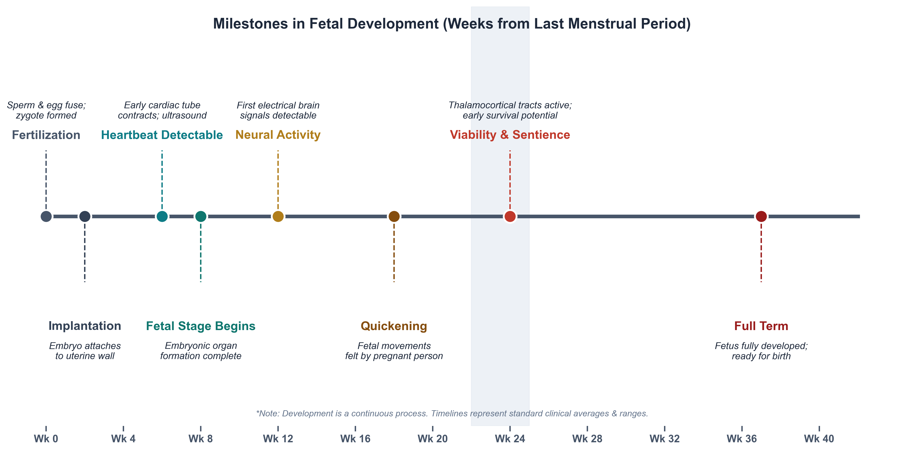

# A Stranger in the Next Bed {.section-divider}

## You Wake Up Connected

::: {.thought-question}
You wake up in a hospital bed. In the bed beside you is a famous, unconscious violinist. The Society of Music Lovers has discovered that you alone have the right blood type to keep his failing kidneys filtering. Overnight they kidnapped you, sedated you, and plugged his circulatory system into yours. The hospital director apologizes. The violinist will die if you unplug. He needs you for nine months.

**Write or discuss:**

1. Are you morally *required* to stay plugged in for nine months?
2. If you unplug, have you *killed* him — or simply *refused to save* him?
3. Where, exactly, does this scenario stop resembling a pregnancy?
:::

::: {.notes}
This is Judith Jarvis Thomson's 1971 case. Don't formalize it yet — let students react. We'll come back and reconstruct it as an explicit argument later in the lecture.
:::

## After You've Discussed

::: {.callout-note}
Three things to hold onto from that scene:

- **A right to life is not automatically a right to *use someone else's body*.** These are two different rights, and people slide between them.
- **There's a moral difference between "killing" and "letting die."** Where you draw that line will decide many other cases in this course.
- **Today's job is to learn a tool, not to settle the question.** By the end you will be able to point at the specific sentence in any abortion argument that you think is wrong. That sentence is where the real disagreement lives.
:::

## Today

::: {.learning-outcomes}
By the end of Part A, you will be able to:

- Rewrite an everyday argument in standard form (numbered premises → conclusion) and distinguish *validity* from *soundness*
- State Don Marquis's future-like-ours argument and the strongest objection to it
- Apply Mary Anne Warren's five marks of personhood to borderline cases (zygote, newborn, adult with advanced dementia, dolphin, AI)
- Reconstruct Judith Jarvis Thomson's violinist case as a formal argument and locate at least two disanalogies critics press against it
- Explain how Rosalind Hursthouse's virtue-ethics approach reframes the abortion question away from the status of the fetus
- Identify, for any abortion argument, the *load-bearing premise* — the one premise the disagreement actually turns on
:::

# A Tool: Standard Form {.section-divider}

## What Standard Form Looks Like

In philosophy, we make arguments visible by stacking the **premises** in a numbered list and setting the **conclusion** below a line. A toy example, far from abortion:

::: {.argument}
::: {.arg-name}
A Simple Argument
:::

1. All registered nurses in Minnesota are licensed by the Board of Nursing.
2. Jamie is a registered nurse working in Rochester, Minnesota.
3. Therefore, Jamie is licensed by the Board of Nursing.
:::

Once an argument is in this shape, disagreement becomes precise: you no longer reject "the whole thing," you reject **a specific premise**, or you reject the **inference** from premises to conclusion.

## Validity vs. Soundness

::: {.columns}
::: {.column width="48%"}
### Valid
An argument is **valid** when the conclusion *follows* from the premises — *if* the premises were all true, the conclusion would have to be true.

Validity is about the *shape* of the argument, not the truth of any individual sentence.
:::
::: {.column width="4%"}
:::
::: {.column width="48%"}
### Sound
An argument is **sound** when it is valid **and** all its premises are actually true.

Most real bioethics arguments are valid; the fight is almost always over whether one of the premises is actually true. That is what to look for.
:::
::::

## Two Traps to Watch For — The Equivocation Trap

The word **"human"** has two very different senses, and arguments about abortion routinely slide between them without anyone noticing.

::: {.columns}
::: {.column width="48%"}
**Biological sense.** "Human" = a living member of the species *Homo sapiens*. A zygote, a fingernail clipping, a tumor of human tissue — all *human* in this sense.
:::
::: {.column width="4%"}
:::
::: {.column width="48%"}
**Moral sense.** "Human" = a being with the kind of mental and moral life that grounds a right to life. An adult patient, plausibly a newborn — *human* in this sense.
:::
::::

::: {.context-box}
**The trap.** "The fetus is human" is true in the biological sense — but the conclusion "it is wrong to kill the fetus" only follows if "human" means *the moral sense*. Sliding between the two senses inside a single argument is the fallacy of **equivocation**, and it is the single most common error in abortion debates on both sides.
:::

## Two Traps to Watch For — Begging the Question

An argument **begs the question** when one of its premises already assumes the very conclusion it is trying to establish. The argument doesn't *prove* anything; it just restates.

::: {.columns}
::: {.column width="48%"}
**Anti-abortion version:**

1. Abortion is the murder of an innocent person.
2. Murder is wrong.
3. ∴ Abortion is wrong.

The word **"murder"** has already done all the work — it means *wrongful killing of a person*. Premise 1 *is* the conclusion.
:::
::: {.column width="4%"}
:::
::: {.column width="48%"}
**Pro-choice version:**

1. The fetus is just a clump of tissue in the woman's body.
2. People can do as they wish with tissue in their own bodies.
3. ∴ Abortion is permissible.

**"Just a clump of tissue"** assumes the fetus has *no* moral status — which is the very point in dispute.
:::
::::

::: {.notes}
Once students see equivocation and question-begging, they hear them everywhere — these are transferable skills for the rest of the course.
:::

## Activity 1 — Reconstruct It

::: {.thought-question}
Here is a passage in the style philosophers actually write in. Pull it apart into standard form on paper or in a text box.

> *"Look — every one of us was once a fetus. If our mothers had ended those pregnancies, none of us would be here to argue about it. The fetus you are talking about already has a future ahead of it, the same kind of future you and I value in our own lives. To cut that future off is no different in principle from cutting yours off. That is why abortion is wrong."*

**Write or discuss:**

1. What is the **conclusion** of this passage? (One sentence.)
2. What are the **premises** — the claims the author needs you to accept to get to that conclusion? (Number them 1, 2, 3.)
3. Which premise do you find **least secure**, and why?
:::

::: {.notes}
This is a paraphrase of Marquis. We'll formalize it carefully in the next section — students should be primed to see it again.
:::

# Two Quick Briefers {.section-divider}

## A Short Biological Primer

- A [zygote]{.key-term} is the single cell formed at fertilization, when sperm and egg fuse.
- An [embryo]{.key-term} is the developing organism from implantation (~2 weeks) through the eighth week, when the major organ systems first form.
- A [fetus]{.key-term} is the developing human from the ninth week of gestation until birth.
- [Viability]{.key-term} is the point at which a fetus could plausibly survive outside the womb with intensive medical support — currently around 22–24 weeks.

::: {.context-box}
**Gestational age vs. fertilization age.** Clinicians count pregnancy from the first day of the last menstrual period (LMP), about two weeks *before* fertilization. So a "12-week pregnancy" describes a roughly 10-week-old embryo or early fetus.
:::

## Timeline of Fetal Development

{width="100%" fig-alt="Timeline of fetal development from fertilization through term, showing zygote, embryo, fetus stages with major developmental milestones"}

::: {.attribution}
Adapted from clinically standard developmental timelines.
:::

## Trimester at a Glance — What Patients Are Actually Experiencing

| Trimester | Weeks (LMP) | What is developing | What care typically looks like |
|---|---|---|---|
| **First** | 0–13 | Implantation; neural tube closes (~wk 4); cardiac activity detectable (~wk 6); limb buds; basic organ systems | Confirmation of pregnancy, prenatal vitamins, first ultrasound, ~80% of US abortions occur here |
| **Second** | 14–27 | Quickening (felt movement, ~16–22 wk); anatomy scan (~20 wk); viability threshold approaches (~22–24 wk) | Anatomy ultrasound; diagnostic testing for fetal anomalies; most pregnancy losses here are not elective |
| **Third** | 28–40 | Rapid weight gain; lung maturation; final neurological wiring; positioning for birth | Frequent prenatal visits; delivery planning; elective abortion is *extremely* rare and almost always for fetal anomaly or maternal life |

::: {.context-box}
**Why this matters for nursing.** Patients use clinical week counts, not fertilization counts. A "six-week pregnancy" is a roughly four-week-old embryo, smaller than a grain of rice. Some recent state laws are written to take effect at clinical week 6 — before many people realize they are pregnant.
:::

## How Abortion Is Actually Performed

::: {.columns}
::: {.column width="48%"}
**Medication abortion** (up to ~10–11 wk; ~63% of US abortions in 2023). Often at home.

- **Mifepristone** blocks progesterone, ending the pregnancy.
- **Misoprostol**, taken 24–48 hours later, causes the uterus to contract and expel the pregnancy.
:::
::: {.column width="4%"}
:::
::: {.column width="48%"}
**Procedural abortion** in clinics (any gestational age; ~37% of US abortions). 

- **Aspiration / vacuum** (most first-trimester procedures): the uterine contents are removed through a thin tube; takes ~5–10 minutes.
- **Dilation and evacuation (D&E)** (second trimester): cervix dilated; instruments and suction used to empty the uterus.

:::
::::

::: {.context-box}
**The pre-2022 picture is shifting.** After *Dobbs* (2022), state-by-state law has become the dominant variable in what is actually available to a given patient. Part B picks this up.
:::

## Who Actually Has Abortions

::: {.columns}
::: {.column width="55%"}
- About **1 in 4** US women will have an abortion by age 45.
- **~60%** of those obtaining abortions are already mothers.
- The **modal patient** is in her 20s, low-income, and identifies as a Christian.
- The most-cited reasons are **economic instability**, **timing**, and **responsibilities to existing children**.
- Roughly **80%** of US abortions occur in the first trimester; **<1%** occur after 21 weeks, almost always for severe fetal anomaly or maternal life.
:::
::: {.column width="4%"}
:::
::: {.column width="41%"}
::: {.callout-note}
**Why these numbers matter.** Public images of abortion often imagine a single, young, childless patient making a quick decision. The data describe a different population: women already raising children, deciding from inside the constraints of an existing family.
:::
:::
::::

::: {.attribution}
Figures from Guttmacher Institute and CDC Abortion Surveillance, 2020–2023.
:::

## What Makes Something Matter Morally?

To have [moral status]{.key-term} is to count, in your own right, in moral reasoning — to be the kind of thing it can be wrong to *harm*, not just the kind of thing it can be wrong to *damage*. 

::: {.columns}
::: {.column width="48%"}
**Biological humanity.** Being a living member of the species *Homo sapiens*. A zygote qualifies; a chimpanzee does not.

**Sentience.** Being able to feel — pleasure, pain, fear. Early fetuses do not; late-term fetuses and most animals do.
:::
::: {.column width="4%"}
:::
::: {.column width="48%"}
**Personhood.** Having the psychological features (consciousness, reasoning, self-awareness) that make someone a *who*, not just a *what*.

**Potentiality.** Being the kind of thing that, left to develop, *will become* one of the above.
:::
::::

## Why the Criterion You Pick Decides Almost Everything

Each candidate criterion delivers a *different* verdict on the early fetus. 
| Criterion | Does the early fetus qualify? | Which argument it lines up with |
|---|:---:|---|
| **Biological humanity** | **Yes** — *Homo sapiens* from fertilization | The conservative right-to-life argument |
| **Sentience** | **No** — no functional pain pathways until ~24 wk | Most pro-choice arguments, esp. early abortion |
| **Personhood** (psychological) | **No** — no consciousness, reasoning, or self-awareness | Warren's argument |
| **Potentiality** (a future like ours) | **Yes** — will develop into a full person if not killed | Marquis's argument |

# Four Arguments {.section-divider}

The rest of the lecture is built around four classic arguments. 

## Argument 1 — The Future-Like-Ours Argument

::: {.argument}
::: {.arg-name}
Marquis: Abortion Deprives a Fetus of a Future Like Ours
:::
::: {.arg-source}
Don Marquis, "Why Abortion Is Immoral" (1989)
:::

1. What makes killing an adult human being seriously wrong is that it *deprives* the victim of all the experiences, projects, activities, and relationships that would otherwise have made up their future.
2. Whatever it is that makes killing wrong in adults is what makes it wrong in any case.
3. A standard human fetus, if not killed, has a future containing experiences, projects, activities, and relationships of the same general kind — a *future like ours*.
4. Therefore, killing a standard human fetus is seriously wrong, for the same reason killing an adult is.
:::

[@marquis1989]

## The Strange Company Marquis's Principle Keeps

Marquis's principle — *killing is wrong when it deprives a being of a valuable future* — has consequences that surprise people on both sides of the debate. 

::: {.columns}
::: {.column width="48%"}

- **Contraception is not wrong.** There is no being yet to be deprived; sperm + egg = no subject of a future.
- **Removing life support from a permanently comatose patient** may not be wrong — there is no valuable future to lose.
- **Abortion of an anencephalic fetus** (no brain development possible) is permissible — no future of the relevant kind.
:::
::: {.column width="4%"}
:::
::: {.column width="48%"}

- **Most abortions for socioeconomic reasons are seriously wrong** — the fetus's future doesn't care about the mother's circumstances.
- **Abortion for fetal Down syndrome is wrong** — those futures are valuable too.
- **Killing many animals may be wrong** if they have futures of value (Marquis himself is cautious here).
:::
::::

## Marquis: Unpacking "a Future Like Ours"

Marquis's argument is unusual: it does **not** depend on the fetus being a "person" right now, or on having a soul, or on a heartbeat. It depends only on the fetus *having a valuable future*.

That move has two consequences worth noticing:

- It explains why killing a temporarily unconscious adult is wrong: their future is still *there*, waiting for them, even though they are not currently conscious. The same logic, Marquis says, covers the fetus.
- It does **not** automatically cover a permanently comatose patient, or a fertilized egg in a clinic freezer that no one will implant — because those entities arguably have no future to be deprived *of*.

The premise doing the heavy lifting is **P3** — that the fetus's future is "of the same general kind" as yours. That is where critics push.

## Objection to Marquis

::: {.objection}
::: {.arg-name}
The Identity Objection (targets P3)
:::
::: {.arg-source}
A common reply in the secondary literature [@harman_sep_abortion, §2.2]
:::

1. For losing a future to be a harm *to me*, the future being lost must be *mine* — it must belong to a continuous psychological subject who can be deprived.
2. A zygote or early embryo has no psychological life at all — no memories, no plans, no point of view from which a future could be "lost."
3. So the early embryo is not the *subject* of any future; talk of "its future" is more like talk of the future of a sperm-and-egg pair before they meet.
4. Therefore, even granting Marquis's general principle, it does not yet show that early abortion deprives *anyone* of a future.
:::

## Activity 2a — Whose Future Counts?

::: {.thought-question}
Marquis's argument stands or falls on **who counts as having "a future like ours."**

**Write or discuss.** For each entity below, does Marquis's argument apply? Why or why not?

1. A 26-year-old in a coma expected to wake up in three weeks.
2. A 70-year-old with advanced Alzheimer's, no memory of yesterday, who will likely die within the year.
3. A 6-week embryo conceived through IVF that the couple has decided not to implant.
4. A frozen embryo that will be donated for stem-cell research with no chance of implantation.
:::

## Argument 2 — The Personhood Argument

::: {.argument}
::: {.arg-name}
Warren: A Fetus Is Not Yet a Person
:::
::: {.arg-source}
Mary Anne Warren, "On the Moral and Legal Status of Abortion" (1973)
:::

1. The right to life belongs to **persons** — beings with a recognizable mental and moral life — not to every member of the biological species *Homo sapiens*.
2. To be a person in this morally relevant sense is to possess (some significant set of) **consciousness, reasoning, self-motivated activity, the capacity to communicate, and self-awareness**.
3. A fetus, at any stage of development, possesses none of these traits to any meaningful degree.
4. Therefore, a fetus is not a person and does not yet have the *right to life* that persons have.
:::

[@warren1973]

## Warren, in Her Own Words

::: {.quote-card}
> "A fetus, even a fully developed one, is considerably less personlike than is the average mature mammal, indeed the average fish. And I think that a rational person must conclude that if the right to life of a fetus is to be based upon its resemblance to a person, then it cannot be said to have any more right to life then, let us say, a newborn guppy."

::: {.attribution}
Mary Anne Warren, "On the Moral and Legal Status of Abortion" (1973), §III.
:::
:::

## Warren: The Five Criteria

Warren argues that a fetus might have *some* moral value, but is not yet a person, since it lacks most of the following:

| Criterion | Plain-language gloss |
|---|---|
| **Consciousness** | Aware of things; can feel pain or pleasure |
| **Reasoning** | Can solve new and reasonably complex problems |
| **Self-motivated activity** | Acts on its own, not just by reflex or external cue |
| **Capacity to communicate** | Can convey many kinds of messages, on many topics |
| **Self-awareness** | Has a concept of itself as a continuing subject |

Critics argue that newborn infants also fail most of these tests, yet killing them is plainly murder. 

## Objection to Warren

::: {.objection}
::: {.arg-name}
The Infanticide Objection (targets P2 and P3)
:::
::: {.arg-source}
A standard reply, pressed in many forms since Warren's paper
:::

1. A newborn infant lacks all five of Warren's marks of personhood to any greater degree than a third-trimester fetus does.
2. So if Warren's criteria are correct, killing a newborn is not killing a person, and is therefore *not* a violation of the right to life.
3. But killing a newborn is *obviously* a grave moral wrong.
4. Therefore, either Warren's criteria are wrong, or Warren's account is missing something — full moral status cannot rest on present psychological capacities alone.
:::

::: {.context-box}
**Warren's own response** (in a 1982 postscript) is that infanticide is wrong because *others* now want and can care for the infant — which moves the moral weight off the infant's own properties and onto social facts. Many readers find this reply unsatisfying.
:::

## Activity 2b — Personhood Scoreboard

::: {.thought-question}
Score each entity on each of Warren's five criteria using **0** (none), **½** (some), or **1** (clearly present). Then write a one-sentence verdict: is this entity a person, on Warren's account?

| Entity | Conscious | Reasons | Self-motivated | Communicates | Self-aware |
|---|:---:|:---:|:---:|:---:|:---:|
| Zygote (day 1) | | | | | |
| Fetus, 24 weeks | | | | | |
| Newborn infant | | | | | |
| Adult dolphin | | | | | |
| Adult with advanced dementia | | | | | |
| Large language model (ChatGPT) | | | | | |

**Write or discuss.** Which row was hardest? What does that suggest about Warren's criteria?
:::

## Argument 3 — The Bodily Autonomy Argument

You met this case at the very start of class. Now we will formalize it.

::: {.argument}
::: {.arg-name}
Thomson: A Right to Life Is Not a Right to Use Another's Body
:::
::: {.arg-source}
Judith Jarvis Thomson, "A Defense of Abortion" (1971)
:::

1. **Even granting** that the fetus is a person with a full right to life, a right to life does not include the right to *use another person's body* without that person's ongoing consent.
2. A pregnant person who has not consented to the pregnancy (e.g., rape, contraceptive failure) has not granted the fetus the use of her body.
3. Withdrawing the use of one's body from another is not unjust killing; it is the refusal to extend an extraordinary form of aid.
4. Therefore, in at least some cases, abortion does not violate any right of the fetus and is morally permissible.
:::

[@thomson1971]

## Thomson, in Her Own Words

::: {.quote-card}
> "I propose, then, that we grant that the fetus is a person from the moment of conception.… I am inclined to think also that we shall probably have to agree that the fetus has already become a human person well before birth.… [But] having a right to life does not guarantee having either a right to be given the use of or a right to be allowed continued use of another person's body — even if one needs it for life itself."

::: {.attribution}
Judith Jarvis Thomson, "A Defense of Abortion" (1971), §§1, 4.
:::
:::

## Thomson: The Move That Shocked Everyone

The brilliance of Thomson's argument is the phrase **"even granting"** in premise 1. Nearly every prior debate had assumed that *if* the fetus is a person, abortion is obviously wrong. Thomson said: fine, grant it — and abortion is *still* sometimes permissible.

This reframes the entire debate. The question is no longer *only* "Is the fetus a person?" It becomes: "What does a right to life actually entitle you to?"

::: {.context-box}
**A right to life is narrower than people assume.** Thomson points out that you cannot, for instance, demand that Henry Fonda fly across the country to put his cool hand on your fevered brow — even if it is the only thing that will save your life. Your right to life does not give you a right to *whatever* you need to keep living.
:::

## Objection to Thomson

::: {.objection}
::: {.arg-name}
The Responsibility Objection (targets P2)
:::
::: {.arg-source}
A standard reply [@harman_sep_abortion, §1.2]
:::

1. If you voluntarily engage in an activity knowing it has a foreseeable chance of producing a dependent being, you have *implicitly* taken on responsibility for that being.
2. Consensual sex is such an activity, even with contraception: pregnancy is a known, foreseeable possibility.
3. Therefore, in the typical case of pregnancy from consensual sex, P2 is false — the pregnant person *has* implicitly granted the fetus the use of her body, the way the violinist analogy does *not* assume.
4. So Thomson's argument, even if sound in the rape case, does not generalize to most actual abortions.
:::

## Activity 3 — Disanalogy Hunt

::: {.thought-question}
An analogy is only as strong as its weakest joint. Thomson's case is built on a structural likeness between *being plugged into the violinist* and *being pregnant*.

**Write or discuss.** List **three concrete disanalogies** between Thomson's violinist case and a typical pregnancy. For each one, answer:

1. What is the difference?
2. Does the difference make the violinist case *more* like an easy case (where unplugging seems obviously fine) or *less* like an easy case?
3. Does the difference, in your judgment, *defeat* Thomson's argument, or only *limit* the range of pregnancies it covers?
:::

## Argument 4 — The Virtue-Ethics Argument

::: {.argument}
::: {.arg-name}
Hursthouse: The Question Is About Character, Not Status
:::
::: {.arg-source}
Rosalind Hursthouse, "Virtue Theory and Abortion" (1991)
:::

1. An action is morally right if and only if it is what a fully **virtuous** person — one with and exercising the virtues such as honesty, courage, justice, and practical wisdom — would characteristically do in those circumstances.
2. Whether having an abortion is what a virtuous person would do depends on the agent's motives, circumstances, and what the choice *expresses* about her character.
3. Some abortions plainly express *vices* — callousness, vanity, irresponsibility, refusal to face the seriousness of what is happening.
4. Other abortions plainly express *virtues* — clear-eyed acknowledgment of a serious matter, care for existing children or dependents, honesty about one's own limits.
5. Therefore, whether a particular abortion is morally right or wrong is not settled by the metaphysical status of the fetus alone; it turns on the character and circumstances of the choice.
:::

[@hursthouse1991]

## Hursthouse, in Her Own Words

::: {.quote-card}
> "To think of abortion as nothing but the killing of something that does not matter, or as nothing but the exercise of some right or rights one has, or as the incidental means to some desirable state of affairs, is to do something callous and light-minded, the sort of thing that no virtuous and wise person would do. It is to have the wrong attitude not only to fetuses, but more generally to human life and death, parenthood, and family relationships."

::: {.attribution}
Rosalind Hursthouse, "Virtue Theory and Abortion" (1991), §III.
:::
:::

## Hursthouse: What a Virtuous Person Notices

Hursthouse's move is to **change the subject** of the question. Marquis, Warren, and Thomson all ask: *what kind of thing is the fetus, and what follows?* Hursthouse asks: *what kind of person decides this way, in these circumstances?*

::: {.context-box}
**Two things she insists on.** First, even if abortion is sometimes permissible, the loss of a potential human life is a *grave* matter — to treat it as trivial is itself a moral failing. Second, character is judged not just on the act but on the *motivations and attitudes* around it: the same outward act, done flippantly or done with sorrow, is not morally the same.
:::

## Objection to Hursthouse

::: {.objection}
::: {.arg-name}
The Action-Guidance Objection (targets P1)
:::
::: {.arg-source}
A standard line of criticism of virtue ethics generally
:::

1. A pregnant person facing this decision needs *guidance*: a way to tell what to do *now*, not a description of what some idealized virtuous person would do.
2. "Do what a virtuous person would do" is unhelpful — if I knew what the virtuous person would do, I would not need the theory; and if I do not know, the theory does not tell me.
3. Hursthouse offers vocabulary (*callous, light-minded, courageous*) rather than rules, but two thoughtful people can apply that vocabulary to the same case and reach opposite verdicts.
4. Therefore, virtue ethics may describe what we *admire* in decisions about abortion, but it does not actually *guide* the decision itself.
:::

::: {.context-box}
**Hursthouse's own reply** is that no theory escapes this problem — utilitarians have to predict consequences they cannot really know; Kantians have to interpret maxims. Ethics is just tough!
:::

## Activity 4 — A Different Question

::: {.thought-question}
Hursthouse refuses to settle abortion at the level of the fetus's status. Instead, she asks what the *decision* expresses about a person.

**Write or discuss.** Consider three pregnant people, each at 10 weeks, each choosing to terminate:

- **A**: a 16-year-old who became pregnant the first time she had sex, terrified to tell her parents, sees no way to continue school.
- **B**: a 32-year-old who already has two young children, is barely paying rent, and knows another child would mean none of them eat enough.
- **C**: a 26-year-old who would have to cancel a long-planned European vacation if she carried to term.

1. On Hursthouse's view, does her *judgment of the decision* differ across the three cases? Why?
2. Does it differ in ways that Marquis, Warren, or Thomson could even *talk about*?
3. Is anything important *missed* by Hursthouse's focus on character?
:::

# The Landscape So Far {.section-divider}

## The Landscape So Far

Four arguments, side by side. Notice that the disagreement almost always lives at one specific premise — and once you see which one, it becomes something you can reason about.

| Argument | Verdict | Load-bearing premise | What you'd have to deny |
|---|---|---|---|
| **Marquis** (FLO) | Most abortion is seriously wrong | P3: the fetus has a future "like ours" | That a being with no current psychology is the *subject* of a future |
| **Warren** (personhood) | Early-fetus abortion is permissible | P2: personhood is defined by these five marks | That consciousness-style criteria are the right ones (also worry: infants) |
| **Thomson** (autonomy) | Abortion is permissible even if the fetus is a person | P3: refusing body-use is not killing | That there's a meaningful difference between killing and refusing aid |
| **Hursthouse** (virtue) | "It depends" — on motives and circumstances | P1: rightness *is* what the virtuous person would do | That morality reduces to character and not to rules or rights |

## Activity 5 — Circle the Weakest Premise

::: {.thought-question}
For **each** of the four arguments above, name the **single premise** you find weakest and explain in **one sentence** why.

**Write or discuss.**

1. *Marquis:* The premise I would push back on is __________ because __________.
2. *Warren:* The premise I would push back on is __________ because __________.
3. *Thomson:* The premise I would push back on is __________ because __________.
4. *Hursthouse:* The premise I would push back on is __________ because __________.

Then: notice the pattern. Do your four "weakest" premises share something in common? That common thing is your *deepest* moral commitment in this debate.
:::

## Where the Real Disagreement Lives

::: {.callout-note}
Notice what just happened. We did not ask you to decide whether abortion is right or wrong. We asked you to point at the **sentence** in each argument you find weakest. That sentence is where the actual disagreement between thoughtful people sits.

This is a transferable move. In end-of-life debates, in research-ethics debates, in resource-allocation debates — the same trick will work. Find the argument. Put it in standard form. Locate the load-bearing premise. *Then* you have a disagreement worth having.
:::

## Mini-Recap

::: {.recap}
We learned a tool — standard form — and used it on four classical arguments. Marquis grounds the wrongness of abortion in a *future like ours*; Warren denies that the fetus is yet a *person*; Thomson grants personhood and still defends *bodily autonomy*; Hursthouse refuses to settle the question at the level of the fetus at all and looks instead to *character*. In Part B we ask a different question: should the law track *any* of these arguments?
:::

## Review Questions

Write a brief answer to each, or use them as discussion prompts.

::: {.review-questions}

::: {.review-item .review-recall}
[Recall]{.review-label}

State Marquis's future-like-ours argument in standard form (three or four premises). Then identify the single premise that is doing the most work — and explain in one sentence why critics target it.
:::

::: {.review-item .review-apply}
[Apply]{.review-label}

A patient at 11 weeks is terminating because prenatal testing revealed Tay-Sachs disease, which kills affected children in early childhood. Which of our four thinkers (Marquis, Warren, Thomson, Hursthouse) would most support her decision, and which would most resist it?
:::

::: {.review-item .review-debate}
[Debate]{.review-label}

Some critics charge that Thomson's violinist case proves too much: if it justifies abortion, it also seems to justify a parent unplugging from a sick child who depends on continued bodily aid. Is there a principled difference between the two cases? Defend your answer using the standard-form tools from today.
:::

:::

## Key Terms

- **Standard form** — an argument written as numbered premises and a marked conclusion, so the inference is visible.
- **Valid / sound** — *valid* = conclusion follows from premises; *sound* = valid plus all premises true.
- **Moral status** — the property of mattering, morally, in one's own right.
- **Personhood (Warren's sense)** — having a significant set of consciousness, reasoning, self-motivated activity, communication, self-awareness.
- **Future like ours (Marquis)** — a future containing the kinds of experiences and projects that make adult human futures valuable.
- **Bodily autonomy (Thomson)** — the right to determine what may be done with and to one's body, even when another's life depends on it.
- **Virtue ethics (Hursthouse)** — the view that right action is what a fully virtuous person would characteristically do.

## Further Reading

Accessible follow-ups beyond the works cited.

- Beckwith, Francis J. *Defending Life: A Moral and Legal Case Against Abortion Choice.* Cambridge University Press, 2007.
- Boonin, David. *A Defense of Abortion.* Cambridge University Press, 2003.
- Kamm, Frances M. *Creation and Abortion.* Oxford University Press, 1992.
- Little, Margaret Olivia. "Abortion, Intimacy, and the Duty to Gestate." *Ethical Theory and Moral Practice* 2 (1999): 295–312.
- Harman, Elizabeth. "The Ethics of Abortion." *Stanford Encyclopedia of Philosophy* (2025). [@harman_sep_abortion]
- Gordon, John-Stewart. "Abortion." *Internet Encyclopedia of Philosophy*. [@gordon_iep_abortion]

## References

::: {#refs}
:::
