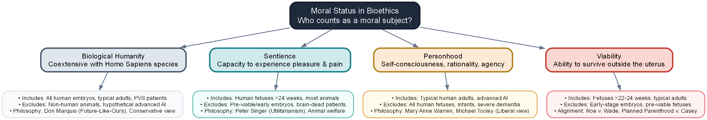

# A Case to Open With {.section-divider}

## A Conflict of Rights

::: {.thought-question}
Imagine waking up in a hospital bed next to a famous, unconscious violinist.

- A music-loving society has discovered that you alone have the required blood type to save him.
- They kidnapped you and connected his circulatory system to yours overnight.
- If you disconnect, the violinist will immediately die.
- The hospital director apologizes, but says you must remain connected for nine months to save his life.

1. Is it morally mandatory for you to remain connected to the violinist?
2. Does the violinist's right to life override your right to control your own body?
3. How is this situation similar to pregnancy, and where does the comparison break down?
:::

## After You've Discussed

::: {.callout-note}
Three starting points are worth keeping sharp from this scenario:

- **A right to life is not the same as a right to use another's body.** The violinist's survival depends on your body, but he did not have a prior claim to it.
- **Bodily autonomy is a powerful moral shield.** Respect for persons usually forbids forcing one person to bear physical burdens for another, even to save a life.
- **The moral landscape is rarely settled by single slogans.** Reconciling the moral value of a developing life with the physical self-determination of a pregnant person requires looking past absolute claims.
:::

::: {.notes}
Use this opening thought experiment to help students separate the question of "when does human life begin" from "what obligations do we have to sustain another life."
:::

## Today

::: {.learning-outcomes}
By the end of Part A, you will be able to:

- Distinguish the biological developmental stages of a human fetus from zygote to term
- Evaluate the four candidate criteria for establishing moral status in bioethics
- Explain Judith Jarvis Thomson’s violinist analogy and identify common objections to it
- Summarize Don Marquis’s "future-like-ours" argument against the morality of abortion
- Analyze Rosalind Hursthouse’s virtue ethics approach to the abortion decision
- Apply these three major philosophical frameworks to clinical scenarios involving pregnancy
:::

# The Biology of Development {.section-divider}

## A Short Biological Primer

- A [zygote]{.key-term} is a single-celled organism formed by the fusion of sperm and egg at fertilization.
- An [embryo]{.key-term} refers to the organism from implantation (roughly two weeks) through the eighth week of development, when major organs form.
- A [fetus]{.key-term} describes the developing human organism from the ninth week of gestation until birth.
- The threshold of [viability]{.key-term} is the point at which a fetus could survive outside the womb with intensive medical support.
- A pregnancy reaches full [term]{.key-term} between 37 and 40 weeks, when the fetus is fully prepared for birth.

::: {.context-box}
**Understanding Gestational Age**

Clinicians calculate pregnancy from the first day of the pregnant person's last menstrual period (LMP). Because fertilization occurs roughly two weeks after LMP, the biological age of the embryo/fetus is actually two weeks younger than the clinical gestational age.
:::

## Biological Development: Continuous & Complex

- **A continuous biological process:** Development proceeds in a seamless sequence rather than a series of abrupt, distinct steps.
- **Morally significant markers:** Ethical arguments often pick specific physical milestones (fertilization, heartbeat, neural activity, viability) as morally critical.
- **Heartbeat vs. consciousness:** Detection of early cardiac electrical activity occurs long before thalamocortical neural connections capable of processing sensations are fully formed.
- **Shifting viability thresholds:** Viability is a technologically dependent boundary rather than an absolute biological constant.

## Timeline of Fetal Development

{width="100%" fig-alt="Timeline of fetal development showing key biological milestones"}

::: {.attribution}
Clinically standard timelines.
:::

# What Is Moral Status? {.section-divider}

## Defining Moral Status

::: {.columns}
::: {.column width="48%"}
### What Is Moral Status?
- Having [moral status]{.key-term} means an entity has moral interests of its own that others are bound to respect.
- A rock has no status; we value it only for what it can do for us.
- An adult human has full moral status; harming them for convenience is wrong.
:::

::: {.column width="4%"}
:::

::: {.column width="48%"}
### The Bioethical Dilemma
- At what point does a developing human cross the line and acquire moral interests?
- The answer determines when a fetus gains a moral claim to protection.
- This claim can conflict with the bodily autonomy of the pregnant person.
:::
:::

## The Four Candidate Criteria

::: {.columns}
::: {.column width="48%"}
### 1. Biological Humanity
Moral status begins at fertilization, coextensive with membership in the species *Homo sapiens*.

### 2. Sentience
Moral status begins when the developing organism can experience pain or pleasure (approx. 24 weeks).
:::

::: {.column width="4%"}
:::

::: {.column width="48%"}
### 3. Personhood
Moral status is reserved for beings possessing advanced cognitive capacities like rationality and self-awareness.

### 4. Viability
Moral status begins when the fetus can survive outside the uterus (approx. 22-24 weeks).
:::
:::

## Concept Map: Moral Status Criteria

{width="100%" fig-alt="Concept map of the four moral status criteria and their philosophical alignments"}

::: {.attribution}
Overview of bioethical criteria.
:::

## Criterion 1: Biological Humanity

::: {.columns}
::: {.column width="48%"}
### The Core Claim
- Moral status is coextensive with being a member of the species *Homo sapiens*.
- A human zygote, embryo, and fetus possess full moral status from fertilization onward.
- Abortion is morally equivalent to killing an adult human being.
:::

::: {.column width="4%"}
:::

::: {.column width="48%"}
### Major Criticisms
- **Speciesism:** Accused of placing absolute value on genetic category alone.
- **Potentiality Fallacy:** Relies too heavily on the *potential* of a single cell to become a person.
:::
:::

## Criterion 2: Sentience

::: {.columns}
::: {.column width="48%"}
### The Core Claim
- Moral status belongs to beings capable of experiencing pleasure and pain [@singer_practical].
- An entity without conscious experiences has no interests to protect; once it feels, it counts.
- Thalamocortical connections capabable of processing pain do not function until approx. 24 weeks.
:::

::: {.column width="4%"}
:::

::: {.column width="48%"}
### Implications & Criticisms
- **Early Permissibility:** Early abortions do not violate any interests of the fetus.
- **Non-Human Animals:** Extends moral status to animals while excluding early embryos.
:::
:::

## Criterion 3: Personhood

::: {.columns}
::: {.column width="48%"}
### The Core Claim
- Defines a [person]{.key-term} by advanced cognitive capacities: reasoning, self-awareness, and agency.
- Being biologically human is not enough; one must possess a mind that can plan and communicate.
- Defended by liberal philosophers like Michael Tooley and Mary Anne Warren.
:::

::: {.column width="4%"}
:::

::: {.column width="48%"}
### Implications & Criticisms
- **High Permissibility:** Fetus does not possess personhood, making abortions permissible.
- **The Infanticide Objection:** Excludes infants and individuals with advanced cognitive decline.
:::
:::

## Criterion 4: Viability

::: {.columns}
::: {.column width="48%"}
### The Core Claim
- Draws the moral line at the ability of the fetus to survive outside the uterus.
- Before viability, the fetus is entirely dependent on the pregnant person's body to exist.
- Once viable, the fetus has physical independence that grounds a claim to life.
:::

::: {.column width="4%"}
:::

::: {.column width="48%"}
### Legal Bounds & Criticisms
- **Legal Landmark:** Served as the core boundary in *Roe v. Wade* and *Planned Parenthood v. Casey*.
- **Tech Dependency:** Viability is highly dependent on medical technology, not the fetus itself.
:::
:::

# Warren's Personhood Criteria {.section-divider}

## Mary Anne Warren: Biological vs. Moral Sense

- In her 1973 landmark paper "On the Moral and Legal Status of Abortion," Mary Anne Warren defends a liberal approach to abortion [@warren1973].
- She argues that the abortion debate often founders because both sides conflate the two different senses of the word "human."
- The [biological sense]{.key-term} of human refers simply to being a genetically human organism (a member of the species *Homo sapiens*).
- The [moral sense]{.key-term} of human refers to being a member of the moral community who possesses full moral rights (a [person]{.key-term}).
- Warren argues that having moral status requires being a person in the moral sense, not just a biological human.

## The Five Criteria of Personhood

::: {.columns}
::: {.column width="50%"}
1. **Consciousness:** The capacity to feel pain and experience the external world.
2. **Reasoning:** The developed cognitive capacity to solve new, complex problems.
3. **Self-motivated activity:** The capacity to initiate actions independent of external control.
:::

::: {.column width="50%"}
4. **Communication:** The capacity to transmit messages of an indefinite variety.
5. **Self-awareness:** Possessing a concept of oneself as an individual persisting over time.

::: {.callout-note}
### Definition of Personhood
Warren proposes that satisfying some or all of these five cognitive criteria is what makes an entity a person [@warren1973].
:::
:::
:::

## Personhood and the Fetus

- A human fetus in early development does not satisfy any of the five cognitive criteria of personhood.
- Therefore, Warren concludes that the fetus is not a person in the moral community.
- As a non-person, the fetus has no moral rights that can override the bodily rights of the pregnant person.
- This view represents a highly consistent, cognitive-based defense of extreme abortion permissibility.

## Potential Personhood & The Space Explorer

::: {.columns}
::: {.column width="48%"}
### The Dilemma
- Imagine an explorer captured by aliens who plan to split their body into thousands of pieces to create clones.
- Each clone is a potential person who would have a valuable future right to life.
- The explorer can escape only by destroying the cloning machine and all potential clones.
:::

::: {.column width="4%"}
:::

::: {.column width="48%"}
### Warren's Solution
- The explorer is fully justified in escaping to preserve their actual life and liberty.
- By escaping, the explorer destroys thousands of potential lives.
- Warren concludes that the rights of an **actual person** (the pregnant individual) always override the claims of a **potential person** (the fetus).
:::
:::

## The Objection from Infanticide

- The most common objection to Warren's criteria is that newborns also fail to satisfy most of her five criteria for personhood.
- If her personhood criteria are correct, it would seem to imply that [infanticide]{.key-term} is morally permissible, which is widely rejected.
- Warren responds by arguing that infanticide is wrong for reasons other than the infant's intrinsic moral status [@warren1973].
- First, a newborn child is highly valued by society, and other people are eager to adopt and care for it, meaning killing it deprives others of value.
- Second, once birth has occurred, the infant no longer violates the bodily autonomy or physical resources of the biological mother.

# Thomson's Defense: Bodily Autonomy {.section-divider}

## The Violinist Thought Experiment

::: {.columns}
::: {.column width="48%"}
### The Scenario
- You wake up connected to a famous, unconscious violinist who has a fatal kidney disease [@thomson1971].
- The Society of Music Lovers kidnapped you and plugged your circulatory system into his.
- Unplugging him kills him, but staying connected for nine months allows him to recover.
:::

::: {.column width="4%"}
:::

::: {.column width="48%"}
### The Core Question
- Are you morally required to remain connected for nine months to save his life?
- Thomson argues that you have no obligation to support him, even if it is generous to do so.
- She concedes that a fetus is a person from conception for the sake of argument.
:::
:::

## The Violinist Analogy

::: {.quote-card}
> "You wake up in the morning and find yourself back to back in bed with an unconscious violinist. A famous unconscious violinist. He has been found to have a fatal kidney ailment, and the Society of Music Lovers has canvassed all the available medical records and found that you alone have the right blood type to help. They have therefore kidnapped you, and last night the violinist's circulatory system was plugged into yours, so that your kidneys can be used to extract poisons from his blood as well as your own. The director of the hospital now tells you, "Look, we're sorry the Society of Music Lovers did this to you--we would never have permitted it if we had known. But still, they did it, and the violinist is now plugged into you. To unplug you would be to kill him. But never mind, it's only for nine months. By then he will have recovered from his ailment, and can safely be unplugged from you." Is it morally incumbent on you to accede to this situation? No doubt it would be very nice of you if you did, a great kindness. But do you have to accede to it?"

::: {.attribution}
Judith Jarvis Thomson, "A Defense of Abortion" [@thomson1971].
:::
:::

## Bodily Autonomy vs. Right to Life

::: {.columns}
::: {.column width="48%"}
### Bodily Consent
- The violinist has a right to life, but not a right to use your kidneys without your ongoing consent.
- A right to life does not include a blank check to another's bodily resources [@thomson1971].
- In pregnancy, survival requires the continuous physical support of the pregnant person.
:::

::: {.column width="4%"}
:::

::: {.column width="48%"}
### Withdrawing Support
- Unplugging the violinist is not an act of unjust killing; it is withdrawing a benefit he has no right to demand.
- Similarly, terminating a pregnancy is not a violation of the fetus's right to life, but a withdrawal of bodily consent.
:::
:::

## Objections and Counters

| Common Objection | Thomson's Likely Counter |
|---|---|
| **Rape vs. Consensual Sex:** The violinist scenario only applies to pregnancy resulting from rape, not consensual intercourse. | Consensual sex is not a blank check; opening a window does not give a burglar the right to stay in your house. |
| **Killing vs. Letting Die:** Unplugging the violinist lets him die of natural disease, but abortion actively kills a fetus. | The moral core is identical: you are removing a body from yours; you are not obligated to keep them alive. |
| **Parental Duty:** Parents have special obligations to their offspring that strangers do not have to violinists. | We do not have natural, unchosen duties to support others at major physical cost; responsibility must be assumed. |

## The People-Seeds Thought Experiment

- Thomson addresses the claim that voluntary, consensual intercourse implies consent to fetal bodily support.
- She designs the **people-seeds thought experiment**: imagine microscopic human seeds floating in the air and taking root in your carpets [@thomson1971].
- To protect your house, you install fine window screens; however, a rare screen defect allows a seed to drift in and grow.
- Thomson argues you have no moral duty to keep the person-plant in your home; consensual sex with contraception does not constitute bodily consent.

## Right to Life vs. Unjust Killing

- Thomson argues a "right to life" does not mean a right to the minimum resources needed to survive, such as another's organs.
- If you are dying of a rare disease, you have no moral right to demand that a stranger donate their kidney to save you.
- Therefore, Thomson defines the right to life strictly as the **right not to be killed unjustly**.
- Withdrawing your bodily resources is not unjust killing; it is simply retracting a voluntary benefit the other has no right to demand.

## Samaritans: Good vs. Minimally Decent

::: {.columns}
::: {.column width="48%"}
### The Splendid Samaritan
- Goes far out of their way to make massive personal and physical sacrifices to save another.
- No laws in the United States force ordinary citizens to perform Splendid Samaritanism (e.g. donating a kidney).
:::

::: {.column width="4%"}
:::

::: {.column width="48%"}
### The Minimally Decent Samaritan
- Performs the basic, standard level of assistance that any decent human would provide.
- US laws do not require even this (e.g., you aren't legally forced to call 911 for a drowning stranger).
:::
:::

::: {.callout-note}
### Thomson's Conclusion
Restrictive abortion laws force pregnant women to make massive physical sacrifices (Splendid Samaritanism) that are never legally demanded of any other citizen.
:::

## Autonomy: Indecent vs. Unjust

::: {.columns}
::: {.column width="48%"}
### The Distinction
- While defending the right to abort, Thomson notes that having a right does not make an action moral.
- **Unjust:** Violating a person's strict right (e.g., taking back a gift you promised to let them keep).
- **Indecent/Callow:** Acting without basic virtue, charity, or decency, even if no rights are violated.
:::

::: {.column width="4%"}
:::

::: {.column width="48%"}
### Case Illustrations
- **Violinist Case:** If you only needed to remain connected for *one hour*, unplugging him would be callow and highly indecent.
- **Pregnancy Case:** Terminating a late-stage pregnancy simply to avoid rescheduling a vacation is indecent and selfish.
- In both cases, the act remains morally wrong because it fails the test of basic decency.
:::
:::

# Marquis's Future-Like-Ours Argument {.section-divider}

## Don Marquis on Why Killing Is Wrong

- In 1989, Don Marquis published "Why Abortion Is Immoral" [@marquis1989].
- He argued that the abortion debate is stalled because both sides rely on arbitrary claims.
- To resolve it, he asks a fundamental question: why is it wrong to kill an ordinary adult?
- The wrongness of killing does not lie in its effect on the killer, nor on the grief of survivors.
- The primary wrong of killing is what it does to the victim.

## The Fetus and a Valuable Future

::: {.quote-card}
> "What primarily makes killing wrong is neither its effect on the murderer nor its effect on the victim’s friends and relatives, but its effect on the victim. The loss of one’s life is one of the greatest losses one can suffer. The loss of one’s life deprives one of all the experiences, activities, projects, and enjoyments which would otherwise have constituted one’s future. Therefore, killing someone is wrong, primarily because the killing inflicts (one of) the greatest possible losses on the victim."

::: {.attribution}
Don Marquis, "Why Abortion is Immoral" [@marquis1989].
:::
:::

## The FLO Account of Abortion

::: {.columns}
::: {.column width="48%"}
### The Core Concept
- Killing is wrong because it deprives a victim of a [future-like-ours]{.key-term} (FLO): a future of experiences, enjoyments, and projects.
- A human fetus possesses a future of value just like any young child or typical adult.
:::

::: {.column width="4%"}
:::

::: {.column width="48%"}
### The Moral Conclusion
- Aborting a fetus deprives it of this valuable future.
- Therefore, abortion is seriously wrong for the exact same reason that killing an adult is wrong.
- This argument requires no claims about personhood or religious concepts of the soul.
:::
:::

## Implications of the FLO Account

::: {.columns}
::: {.column width="48%"}
### Theoretical Virtues
- **Non-Speciesist:** Implies that killing intelligent extraterrestrials with valuable futures is wrong.
- **Tragedy of Youth:** Explains why premature death of infants/children is exceptionally tragic.
- **Euthanasia:** Permits active euthanasia when a patient lacks any prospect of future valuable experiences.
:::

::: {.column width="4%"}
:::

::: {.column width="48%"}
### Clinical Abortion Impact
- Makes almost all abortions seriously immoral, regardless of the gestational age of the fetus.
- The moral weight is carried entirely by the future value the fetus would eventually experience.
:::
:::

## Objections to the FLO Argument

| Common Objection | Marquis's Defender Counter |
|---|---|
| **The Potentiality Fallacy:** Just because a fetus has potential, that does not give it actual rights now. | The argument is about loss, not rights. Depriving an entity of a future it will experience is a real loss today. |
| **The Interest Objection:** An entity cannot be harmed by a loss if it lacks the cognitive capacity to care about it. | A comatose patient can be harmed by being killed, even if they are temporarily unable to care about their future. |
| **Contraception:** If FLO is true, then contraception must be wrong because it prevents a valuable future. | Contraception is not killing; there is no identifiable individual who suffers a loss before fertilization. |

## The "Worst of Crimes" Thesis

- Marquis argues that his **Future-Like-Ours (FLO) account** provides the best explanation for why killing is widely considered the worst of crimes.
- When you steal from someone, you deprive them of some of their property, but they still have their lives and other projects.
- When you kill someone, you deprive them of *everything* they have and will ever have—their entire future of experiences.

## FLO and Moral Gravity

- The FLO account explains why we believe premature death is a particularly tragic and devastating loss for young people (they lose more future).
- It also explains why we do not consider it wrong to kill a person who is brain-dead, as they no longer have a future of conscious experience.
- Therefore, the moral gravity of killing is directly proportional to the value of the future of which the victim is deprived.

## The Desire Account Objection

- Critics argue killing is wrong only because it frustrates the victim's strong desire to continue living.
- Under this view, since a fetus has no cognitive capacity to form desires, abortion is not wrong.
- Marquis responds that this account fails to explain why it is seriously wrong to kill depressed, suicidal, or comatose people.
- We protect these lives because their futures remain valuable, regardless of their current conscious desires.

## The Valuing Account Objection

- Another major objection holds that a future is only valuable if it is currently valued *by the entity itself*.
- Marquis counters that a person can be deprived of a valuable future even if they do not currently recognize its value.
- Consider a suicidal teenager: if we prevent their suicide and they go on to live a happy life, we have saved a future that *became* valuable.
- Similarly, a fetus's future is valuable because it will eventually grow to experience and value it, making early termination a real loss.

## Identity & IVF Pre-Embryos

- The most powerful challenge to Marquis is the **identity objection**: a fetus must survive as the same continuous individual to lose "its" future [@kamm1992].
- However, during the first 14 days after fertilization, the multicellular zygote can split into identical twins.
- If a zygote splits, the original entity ceases to exist; therefore, no stable, single individual exists before day 14 to whom a "future" belongs.
- This objection suggests that the FLO argument does not apply to early-stage pre-implantation embryos in IVF clinics.

# Hursthouse: A Virtue Ethics Approach {.section-divider}

## Rosalind Hursthouse's Virtue Theory

- In 1991, Rosalind Hursthouse published "Virtue Theory and Abortion" [@hursthouse1991].
- She argued that both sides of the debate focus too much on rigid rights and rules.
- Rights-based bioethics asks: "what are my rights?" or "what does the law allow?".
- Hursthouse argues these questions miss the emotional, biological, and personal reality of pregnancy.
- Virtue ethics asks a different question: "how does a virtuous person act in this situation?".

## Pregnancy as a Grave Moral Fact

- Hursthouse argues that pregnancy is not just a physical state like having a cold, nor is it an inert piece of property.
- Pregnancy is a significant human biological and existential event, tied to love, family, and mortality.
- Approaching abortion with casual disregard reflects a vice: a lack of seriousness or respect for life.
- A virtuous agent recognizes that ending a pregnancy is a grave decision that requires serious justification.
- It is possible to have a legal right to an abortion while still acting viciously in exercising that right.

## Virtue, Vice, and Decisions

- Virtue ethics does not yield a simple, single rule ("always wrong" or "always right").
- The morality of an abortion depends on the character, motives, and circumstances of the person making the choice.
- Terminating a pregnancy due to severe threat to health, or inability to care for existing children, can be wise and compassionate.
- Terminating a pregnancy because it would interfere with a planned vacation reflects selfishness or lack of appreciation for life.
- The focus is on flourishing: does this decision align with a life lived with wisdom, courage, and responsibility?

## Hursthouse: Rights vs. Virtue

::: {.columns}
::: {.column width="48%"}
### The Limits of "Rights-Mongering"
- Bioethics focuses too much on abstract entitlements ("what does the law allow?" or "what is my right?").
- Having a legal or moral right to do something does not automatically make the decision wise, compassionate, or virtuous.
- Example: You have a clear legal right to speak rudely to family, but doing so reflects a vicious character.
:::

::: {.column width="4%"}
:::

::: {.column width="48%"}
### The Shift to Virtue Ethics
- Redirects the debate from abstract rules to the actual character, motives, and circumstances of the moral agent.
- Asks a richer clinical and personal question: "how does a virtuous person act in this specific scenario?".
- Treats terminating a pregnancy not as a minor transaction, but as a grave existential decision requiring mature justification.
:::
:::

## Virtue and "Appropriate Grief"

::: {.columns}
::: {.column width="50%"}
### Acknowledging Complexity
- Unlike rights-based frameworks that treat abortion as either simple or neutral, virtue theory respects moral complexity.
- A virtuous agent will experience **appropriate grief** or sorrow, even when a termination is fully justified.
- Sorrow is a sign of a character that appreciates the gravity of human life, potential, and loss.
:::

::: {.column width="50%"}
::: {.callout-important}
### Case Study: Maternal Threat
A mother terminates a pregnancy because severe heart disease carries a 30% risk of maternal death.

- Her decision is wise and compassionate.
- Yet, it remains a tragic loss of potential.
- Casual indifference to this loss reflects a vice of callowness.
:::
:::
:::

## Pregnancy & Human Flourishing

::: {.columns}
::: {.column width="48%"}
### Existential Grounding
- Human pregnancy, parenting, and family are tied to biological reproduction and flourishing.
- Carrying a pregnancy to term is a major existential decision about one's role in the cycle of life.
- Approaching pregnancy with serious reflection reflects appreciation for the gravity of bringing new life.
:::

::: {.column width="4%"}
:::

::: {.column width="48%"}
### The Path to Eudaimonia
- Deciding whether to become a parent is a primary component of a well-lived human life (*eudaimonia*).
- Parenting requires years of care and shapes one's character, virtues, and maternal/paternal duties.
- A virtuous agent rejects casual utility in favor of a life lived with wisdom, responsibility, and courage.
:::
:::

# Synthesizing the Landscape {.section-divider}

## Comparing the Four Frameworks

| Feature | Warren (Personhood) | Thomson (Bodily Autonomy) | Marquis (Future-Like-Ours) | Hursthouse (Virtue Ethics) |
|---|---|---|---|---|
| **Focal Point** | Presence of cognitive capabilities. | Conflict of rights and bodily control. | The loss suffered by the victim. | The character and motives of the agent. |
| **Fetal Status** | Lacks personhood; not a moral person. | Conceded as a person for the sake of argument. | Possesses a future of value; status is high. | Irrelevant; what matters is the gravity of life. |
| **Permissibility** | Permissible (fetuses have no rights overriding a person). | Often permissible (consent to bodily use is key). | Rarely permissible (except in extreme conflicts). | Context-dependent (wise vs. callow reasons). |
| **Primary Limitation** | Leads to difficult objections regarding infants (infanticide). | Relies on analogies that may not match parent-child relations. | Hard to apply to cases of severe genetic anomalies. | Does not provide clear-cut rules for public policy. |

## Thought Question

::: {.thought-question}
A patient with severe heart disease is pregnant. Her doctor tells her that continuing the pregnancy carries a 30% risk of maternal death. She has two young children at home.

1. How would Thomson, Marquis, and Hursthouse analyze this scenario?
2. How do the patient's existing maternal responsibilities change the moral equation for each philosopher?
3. In a hospital, who is the primary moral agent in this decision: the patient, the doctor, or the nurse?
:::

## Make It Contemporary

::: {.thought-question}
Severe fetal anomalies incompatible with life (such as anencephaly) present deep moral dilemmas.

- In many jurisdictions, restrictive laws place narrow exceptions on late-term abortions.
- Clinicians sometimes face legal penalties if they intervene before an active emergency occurs.
- Families often want to terminate to avoid suffering, while some suggest carrying to term is required.

How do our three philosophical frameworks help a clinician navigate a situation where legal boundaries, professional ethics, and patient wishes collide?
:::

## After You've Discussed

::: {.callout-note}
Three final distinctions to carry forward into your clinical practice:

- **A right to act is not the same as a virtuous choice.** You may have a legal or moral right to withdraw bodily support (Thomson), but doing so for callow reasons still reflects a lack of virtue (Hursthouse).
- **Tragedies are real.** Marquis's account forces us to acknowledge the genuine loss of a future, even when a termination is fully justified to save a maternal life.
- **Clinicians support persons, not just arguments.** In the hospital, your job is to understand which ethical framework is guiding your patient's reasoning, rather than imposing your own.
:::

## Mini-Recap

::: {.recap}
Part A laid out the structural biology and major philosophical arguments surrounding abortion. While biological development is continuous, philosophers draw sharp moral boundaries using criteria like biological humanity, sentience, personhood, and viability. Thomson defends abortion by highlighting bodily autonomy; Marquis opposes it by showing that abortion deprives a fetus of a valuable future; Hursthouse redirects the debate toward the character of the moral agent and the gravity of the decision. Part B will build on these ideas to explore how these ethical tensions have shaped the history of abortion law, the post-*Dobbs* landscape, and the application of the four principles at the bedside.
:::

## Key Terms

- **Zygote** — The single-celled organism formed by fertilization.
- **Embryo** — The developing human from implantation through 8 weeks.
- **Fetus** — The developing human from 9 weeks until birth.
- **Viability** — The point where survival outside the womb is possible.
- **Moral Status** — The property of being an entity whose interests count morally.
- **Personhood** — Having advanced cognitive and rational capacities.
- **Sentience** — The capacity to feel pleasure and pain.
- **Bodily Autonomy** — The right to control one's own physical body.
- **Future-Like-Ours** — Marquis's term for a valuable future of experiences.

## Further Reading

- Dworkin, Ronald. *Life's Dominion: An Argument About Abortion, Euthanasia, and Individual Freedom*. Vintage, 1994.
- Hursthouse, Rosalind. *On Virtue Ethics*. Oxford University Press, 1999.
- Kamm, Frances M. *Creation and Abortion: A Study in Moral and Legal Philosophy*. Oxford University Press, 1992.

## Review Questions

Write a brief answer to each, or use them as discussion prompts.

::: {.review-questions}

::: {.review-item .review-recall}
[Recall]{.review-label}

Briefly define the four candidate criteria for moral status (biological humanity, sentience, personhood, viability) and name one philosopher or framework associated with each.
:::

::: {.review-item .review-apply}
[Apply]{.review-label}

A couple undergoing IVF must decide what to do with remaining, frozen pre-implantation embryos. Analyze the moral gravity of discarding these embryos using two different moral-status criteria (e.g., biological humanity vs. sentience), explaining how each criterion leads to a different ethical conclusion.
:::

::: {.review-item .review-debate}
[Debate]{.review-label}

Should legal regulations governing medical procedures like abortion be anchored in a specific moral-status criterion (such as sentience or viability), or should public policy remain neutral on these deep, unresolved metaphysical disputes?
:::

:::

## References

::: {#refs}
:::
