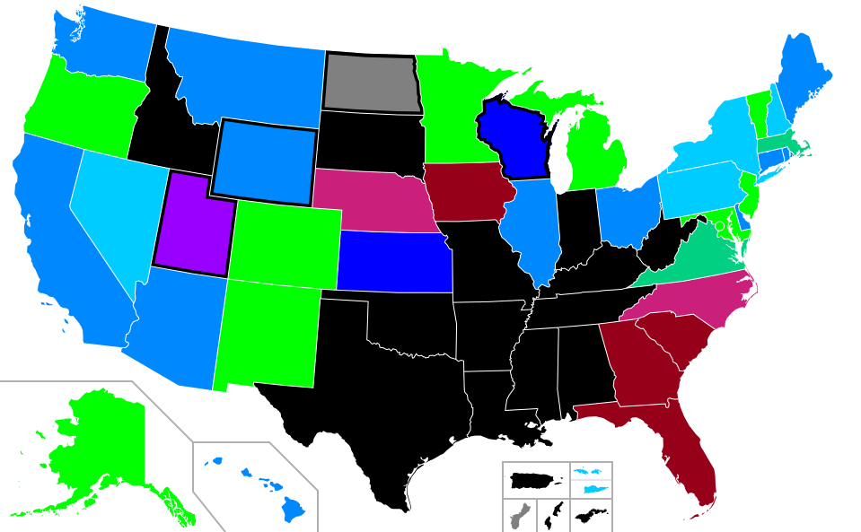
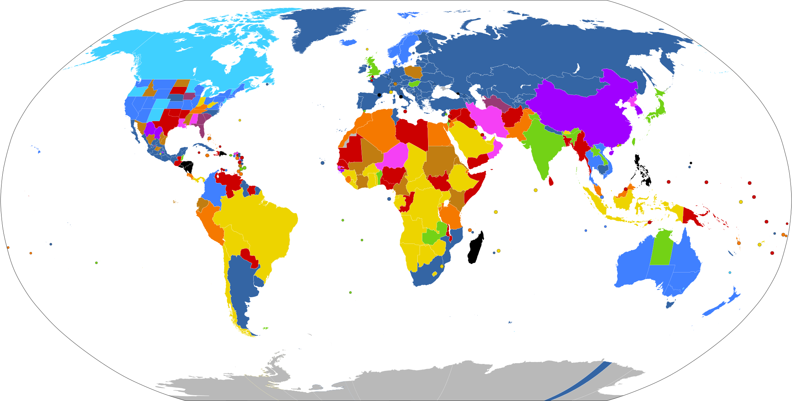

# When the Law Meets the Bedside {.section-divider}

## Kate Cox, 31, Texas, December 2023

::: {.columns}
::: {.column width="55%"}
At twenty weeks pregnant, Kate Cox learned her fetus had **trisomy 18** — almost always fatal at or shortly after birth. Her physician recommended termination.

Texas law banned abortion except to prevent **"substantial impairment of a major bodily function."** Cox sued. A trial court granted permission; the **Texas Supreme Court reversed** within days. She traveled to New Mexico for care.

She was not alone. *Zurawski v. Texas*, filed the same year, gathered twenty-plus women denied care under the same statute — some after their water broke before viability, some after sepsis set in.
:::
::: {.column width="4%"}
:::
::: {.column width="41%"}
::: {.thought-question}
**Write or discuss:**

1. Should the **physician** have been allowed to make this call, or is it right that the legislature draws the line?
2. The Texas law uses the phrase **"substantial impairment of a major bodily function."** What does that mean to a doctor in a hospital at 2 a.m.?
3. If a clinician guesses wrong, the penalty is up to **99 years in prison** and loss of license. How does that change how she practices?
:::
:::
::::

## Where We Left Off

Part A asked **what makes the moral status of the fetus disputable** and laid out four arguments — Marquis, Warren, Thomson, Hursthouse — in standard form. Today we turn the question outward: **what should the *law* do** about something so contested? We trace how Western legal systems have answered it from antiquity to *Dobbs*, learn how US legal argument actually works, look at the post-*Dobbs* state-by-state landscape, and finally compare the US to the rest of the world — including places where the state has used law to push birth rates either *down* (China) or *up* (Romania).

## Today

::: {.learning-outcomes}
By the end of Part B, you will be able to:

- Trace how abortion law has varied historically — from common-law "quickening" through 19th-century criminalization to the present
- Explain in plain English how US legal argument works: precedent, *stare decisis*, the structure of a Supreme Court opinion
- Reconstruct the *Roe*, *Casey*, and *Dobbs* majorities as arguments in standard form and identify the load-bearing premise of each
- Read a current US state-law map and describe what care is actually available in your state right now
- Compare four global regulatory models (Western Europe, Latin America, post-*Dobbs* US, restrictive states) and place the US in that landscape
- Evaluate state policies that try to *change* birth rates — China's One-Child Policy, Romania's Decree 770, Hungary's incentives — using the four principles
:::

# 1. A Brief History {.section-divider}

## Antiquity: Before "Personhood" Was a Category

- In ancient Greece and Rome, abortion and **infant exposure** were widely practiced, lightly regulated, and not understood through any concept resembling fetal personhood.
- The original **Hippocratic Oath** (~5th c. BCE) prohibits giving "a destructive pessary" — but other Hippocratic texts describe abortifacient techniques in clinical detail. Ancient medicine was internally divided.
- Aristotle held that the **soul entered the fetus** at 40 days (male) or 90 days (female), a view that shaped European thought for two millennia. Early abortion was qualitatively different from late.
- Roman law treated the fetus as **part of the mother (*pars viscerum matris*)** — abortion was an offense against the father's authority, not a homicide.

## English Common Law and "Quickening" {.shrink}

::: {.columns}
::: {.column width="58%"}
For roughly **seven hundred years**, English common law — inherited by colonial America — treated abortion as a crime only after [quickening]{.key-term}: the moment the pregnant woman first felt fetal movement, typically 16–20 weeks.

- Before quickening, abortion was **not a common-law crime**. Women openly purchased "obstructions of the menses" remedies.
- After quickening, it was a *misdemeanor* — punishable, but far short of murder.
- The line was *epistemic*, not metaphysical: quickening was the first reliable evidence the pregnancy was real and ongoing.
:::
::: {.column width="4%"}
:::
::: {.column width="38%"}
::: {.callout-note}
**Why this matters.** The original *Roe v. Wade* opinion (1973) leaned heavily on this history to argue that the recent American consensus *against* abortion was, in fact, a 19th-century departure from a much older common-law tradition.
:::
:::
::::

## The 19th-Century Criminalization Campaign

Between roughly 1830 and 1880, every US state outlawed abortion at every stage of pregnancy. The driving force was not religion but a **professional movement led by the American Medical Association** (founded 1847).

- **Dr. Horatio Storer** launched an AMA campaign in 1857 arguing that scientific embryology had shown fetal life began at conception — quickening, he said, was obsolete.
- The campaign also served the AMA's interest in **displacing midwives and homeopaths** from reproductive care.
- By 1880, abortion was a felony in every US state. The Catholic Church did not formally adopt its current position until **1869** (Pope Pius IX).

## The Back-Alley Era (1900–1973)

Criminalization did not end abortion; it moved it underground.

- 1930s: illegal abortion was a leading cause of **maternal death** — 5,000 to 17,000 deaths per year.
- **Sherri Finkbine (1962):** a Phoenix TV host took thalidomide, learned of its effects on fetal development, and traveled to Sweden for an abortion. A turning point in US opinion.
- **The Jane Collective (Chicago, 1969–1973):** a clandestine, mostly non-medical network that performed an estimated **11,000 abortions** before *Roe*.
- By the early 1970s, **fourteen states** had reformed their laws; four (Alaska, Hawaii, New York, Washington) had legalized abortion on request before *Roe*.

## Activity 1 — A Different Country's History

::: {.thought-question}
Abortion law in **Central Europe and Germany** followed a strikingly different arc.:

- **Weimar Germany (1920s):** broad legalization for medical reasons — among the most liberal in the world at the time.
- **Nazi Germany (1933–1945):** abortion banned, with the death penalty for some cases — but **forced** on women deemed "racially undesirable."
- **East Germany (1972) and most of the Eastern Bloc:** abortion on request to 12 weeks, decades before US legalization.
- **Reunified Germany (1995):** a compromise system — abortion remains technically illegal but unpunished in the first trimester with mandatory counseling.
:::

[@dienerowitz_david_2026]

## Activity 1 - Discuss

1. The same act — terminating a pregnancy — has been called *a right*, *a duty*, *a felony*, and *a regrettable choice* by **the same country** within a single century. What does that tell you about the relationship between abortion and political ideology?
2. Both Nazi Germany (forcing abortion on some, banning it for others) and Romania (banning it on everyone — we'll see this later) used reproductive law as a tool of **demographic engineering**. What makes that misuse possible?


# 2. How US Legal Argument Works {.section-divider}

## Three Sources of Law

US law comes from three layers; conflicts resolve by going *up* the stack.

```{dot}
//| fig-width: 9
//| fig-height: 3.2
digraph G {
  rankdir=TB;
  bgcolor=transparent;
  node [shape=box, style="rounded,filled", fillcolor="#e6f1f2", color="#0e7c86", fontname="Inter", fontsize=14];
  edge [color="#64748b", fontname="Inter", fontsize=11];

  C [label="US Constitution\n(highest authority)", fillcolor="#0e7c86", fontcolor=white];
  S [label="Federal Statutes\n(passed by Congress, signed by President)"];
  R [label="State Constitutions and Statutes\n(within their own borders)"];
  CL [label="Common Law\n(judge-made law inherited from England;\nfilled in where statutes are silent)"];

  C -> S [label="trumps"];
  S -> R [label="preempts on federal matters"];
  R -> CL [label="overrides where it speaks"];
}
```

Most abortion law lives at the **state level** — but federal court rulings on the *US Constitution* can override it. *Roe* and *Dobbs* are both such rulings.

## Precedent — In Plain English

A [precedent]{.key-term} is a prior court decision that later courts treat as authoritative.

- When the Supreme Court decides a case, the **reasoning** — not just the outcome — becomes binding on every lower federal court.
- Lawyers and judges argue by *analogy*: "the situation in front of us is relevantly like *Miranda*, so the same rule applies."
- Precedent is what makes law **predictable**. Without it, every case would be argued from scratch.

::: {.callout-note}
**Example.** In *Miranda v. Arizona* (1966), the Supreme Court ruled that police must inform suspects of their right to remain silent. That single decision is now cited every time a "Miranda warning" is given — millions of times per year. The rule did not exist before *Miranda*; it exists because precedent made it stick.
:::

## *Stare Decisis* — and When Courts Overturn It

[*Stare decisis*]{.key-term} (Latin: "to stand by things decided") is the principle that even when a current judge disagrees with a precedent, the precedent should usually be followed. It is a **presumption**, not an absolute.

When the Supreme Court *does* overturn precedent, it typically invokes one or more of four standard reasons:

1. **Workability** — the rule has proved too vague or unstable for lower courts to apply
2. **Reliance** — has society reorganized itself around the rule? Strong reliance counts *against* overturning
3. **Doctrinal coherence** — does the rule fit with related areas of law, or stick out as an anomaly?
4. **Factual or social change** — have the assumptions on which the rule rested been disproved?

We will see all four contested in the *Roe* → *Casey* → *Dobbs* arc.

## Reading a Court Opinion

Three things in every Supreme Court decision:

::: {.columns}
::: {.column width="32%"}
**Majority opinion**

The official ruling. Binds lower courts. Written by one justice on behalf of however many agree — five out of nine is enough.
:::
::: {.column width="2%"}
:::
::: {.column width="32%"}
**Concurrence**

A justice voted with the majority but wants to add reasoning of her own. Often signals where the law may go next.
:::
::: {.column width="2%"}
:::
::: {.column width="32%"}
**Dissent**

A justice disagrees with the majority. Has no legal force *now* — but dissents have a long history of becoming majorities later.
:::
::::

## Legal Argument Is Just Argument

The good news: legal argument follows the same standard-form structure we learned in Part A. A *Roe* or *Dobbs* majority is, at bottom, a numbered list of premises ending in a conclusion. **The premises just happen to be claims about constitutional text, history, and precedent.**

This means the move from Part A still works: locate the premise the disagreement really turns on, and you have an argument worth having.

## Activity 2 — *Miranda* in Standard Form

::: {.thought-question}
Here is the core of the *Miranda* ruling in everyday language. Reconstruct it as an argument with **three premises and a conclusion**.

> *"The Fifth Amendment protects people from being forced to incriminate themselves. Custodial police interrogation is inherently coercive — being held by armed officers in a closed room is the kind of pressure the Fifth Amendment was meant to guard against. Unless suspects are told they may remain silent and may have an attorney, any 'confession' they give cannot really be called voluntary. Therefore, police must warn suspects of these rights before custodial questioning, or anything they say is inadmissible at trial."*

**Write or discuss:**

1. Pull the passage apart into **P1, P2, P3, C**.
2. Which premise would a critic of *Miranda* most likely attack?
3. Notice the structure. We will use the same one for *Roe* and *Dobbs*.
:::

# 3. The Constitutional Arc: *Roe* → *Casey* → *Dobbs* {.section-divider}

## *Roe v. Wade* (1973) — What It Actually Held

::: {.columns}
::: {.column width="58%"}
- A **7–2** decision written by Justice Harry Blackmun.
- Held that the **Fourteenth Amendment**'s Due Process Clause implicitly protects a "right of privacy" broad enough to cover the abortion decision.
- Created the **trimester framework**: 1st — woman and physician decide; 2nd — state may regulate for maternal health; 3rd — state may prohibit except for life or health.
- Drew on the common-law history of *quickening*.
:::
::: {.column width="4%"}
:::
::: {.column width="38%"}
Framed not as creating a new right but as recognizing one already implicit in *Griswold* (1965, contraception) and *Loving* (1967, interracial marriage).
:::
::::

## *Roe* in Standard Form

::: {.argument}
::: {.arg-name}
The *Roe* Majority Argument
:::
::: {.arg-source}
Blackmun, J., for a 7–2 Court [@roe_v_wade_1973]
:::

1. The Fourteenth Amendment's Due Process Clause protects a sphere of personal liberty (the "right of privacy") that the government may not enter without a compelling reason.
2. The decision whether to terminate a pregnancy lies inside that sphere — it is among the most intimate and consequential choices a person can make.
3. The state has two interests that *might* override that liberty: protecting maternal health, and protecting "potential life." Neither becomes **compelling** until certain points in pregnancy (roughly the second and third trimesters, respectively).
4. Therefore, before those points, the state may not prohibit abortion.
:::

## *Roe*, in Justice Blackmun's Words

::: {.quote-card}
> "This right of privacy, whether it be founded in the Fourteenth Amendment's concept of personal liberty and restrictions upon state action, as we feel it is, or, as the District Court determined, in the Ninth Amendment's reservation of rights to the people, is broad enough to encompass a woman's decision whether or not to terminate her pregnancy."

::: {.attribution}
*Roe v. Wade*, 410 U.S. 113, 153 (1973). Majority opinion, Blackmun, J. [@roe_v_wade_1973]
:::
:::

## *Planned Parenthood v. Casey* (1992)

::: {.columns}
::: {.column width="58%"}
- **5–4** decision; unusual **joint opinion** by three Republican-appointed justices (O'Connor, Kennedy, Souter).
- The Court was expected to **overturn *Roe***. Instead it reaffirmed the central holding on *stare decisis* grounds.
- Replaced the trimester framework with **viability** as the dividing line and the **undue burden** standard — states may regulate, but not place substantial obstacles before viability.
:::
::: {.column width="4%"}
:::
::: {.column width="38%"}
*Casey* works the four standard reasons for overturning precedent (workability, reliance, coherence, factual change) through in plain view — a controversial exhibit of *stare decisis* in action.
:::
::::

## *Casey*, in the Joint Opinion's Words

::: {.quote-card}
> "At the heart of liberty is the right to define one's own concept of existence, of meaning, of the universe, and of the mystery of human life. Beliefs about these matters could not define the attributes of personhood were they formed under compulsion of the State."

::: {.attribution}
*Planned Parenthood of Southeastern Pennsylvania v. Casey*, 505 U.S. 833, 851 (1992). Joint opinion of O'Connor, Kennedy, and Souter, JJ. [@casey_1992]
:::
:::

This is the famous "mystery passage" — one of the most cited and most mocked sentences in modern constitutional law. Critics call it philosophically empty; supporters call it the most honest articulation of what liberty actually means in a pluralistic society.

## *Dobbs v. Jackson Women's Health* (2022)


- **6–3** decision (5 for full overruling, 1 for the narrow result only), Justice Alito writing.
- The case challenged Mississippi's **15-week ban** — well before viability under *Casey*.
- The Court overturned **both *Roe* and *Casey*** entirely and returned the question to **state legislatures**. Within a year, 13 states activated "trigger laws."
- Justice Thomas's **concurrence** suggested the same reasoning could reach *Griswold*, *Lawrence*, and *Obergefell*.


## *Dobbs* in Standard Form

::: {.argument}
::: {.arg-name}
The *Dobbs* Majority Argument
:::
::: {.arg-source}
Alito, J., for a 5-justice majority [@dobbs_2022]
:::

1. Rights protected by the Due Process Clause beyond those listed in the Bill of Rights must be **"deeply rooted in this Nation's history and tradition"** and "implicit in the concept of ordered liberty."
2. Abortion was a **crime in most American states** from the mid-19th century until *Roe* in 1973 — so it is *not* deeply rooted in our history and tradition.
3. *Stare decisis* is a presumption, but it gives way when a prior decision was "egregiously wrong" from the start, has proved unworkable, and has not generated strong reliance interests of the kind that justify keeping it.
4. *Roe* and *Casey* meet that test.
5. Therefore, *Roe* and *Casey* are overruled; the Constitution does not protect a right to abortion; the question returns to the states.
:::

## *Dobbs*, in Justice Alito's Words

::: {.quote-card}
> "We hold that *Roe* and *Casey* must be overruled. The Constitution makes no reference to abortion, and no such right is implicitly protected by any constitutional provision… It is time to heed the Constitution and return the issue of abortion to the people's elected representatives."

::: {.attribution}
*Dobbs v. Jackson Women's Health Organization*, 597 U.S. ___ (2022). Majority opinion, Alito, J. [@dobbs_2022]
:::
:::

## The *Dobbs* Dissent, in Their Words

::: {.quote-card}
> "Whatever the exact scope of the coming laws, one result of today's decision is certain: the curtailment of women's rights, and of their status as free and equal citizens... With sorrow — for this Court, but more, for the many millions of American women who have today lost a fundamental constitutional protection — we dissent."

::: {.attribution}
*Dobbs*, joint dissent of Breyer, Sotomayor, and Kagan, JJ. [@dobbs_2022]
:::
:::

## Activity 3 — Circle the Weakest Premise

::: {.thought-question}
You now have both *Roe* and *Dobbs* in standard form. The dispute between them is not really about whether abortion is *moral* — it is about what the *Constitution* requires.

**Write or discuss:**

1. In the **Roe** argument, which premise (P1, P2, P3) carries the most weight, and which would a critic most likely target?
2. In the **Dobbs** argument, the same question. (Hint: look hard at P1 — is "deeply rooted in history and tradition" really the right test?)
3. Notice that both arguments could be **valid** while disagreeing fundamentally. The fight is over which premises are *true*. What does that tell you about how to evaluate the next Supreme Court decision you read?
:::

# 4. The Post-*Dobbs* US Landscape {.section-divider}

## Where Things Stand — A US Map

{width="92%" fig-alt="Map of the United States showing gestational limits for elective abortion by state as of May 2025"}

::: {.attribution}
Wikimedia Commons, "Gestational limits for elective abortion in the United States" (May 2025). Updated periodically; verify current status before clinical use.
:::

## Five Regulatory Tiers

| Tier | Approx. gestational limit | Representative states |
|---|---|---|
| **No state restriction beyond federal law** | Up to viability or later (some allow later for health) | Colorado, New Jersey, Minnesota, Oregon |
| **Viability standard (~24 wk)** | Roughly the pre-*Dobbs* federal floor | California, Illinois, New York, Wisconsin |
| **Mid gestational limit** | 15–22 weeks | Florida (6 wk), North Carolina (12 wk), Utah (18 wk) |
| **Six-week ("heartbeat") laws** | ~6 weeks LMP — before many know they're pregnant | Georgia, Iowa, South Carolina, Texas (partial) |
| **Near-total ban** | Conception, with narrow life/health exceptions | Alabama, Arkansas, Kentucky, Mississippi, Missouri, Texas, ~7 others |

::: {.attribution}
Compiled from Guttmacher Institute state-policy tracking [@guttmacher_state_policies_2024].
:::

## Medication Abortion and the Comstock Act

- Since 2020, more than **half** of US abortions have been medication abortions (mifepristone + misoprostol).
- This makes abortion **harder to ban completely** — pills travel through the mail, across state lines, and from overseas pharmacies.
- The **Comstock Act of 1873** — an obscenity statute still on the books — prohibits mailing items "designed, adapted, or intended for producing abortion." For a century it was treated as a dead letter.
- Some legal commentators argue *Dobbs* has revived Comstock. If the next administration enforces it, mifepristone could become functionally unavailable nationwide — without any new law being passed.

## Travel, Shield Laws, and Interstate Conflict

::: {.columns}
::: {.column width="48%"}
**Travel for care.** After *Dobbs*, abortion travel surged. Illinois clinics report patients from twenty states. Kansas became a regional destination. Estimates suggest **150,000–200,000** Americans travel for abortion care each year.
:::
::: {.column width="4%"}
:::
::: {.column width="48%"}
**Shield laws.** A growing set of states (NY, MA, CA, CO, WA) have passed laws **shielding** their providers from out-of-state subpoenas and prosecutions when they ship pills to or treat patients from ban states. Expect this to be the next major constitutional fight — likely under the **Full Faith and Credit Clause**.
:::
::::

## "Life of the Mother" — What It Really Means at the Bedside

Most state bans include an exception for risks to the **life** of the mother. The phrase looks clear. It is not.

- **Sepsis from incomplete miscarriage**, **previable PPROM** (premature rupture of membranes), **ectopic pregnancy at risk of rupture**, **severe preeclampsia at 22 weeks** — at what point is the threat to maternal life "imminent enough" for the exception to apply?
- The **statute** is read by **prosecutors**, not physicians. A clinician who acts too early risks felony charges; one who waits too long risks the patient's life.
- This can create ethial dilemmas for physicians, nurses, and other clinical staff

## Activity 4 — On Call in Lubbock {.shrink}

::: {.thought-question}
Imagine you are the doctor on call in Lubbock, Texas. A 26-year-old patient who has been pregnant twice and has one prior birth arrives at **20 weeks** after her water has broken. She has a fever of 101.8°F, and test results are still pending. The fetus cannot survive yet at this stage of pregnancy. Continuing the pregnancy is likely to lead to serious infection, including chorioamnionitis and sepsis — but at this moment her vital signs are stable, and there is still fetal cardiac activity.

Texas law allows abortion only when there is "a life-threatening physical condition aggravated by, caused by, or arising from a pregnancy" that creates a "serious risk of substantial impairment of a major bodily function."

**Write or discuss:**

1. From a clinical point of view, what would you want to do for the patient, and why?
2. Based on the wording of the law, do you think it clearly allows that care? Why or why not?
3. If the team waits until she becomes much sicker — for example, until her fever rises or her blood pressure drops — has the law already harmed her, even if she survives?
4. What kinds of changes would help most: clearer laws, better legal protection for clinicians using their judgment, hospital guidance, or something else?
:::

## Conscience Clauses

A second post-*Dobbs* legal fault line: when may a clinician **refuse** to participate?

- Federal **Church Amendments** (1973) protect clinicians who refuse to perform abortions on religious or moral grounds.
- About **45 states** have their own conscience laws — varying enormously in scope.
- The **ANA Code of Ethics** (Provision 5) recognizes conscientious objection but requires that the nurse not abandon the patient and provide referral.
- The hard cases are *referral* (in some states, refusing to refer is also protected) and *emergencies* (federal EMTALA may override state conscience laws, but the Supreme Court has not yet resolved the conflict).

# 5. Abortion Law Around the World {.section-divider}

## A World Map

{width="92%" fig-alt="World map of abortion laws by country, color-coded by tier of legal access"}

::: {.attribution}
Wikimedia Commons, "Abortion Laws" — based on the Center for Reproductive Rights' classification [@crr_world_abortion_laws].
:::

## Four Global Tiers

The Center for Reproductive Rights groups countries into four tiers by legal grounds.

| Tier | Grounds | Examples | % of reprod.-age women |
|---|---|---|:---:|
| **I. Prohibited** | None, or only implicit necessity | El Salvador, Nicaragua, Senegal, Egypt | ~5% |
| **II. To save the woman's life** | Threat to life only | Nigeria, Iran, Indonesia, Brazil | ~22% |
| **III. Health grounds** | Plus mental/social/economic in some | UK, Finland, Israel, India, Japan | ~14% |
| **IV. On request** | No grounds, early in pregnancy | Canada, W. Europe, China, S. Africa, most of Latin America | ~36% |

::: {.attribution}
Estimates from Center for Reproductive Rights, 2024 [@crr_world_abortion_laws; @cfr_abortion_law].
:::

## The Western European Consensus {.shrink}

Despite enormous cultural variation, most of Western Europe has converged on a **strikingly similar settlement**:

- Abortion **on request** during a first window — most often **12 weeks** (Germany, France, Italy, Belgium, Spain) or **14 weeks** (France since 2022)
- **Mandatory counseling** and often a brief waiting period (Germany's "*Beratungsregelung*": 3 days)
- After the first window: only on specific grounds (maternal health, fetal anomaly, rape) — but those grounds are interpreted **fairly broadly** by most national health services
- Public funding through national health insurance in most countries

::: {.callout-note}
**The puzzle.** Western Europe's settlement is *more restrictive* than *Casey*'s viability standard (~24 wk) but *less restrictive* than most US ban states. Both sides of the US debate routinely point to Europe to support their position — usually selectively.
:::

## Latin America's "Green Wave"

For most of the 20th century, Latin America had some of the world's most restrictive abortion laws. That has changed remarkably fast.

- **Argentina (2020):** Senate legalized abortion on request to 14 weeks, after years of mass green-bandana protests
- **Mexico (2021, 2023):** Supreme Court decriminalized abortion, then extended ruling to all states
- **Colombia (2022):** Constitutional Court legalized abortion on request to 24 weeks — among the most permissive standards anywhere
- **Chile (2017, 2024 attempt):** narrowly legalized for three grounds; broader liberalization stalled


## Two European Tipping Points {.shrink}

::: {.columns}
::: {.column width="48%"}
**Ireland's Eighth Amendment repeal (2018)**

For 35 years, Ireland's constitution treated the fetus as equal to the mother. The 2012 death of **Savita Halappanavar** from sepsis after being denied an abortion during a miscarriage at 17 weeks galvanized national reform. A 2018 referendum repealed the amendment by **66% to 34%**, ushering in legal abortion on request to 12 weeks.
:::
::: {.column width="4%"}
:::
::: {.column width="48%"}
**Poland's tightening (2020)**

Poland was already among Europe's most restrictive. In 2020 its constitutional tribunal — packed with allies of the ruling party — ruled that abortion for severe fetal anomaly was unconstitutional, eliminating the most common legal ground. Mass protests followed. The 2023 election change has so far not produced legislative reform.
:::
::::

## Activity 5 — Why Does the World Converge Around 12–15 Weeks?

::: {.thought-question}
A striking pattern: nearly every liberal democracy that has settled the question — Germany, France, Italy, Belgium, Spain, the Netherlands, Argentina, Ireland — has landed on a first-trimester (or slightly later) **on-request window**, with stricter standards beyond it.

**Write or discuss:**

1. What features of **12–15 weeks** make it a natural settling point? Biological? Practical? Political?
2. Why might the **US** have failed to reach such a settlement? (Hint: think about the difference between *constitutional* and *legislative* resolution.)
3. Is convergence here evidence that this is the *right* answer, or only that it is a politically *stable* one?
:::

# 6. When the State Wants More Babies — or Fewer {.section-divider}

## Coercive Anti-Natalism: China's One-Child Policy (1979–2015) {.shrink}

After the Great Leap Forward famine and rapid population growth, China in 1979 imposed a **one-child-per-couple policy** on most urban families. Enforcement included:

- **Heavy fines** scaled to several years' income
- **Mandatory IUD insertion** after a first child, **sterilization** after a second — in the hundreds of millions
- **Forced abortions**, sometimes at late gestational ages, where local quotas were enforced aggressively
- **Hukou denial** for unregistered children, locking them out of school and health care

Combined with cultural preference for sons, the policy produced an estimated **30 million "missing women"** by 2010.

## China's Sudden Pivot

By 2015 China's birth rate had fallen below replacement, and the country was aging faster than any in history.

- **2015**: two-child policy
- **2021**: three-child policy
- **2023**: most restrictions formally removed; tax incentives, housing subsidies, and propaganda campaigns added
- Birth rates have continued to fall

::: {.callout-note}
**The lesson.** Coercive anti-natalism produced a demographic catastrophe that coercive pro-natalism is now unable to reverse. Once people experience reproductive autonomy, governments may find they cannot order it away.
:::

## Coercive Pro-Natalism: Romania's Decree 770 (1966–1989)

Under Communist leader Nicolae Ceaușescu, Romania's **Decree 770** banned abortion and most contraception for women under 45 with fewer than five children. The goal: 30 million Romanians by 2000. The consequences:

- **Maternal mortality rose seven-fold** as illegal abortion became the leading cause of death for women of reproductive age
- The birth rate doubled briefly, then collapsed as families found workarounds
- Tens of thousands of unwanted children were warehoused in **state orphanages** — discovered by the world only after Ceaușescu's 1989 fall, with conditions that became a textbook case in developmental psychology

## Non-Coercive Pro-Natalism {.shrink}

Many democracies face falling birth rates and have responded with **incentives** rather than bans:

::: {.columns}
::: {.column width="48%"}
- **Hungary** (since 2019): tax exemptions for life for women with four+ children; subsidized housing loans forgiven on third child; ~5% of GDP on family policy
- **South Korea**: cash payments per child; expanded parental leave; ~$280 billion spent over 16 years
- **Singapore**: "Baby Bonus" cash plus subsidized childcare
:::
::: {.column width="4%"}
:::
::: {.column width="48%"}
- **France**: longstanding family allowances; childcare guarantees; modest but real effect on fertility
- **Nordic countries**: generous parental leave, near-universal childcare, gender-egalitarian leave-sharing

These have resulted in modest stabilization at best. No incentive package has restored a country to replacement-rate fertility once it fell well below.
:::
::::

## Activity 6 — Where Is the Line?

::: {.thought-question}
A spectrum of state involvement in reproduction:

- **A**: free contraception and parental leave
- **B**: $10,000 tax credit per child
- **C**: $100,000 tax credit per child
- **D**: priority access to housing for families with three children
- **E**: tax *penalties* on childless adults over 30 (proposed in Hungary in 2010s)
- **F**: criminalize sterilization for adults under 35
- **G**: ban contraception (Romania, 1966)
- **H**: forced sterilization of those deemed unfit (China; US, 1907–1979)

**Write or discuss:**

1. Where on this spectrum does **incentive** become **pressure**? Where does **pressure** become **coercion**?
2. Apply each of the four principles — **autonomy, beneficence, non-maleficence, justice** — to step **C** and to step **E**. Which principle does the most work?
3. Is the relevant question *whether* the state has a legitimate demographic interest, or *which means* it may use to pursue one?
:::

# 7. Pulling It Together {.section-divider}

## The Four Principles, Applied to Law

| Principle | What it pushes toward in abortion law | Where it pulls back |
|---|---|---|
| **Autonomy** | Decisions about one's own body and reproductive future belong to the person living them | Limits when the autonomy of another being is plausibly at stake (later gestational ages, viability) |
| **Beneficence** | Maximize access to safe care — bans drive abortion underground, not away | Includes weighing the interests of fetuses, families, and future children |
| **Non-maleficence** | Avoid the foreseeable harms of restrictive regimes — maternal deaths, denied miscarriage care, clinician moral injury | Avoid the foreseeable harms of liberal regimes that some claim (coarsening of moral attitudes, late-term cases) |
| **Justice** | Equal access — burdens of restrictive laws fall most heavily on the poor and on rural patients | Distributive concerns also push toward considering future generations and demographic balance |

## Mini-Recap

::: {.recap}
Law has answered the abortion question in radically different ways across time and place: the common law treated early abortion as no crime; 19th-century America criminalized it everywhere; *Roe* and *Casey* read a privacy-and-liberty right into the Fourteenth Amendment; *Dobbs* returned the question to state legislatures; Latin America has liberalized while the US restricted; and some states have used coercive laws to engineer demographics in both directions, with disastrous results. The argumentative tool from Part A travels — every Supreme Court opinion, every state statute, every UN resolution can be put into standard form and tested at its load-bearing premise.
:::


## Review Questions

::: {.review-questions}

::: {.review-item .review-recall}
[Recall]{.review-label}

Pick two of the standard reasons a court gives for overturning one of its own past decisions. Which of the two did the most work in *Dobbs*?
:::

::: {.review-item .review-apply}
[Apply]{.review-label}

A state bans abortion except when the patient's "life is in imminent danger." A patient at 19 weeks has a serious infection that is not yet life-threatening but is expected to become so. What does the word *imminent* force the medical team to wait for? Suggest one change to the statute that would fix the problem.
:::

::: {.review-item .review-debate}
[Debate]{.review-label}

China forced people to have fewer children; Romania forced people to have more. Both caused severe harms. Is the lesson that *all* coercive reproductive policy is wrong, or only that these particular policies went wrong? Defend your view.
:::

:::


## Key Terms

- **Quickening** — the first felt fetal movement; the common-law line below which abortion was not a crime.
- **Precedent** — a prior court decision treated as authoritative in later cases.
- ***Stare decisis*** — the presumption that courts should follow precedent unless very strong reasons compel otherwise.
- **Trimester framework** — *Roe*'s original standard, replaced in *Casey*.
- **Undue burden** — *Casey*'s standard: states may regulate but not place substantial obstacles before viability.
- **Viability** — the gestational point at which a fetus could plausibly survive outside the womb (~22–24 weeks).
- **Trigger law** — a state law written to take effect automatically when a Supreme Court precedent is overturned.
- **Shield law** — a state law protecting in-state providers from out-of-state legal action.
- **Comstock Act** — 1873 federal anti-obscenity statute that, on a literal reading, prohibits mailing abortion-related items.

## Further Reading

- Greenhouse, Linda, and Reva B. Siegel. *Before Roe v. Wade: Voices That Shaped the Abortion Debate Before the Supreme Court's Ruling.* Kaplan, 2010.
- Ziegler, Mary. *Roe: The History of a National Obsession.* Yale University Press, 2023.
- Greenhalgh, Susan. *Just One Child: Science and Policy in Deng's China.* University of California Press, 2008.
- *Stanford Encyclopedia of Philosophy*, "The Ethics of Abortion." [@harman_sep_abortion]
- *Internet Encyclopedia of Philosophy*, "Abortion." [@gordon_iep_abortion]
- Center for Reproductive Rights, *The World's Abortion Laws* (live map). [@crr_world_abortion_laws]
- Council on Foreign Relations, *Abortion Law: Global Comparisons*. [@cfr_abortion_law]


## References

::: {#refs}
:::
