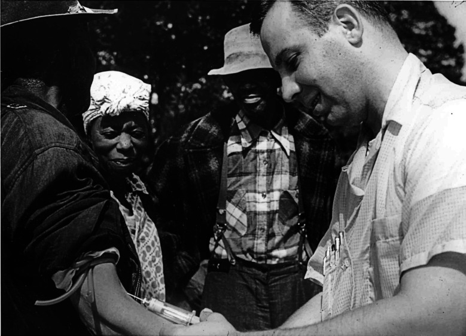
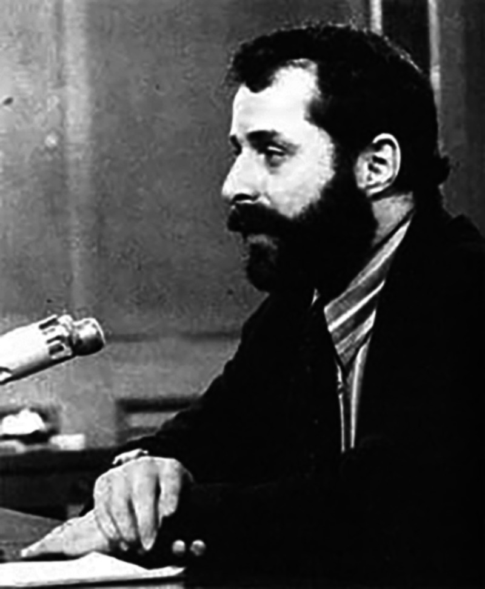

::: {.case-at-a-glance}
- **Who:** ~600 Black men of Macon County, Alabama — 399 with latent syphilis, 201 uninfected controls — and, later, more than 1,300 Guatemalans deliberately infected by the same U.S. agency
- **What:** The U.S. Public Health Service watched untreated syphilis progress to autopsy for **40 years (1932–1972)**, withholding penicillin and deceiving the men into believing they were being treated; a parallel PHS project in Guatemala (1946–1948) infected prisoners, soldiers, and psychiatric patients on purpose
- **Where / When:** Tuskegee/Macon County, Alabama, 1932–1972; Guatemala, 1946–1948; exposed by a whistleblower and the press in 1972; the Guatemala records found in 2003
- **Why it matters:** Tuskegee is widely called the single most important event in the rise of American [bioethics]{.key-term}. It produced the modern rules — [informed consent]{.key-term}, the [IRB]{.key-term}, the Belmont principles — and a debate, still unsettled, about whether rules were ever the thing that was missing, and about the medical distrust the study left behind.
- **Pair with:** History & the Making of Research Ethics
:::

## The Case

In 1932 the United States Public Health Service (PHS) — the federal agency that would become the CDC — began what its own scientists titled the *Tuskegee Study of Untreated Syphilis in the Negro Male*. The premise was simple and, to its designers, scientifically attractive: find people with untreated [syphilis]{.key-term} and observe what the disease does to a human body if nothing is done, all the way to autopsy.

They chose Macon County, Alabama, where most residents were Black, most were poor, and almost none had access to a doctor. That was the point. The men recruited — about 600, of whom 399 had latent syphilis and 201 served as healthy controls — were sharecroppers working white-owned land in a system of debt peonage. The PHS enlisted the respected Tuskegee Institute and a trusted Black public-health nurse, Eunice Rivers, whose constancy kept the men coming back for decades. The men were never told they had syphilis. They were told they had "**bad blood**," a vague local phrase, and that the government doctors were treating them for it.

::: {.context-box}
**What untreated syphilis does.** Syphilis is a bacterial infection. After an early stage it can go *latent* — silent for years — and then, in roughly a third of untreated cases, attack the heart, blood vessels, brain, and spinal cord. The consequences the PHS's own venereal-disease workers printed on a matchbook to scare people into testing were blunt and accurate: "Blindness, heart injury, insanity, death." None of that was named to the Tuskegee men.
:::

The deception was not passive. To collect the data they wanted, investigators performed painful diagnostic spinal taps and described them to the men as a special free "spinal shot" — a *treatment*. One PHS officer wrote to colleagues that the men might refuse the procedure if they understood it was only diagnostic, so its real purpose should "be kept from them as far as possible." Because the study's final data point was the autopsy, the PHS offered burial insurance — a powerful inducement in a poor rural community where a proper funeral mattered — so that families would surrender the bodies. One investigator wrote that the team had "no further interest in these patients until they die." When a mobile treatment unit later swept the county offering free penicillin to everyone, PHS staff quietly flagged their enrollees to local doctors with the instruction that the man was under study and *not to be treated*.

{#fig-blood width="78%" fig-alt="A smiling white PHS worker draws blood from the arm of an older Black man at an outdoor gathering; a Black nurse and two other Black men stand nearby."}

::: {.attribution}
National Archives and Records Administration. Public domain. Reproduced in [@tobin2022].
:::

Penicillin became the standard cure for syphilis in the mid-1940s. The men were not given it. PHS scientists argued that the arrival of a cure made the study *more* valuable, not less — a never-to-be-repeated chance to see the full natural course of a disease that would soon no longer run its course anywhere else. The study generated about fifteen papers in reputable medical journals over thirty-seven years. The titles alone announced what it was — one 1964 article was called "The Tuskegee Study of Untreated Syphilis; the 30th Year of Observation." A 1955 paper reported that more than thirty percent of the autopsied men had died directly of syphilis. No physician, anywhere, published a letter of objection.

It ended only because one PHS employee would not let it go. By the most-cited later reckonings, dozens of the men had died of syphilis or its complications, dozens of their wives had been infected, and children had been born with congenital syphilis. In 1973, after the story broke, a class-action suit produced an out-of-court settlement, and the government eventually provided lifetime medical care to survivors and affected families. In 1997 — a quarter century after the study stopped — President Clinton apologized: what the government did "was shameful," a study "so clearly racist." No scientist was ever prosecuted.

The case is usually taught as a failure of consent. The questions it actually raises are harder than that, and they are still open.

## The Argument Tuskegee Started

Few cases have generated as much agreement *that* something monstrous happened and as much disagreement about *what the monstrous thing was*. The moves below trace that argument as a connected exchange — each answering the one before.

### "We were missing rules"

The official lesson is institutional. Tuskegee, on this view, happened because the United States had no system requiring that subjects consent and no body to review research before it ran. So the country built one: the 1974 National Research Act, [institutional review boards]{.key-term} (IRBs) to approve and monitor studies, federal informed-consent regulations, and, in 1979, the Belmont Report's three principles — respect for persons, beneficence, and justice.

::: {.context-box}
**Informed consent, the IRB, and Belmont.** [Informed consent]{.key-term} means a competent person is told the truth about a study's risks, benefits, and purpose and freely agrees to take part. An [IRB]{.key-term} is a committee that must approve human research before it begins and can stop it. The **Belmont Report** distilled the post-Tuskegee consensus into three duties: respect persons as autonomous agents, do not harm and maximize benefit, and distribute research's burdens and benefits fairly. These are the spine of every research-ethics rulebook in use today [@belmont1979].
:::

::: {.argument}
**The Regulatory-Gap Argument**

1. Tuskegee occurred because no rule required informed consent and no independent body reviewed the study.
2. After Tuskegee, the United States created exactly those rules and bodies (consent regulations, IRBs, Belmont).
3. Therefore, the central lesson of Tuskegee is procedural, and a Tuskegee cannot happen here again.
:::

Premise 1 is where this breaks. It assumes the gap was the *absence* of rules. The next move denies that.

### "The rules existed — and were ignored"

The Nuremberg Code, written in 1947 after Nazi doctors were tried for experimenting on prisoners, opens with the sentence "The voluntary consent of the human subject is absolutely essential." It existed for the last twenty-five years of Tuskegee. American researchers of the era reportedly dismissed it as "a good code for barbarians" — something for Nazis, not for them. Rules were not missing. They were not felt to apply.

Then there is Guatemala. While researching Surgeon General Thomas Parran's papers in 2003, the historian Susan Reverby opened the donated files of a PHS doctor named John Cutler and found something worse than Tuskegee [@reverby2011]. Between 1946 and 1948, the same Public Health Service had **deliberately infected** more than 1,300 Guatemalans — prisoners, soldiers, and patients in a psychiatric hospital — with syphilis, gonorrhea, and chancroid, to test prevention. When infection through arranged contact proved unreliable, investigators inoculated subjects directly. At least eighty-three deaths were recorded. One psychiatric patient, after months of induced disease, was dying when a researcher infected her further; she died days later.

The decisive fact about Guatemala is not its cruelty but its respectability. The principal investigator, John Mahoney, was arguably the most honored American physician-scientist of his day — he won a Lasker Award the year the experiments began. The proposal was reviewed and funded by an NIH study section staffed by physicians from the country's leading medical schools. The Surgeon General was kept informed and enthusiastic; he is recorded remarking that "we couldn't do such an experiment in this country." Nothing failed in the chain of command. Everyone with authority approved.

```{dot}
//| label: fig-chain
//| fig-cap: "The PHS chain of command in the Tuskegee and Guatemala studies. The point of the diagram is what it does *not* contain: a broken link. Approval and knowledge flowed through every legitimate level of authority — the Surgeon General, the funding review, the senior investigators, the trusted on-site nurse — down to instructing local doctors that enrolled men were 'not to be treated.' The one person who finally stopped Tuskegee, Peter Buxtun, sits *outside* this structure entirely (dashed). A rule is enforced by the people inside the boxes; that is why 'add a rule' did not, by itself, answer the problem."
digraph G {
  rankdir=TB;
  node [shape=box, style="rounded,filled", fillcolor="#eef3f8",
        fontname="Helvetica", fontsize=11, margin="0.16,0.09"];
  edge [fontname="Helvetica", fontsize=10];

  sg     [label="U.S. Surgeon General\n(kept informed, approving)", fillcolor="#dde8f0"];
  div    [label="PHS Venereal Disease Division\n(directors: Clark, Vonderlehr, Heller)"];
  nih    [label="NIH study section\n(reviewed & funded Guatemala)"];
  pi     [label="Senior investigators\n(Mahoney, Cutler, Wenger)"];
  site   [label="On-site team &\nNurse Eunice Rivers\n(kept the men enrolled)"];
  local  [label="Local doctors instructed:\nenrollee “not to be treated”", fillcolor="#fad7d2"];
  subj   [label="The men / the Guatemalan subjects", fillcolor="#f3e9d8"];
  bux    [label="Peter Buxtun\n(PHS interviewer, no authority)", style="rounded,dashed,filled", fillcolor="#e3efe1"];

  sg -> div; sg -> nih;
  div -> pi; nih -> pi;
  pi -> site; site -> subj; pi -> local; local -> subj;
  bux -> div [style=dashed, label="  objects, 1966–1968", constraint=false];
}
```

::: {.argument}
**The Conscience Argument**

1. Rules constrain conduct only through people who recognize the rules as applying to them and the subjects as persons owed protection.
2. In both studies, every level of legitimate authority knew and approved; existing codes (Nuremberg) were not felt to apply.
3. Therefore, the binding failure was not the absence of rules but the absence of conscience, and only an individual willing to break with authority could stop it.
:::

That individual was Peter Buxtun. Hired by the PHS in 1965 as a venereal-disease interviewer in San Francisco, the Czech-born social worker — whose family had fled to America in 1937 — learned of the study from a coworker, obtained a folder of internal "roundup" reports, and recognized the shape of what he was reading. He had read the Nuremberg trial record. He filed formal objections in 1966 and again in 1968. The CDC summoned him to Atlanta and a senior official berated him. A blue-ribbon panel was convened in 1969; its dominant voice argued, "You will never have another study like this; take advantage of it," and only one member, Gene Stollerman, urged that the men be treated as patients rather than as a data set. The panel voted to continue. Buxtun asked the CDC, in writing, "What is the ethical thing to do?" He received no answer. He took the documents to the press; the story broke in July 1972.

{#fig-buxtun width="48%" fig-alt="A bearded man in a jacket sits at a desk beside a microphone, looking to one side, apparently testifying."}

::: {.attribution}
Public domain. Reproduced in [@tobin2022].
:::

Why did it take one outsider seven years, when no insider acted in forty? Buxtun's own answer was wry: "It's tough being a whistleblower when you don't even know you're a whistleblower." Stronger pressure to weave in here is from social psychology. Stanley Milgram's obedience experiments — and a later study modeled on them in which university students were asked to recruit others into an obviously dangerous sham experiment — found that most people, given a legitimate-seeming authority, comply and look away, even when dissent is safe, anonymous, and easy [@elliott2018]. Milgram called this surrender the "agentic state": we recast ourselves as instruments of the authority and let our conscience go quiet. The Tuskegee physicians were not monsters by Milgram's lights; they were ordinary people inside a structure that made silence feel normal.

### "But heroes are not a policy"

If the Conscience Argument is right, it leaves a problem. You cannot run a research system on the hope that each abuse will produce its own Buxtun — especially since the system punishes the ones it gets.

::: {.argument}
**The Institutional-Design Reply**

1. Relying on individual conscience works only if would-be objectors actually come forward.
2. The evidence is that they rarely do, and that those who do are routinely destroyed: in one large study of corporate fraud, over 80% of named employee-reporters were fired, sued, or otherwise punished; surveyed nurses who reported misconduct were overwhelmingly reprimanded or pushed out [@elliott2018].
3. Therefore, the workable lesson is structural — design institutions so that dissent is less lonely and authority less inflated — not exhortation to be brave.
:::

The constructive half of this comes, again, from Milgram: obedience dropped sharply when the authority figure was made less imposing, when the victim was made more present, and — most powerfully — when *even one* other person in the room dissented. The design implication is concrete: deflate the prestige of the lead researcher, make subjects visible rather than abstract, protect real (not cosmetic) channels for objection, and make it possible for objectors to find each other. The recurring real-world successes — the New Zealand "unfortunate experiment," for instance — came from *teams* of clinicians acting together, not solitary martyrs. An anonymous "ethics hotline," the usual institutional answer, is the thing the evidence trusts least.

### Who was chosen, and why

There is a wrong here that none of the moves above quite names. The Tuskegee men were not random. They were selected *because* they were poor, Black, unschooled, and without doctors — chosen for the very powerlessness that made them easy to deceive and unlikely to be believed. A PHS internal phrasing reduced them to a single compound label, a string of demographic adjectives ending in "men." That is not a consent failure or an oversight failure. It is a [justice]{.key-term} failure: a vulnerable group made to carry a burden for a science that would never have been done to the powerful.

::: {.context-box}
**Vulnerability and fair subject selection.** Kenneth Kipnis argued that "vulnerable" is not a list of groups but a set of *pressures* a participant is under — economic, social, deferential, institutional — that compromise a genuinely free choice [@kipnis2001]. The Belmont principle of **justice** demands *fair subject selection*: research must not load its risks onto those least able to refuse, nor (the mirror error) exclude groups from research's benefits. Tuskegee is the textbook case of wrongful **exploitation** of the vulnerable; modern ethics also watches for wrongful **exclusion**.
:::

::: {.argument}
**The Justice Reframing**

1. The men were recruited specifically for traits (poverty, race, low literacy, no access to care) that made them unable to refuse or be heard.
2. Selecting subjects for their powerlessness, to bear a risk the powerful would never bear, is a distinct wrong — exploitation of the vulnerable — independent of whether consent or review existed.
3. Therefore, the deepest wrong of Tuskegee is one of justice, and a system that perfects consent and IRBs while still routing research risk toward the powerless has not fixed it.
:::

This is not safely historical. Research today still gravitates toward the institutionalized, the incarcerated, the cognitively impaired, and the poor — people under exactly Kipnis's pressures — which is why "fair subject selection" remains an active demand and not a settled box to check.

### The argument that hasn't ended

There is a final move, and it is the one with the most current stakes. The standard account says: Tuskegee is *why* many Black Americans distrust medicine and research, so the remedy is outreach, apology, and education to repair the trust the study broke. After 1972 the empirical legacy is, in fact, measurable — Marcella Alsan and Marianne Wanamaker found that disclosure of the study was followed by reduced medical contact among older Black men and worse health outcomes, a real and lasting cost [@alsan2018].

But Vanessa Northington Gamble and Susan Reverby press a sharp objection to the standard account. Black medical distrust did not begin with Tuskegee and is not exhausted by it; it tracks a long history and, more importantly, *present* mistreatment — documented disparities in pain treatment and outcomes, structural barriers in care now [@gamble1997]. To explain today's distrust by pointing only to a study that ended in 1972 can become a way of locating the problem safely in the past, and of casting Black patients as irrationally haunted rather than accurately observant. (Reverby also notes a precise irony: the Tuskegee men were not distrustful refusers — they *trusted* the government doctors, which is exactly how they were used.) The COVID-19 vaccination gap became the live test of this dispute: was the right response to recite Tuskegee and reassure, or to address the present-day inequities that make wariness a reasonable inference?

What actually moved the gap is instructive. Early 2021 messaging that leaned on history-and-reassurance — *that was then, the rules are different now, the vaccine is safe* — tended to land poorly, partly because it answered a question many Black patients were not asking. A review of equity strategies found that the interventions that raised uptake were structural and relational rather than rhetorical: vaccine sites placed inside trusted Black churches and barbershops, and outreach delivered by community health workers, clergy, and Black clinicians rather than by the institutions themselves [@dada2022]. The recurring mechanism is *concordance* — patients are more likely to accept advice, including vaccination, from clinicians who share their background or have earned standing in their community. A randomized field experiment in Oakland found that Black men assigned to a Black physician agreed to substantially more preventive services, including invasive screening, than those assigned to a non-Black physician — a gap that no recitation of history opens or closes [@alsanGarrick2019]. The lesson tracks Reverby's point precisely: the operative variable was not how vividly the past was explained but how much present trustworthiness the patient could actually observe in the room.

That gives a clinician something to do rather than something to recite. It does not, however, settle the argument — it arguably concedes the critique's premise (trust follows present conditions, not historical correction) while leaving the standard view's strongest reply intact: history is *part* of why those present conditions are read the way they are, and a patient who invokes Tuskegee is often naming a pattern, not a date — distrust as a response to everyday racism, not only to one archived study [@bajaj2021]. The dispute is which description should drive the response.

::: {.argument}
**The Distrust Dispute**

1. *Standard view:* Tuskegee caused durable Black distrust of medicine; the remedy is to rebuild trust through apology, outreach, and education.
2. *Critique:* distrust predates and outruns Tuskegee and responds to present mistreatment; invoking "Tuskegee" can deflect attention from current structural racism and pathologize a rational response.
3. Both can cite real evidence (a measured post-1972 health cost; persistent present-day disparities). Therefore the question is not whether the legacy is real but **what counters distrust** — correcting a historical narrative, or changing the conditions that make distrust reasonable now.
:::

Fifty years on, that is where the argument rests — not at a verdict, but at a question that a nurse, a researcher, and a public-health officer each have to answer the next time someone says, reasonably, that they are not sure they trust the people offering to help them.

## Discussion Questions

1. Reconstruct **The Regulatory-Gap Argument** and **The Conscience Argument**. They disagree about one premise — identify it, and say what Guatemala (eminent PI, NIH review, approving Surgeon General) contributes as evidence for one side.
2. Nurse Eunice Rivers was trusted by the men precisely because she was caring, constant, and one of their own — and that trust kept them in the study for decades. You are a nurse who has just realized the "treatment" you administer is a deception. What do you owe these particular patients that the institution does not, and what concretely do you do — knowing what the evidence says happens to nurses who report?
3. The Justice Reframing claims the deepest wrong was *whom they chose*, not the missing consent form. If a future study obtained perfect informed consent from poor, uninsured volunteers offered money they badly needed, would it have fixed Tuskegee's wrong or only relocated it? Defend your answer using **fair subject selection** and Kipnis's idea of vulnerability as pressure.
4. Apply **The Institutional-Design Reply** to a hospital you know. Name one concrete change (not an ethics hotline) that would make a dissenting nurse or resident less alone, and explain, using Milgram, why it would work.
5. A patient eligible for a new vaccine tells you she does not trust it, and mentions Tuskegee. Using **The Distrust Dispute**, give the strongest version of *both* responses — the reassure-and-educate response and the address-present-conditions response — and say which you would actually give her, and why.

## Further Reading

- James H. Jones, *Bad Blood: The Tuskegee Syphilis Experiment* (Free Press, 1981; rev. 1993) [@jones1981] — the definitive history.
- Susan M. Reverby, *Examining Tuskegee: The Infamous Syphilis Study and Its Legacy* (University of North Carolina Press, 2009) [@reverby2009].
- Harriet A. Washington, *Medical Apartheid* (Doubleday, 2006) [@washington2006] — the longer history of which Tuskegee is one chapter.
- Carl Elliott, "Tuskegee Truth Teller," *The American Scholar* 87, no. 1 (2018) [@elliott2018] — the Buxtun profile and the whistleblowing evidence.
- Presidential Commission for the Study of Bioethical Issues, *"Ethically Impossible": STD Research in Guatemala from 1946 to 1948* (2011) [@pcsbi2011].

## References

::: {#refs}
:::
